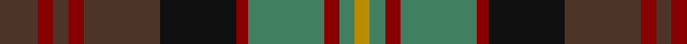

This page is one **sett** — a single exact thread-count. It belongs to the [tartan](/tartans/t10dr4t4dr4t20k20dr3g20dr4g4dy4/)
(the same proportion at any scale), whose colour order is pattern [BRBRBKRGRGY](/stripes/brbrbkrgrgy/).

Sourced from register-of-tartans.  It is a [11 stripe tartan](/stripes/stripes11/).

Original link https://www.tartanregister.gov.uk/tartanDetails.aspx?ref=5258

## Register references

External register numbers recorded for this tartan.

- Scottish Register of Tartans: [5258](https://www.tartanregister.gov.uk/tartanDetails.aspx?ref=5258)
- Scottish Tartans Authority (ITI): 3798

## Thread count
T/20 DR8 T8 DR8 T40 K40 DR6 G40 DR8 G8 DY/8

## Palette
Each colour and the base-6 reference it is a variant of.

| Colour | Shade | Base |
|---|---|---|
| DR | <code style="background-color:#880000;">#880000</code> `oklch(39.4% 0.162 29.2)` <small>#880000</small> | R <code style="background-color:#CC0000;">#CC0000</code> |
| DY | <code style="background-color:#BC8C00;">#BC8C00</code> `oklch(66.8% 0.137 84.1)` <small>#BC8C00</small> | Y <code style="background-color:#F2BF00;">#F2BF00</code> |
| G | <code style="background-color:#408060;">#408060</code> `oklch(54.8% 0.084 160.1)` <small>#408060</small> | G <code style="background-color:#006100;">#006100</code> |
| K | <code style="background-color:#101010;">#101010</code> `oklch(17.3% 0.000 89.9)` <small>#101010</small> | K <code style="background-color:#000000;">#000000</code> |
| T | <code style="background-color:#4C3428;">#4C3428</code> `oklch(34.9% 0.040 47.5)` <small>#4C3428</small> | B <code style="background-color:#2A418A;">#2A418A</code> |

## Nearest tartans

The nearest existing variants by ΔTartan distance, with this tartan at the top so the swatches line up against it.

ΔTartan

Tartan

Sett

—

<a href="/ttd/edit/#slug=do10r4do4r4do20k20r3g20r4g4lo4~x2">Cameron of Erracht (WCWM)</a> <a class="nn-out" href="/setts/s11/do10r4do4r4do20k20r3g20r4g4lo4~x2/" title="open its dictionary page">↗</a>

0.99

<a href="/ttd/edit/#slug=k3r7k4dy7r3dy7k4dg3k3dg19k2dg2k2r3~x2">Anderson (Coulson Bonner #1)</a> <a class="nn-out" href="/setts/s14/k3r7k4dy7r3dy7k4dg3k3dg19k2dg2k2r3~x2/" title="open its dictionary page">↗</a>

1.00

<a href="/ttd/edit/#slug=y3k2dg18k4y15k4o6k4y2ly3~x2">Fitzsimmons</a> <a class="nn-out" href="/setts/s10/y3k2dg18k4y15k4o6k4y2ly3~x2/" title="open its dictionary page">↗</a>

1.01

<a href="/ttd/edit/#slug=dt20b3dt4r3dt3k10g21k4r20~x2">Holland &amp; Sherry (Corporate)</a> <a class="nn-out" href="/setts/s9/dt20b3dt4r3dt3k10g21k4r20~x2/" title="open its dictionary page">↗</a>

1.05

<a href="/ttd/edit/#slug=lo5db2r14do9dg8db3r3db3r3db3dg18ly3~x2">Meath, County</a> <a class="nn-out" href="/setts/s12/lo5db2r14do9dg8db3r3db3r3db3dg18ly3~x2/" title="open its dictionary page">↗</a>

1.08

<a href="/ttd/edit/#slug=r4dy14lo2dy4lo2k6dy3k6db14r2db4r4~x2">Kinloch Anderson</a> <a class="nn-out" href="/setts/s12/r4dy14lo2dy4lo2k6dy3k6db14r2db4r4~x2/" title="open its dictionary page">↗</a>

1.10

<a href="/ttd/edit/#slug=dg10dp2dg3r4dg13k13r2g13r4g3r2g10~x2">MacDonald of Denovan Htg (Clan)</a> <a class="nn-out" href="/setts/s12/dg10dp2dg3r4dg13k13r2g13r4g3r2g10~x2/" title="open its dictionary page">↗</a>

1.10

<a href="/ttd/edit/#slug=r4y14o2y4o2k6y3k6db12r2db4r4~x2">Kinloch Anderson #2 (Corporate)</a> <a class="nn-out" href="/setts/s12/r4y14o2y4o2k6y3k6db12r2db4r4~x2/" title="open its dictionary page">↗</a>

1.15

<a href="/ttd/edit/#slug=k5do1g3do1g3do1k5r1r5r1~x4">Murdoch (Dalgliesh)</a> <a class="nn-out" href="/setts/s10/k5do1g3do1g3do1k5r1r5r1~x4/" title="open its dictionary page">↗</a>

1.15

<a href="/ttd/edit/#slug=dg6r1dg1r4g4r4dg1r1dg6o2g2y4~x8">Maple Leaf</a> <a class="nn-out" href="/setts/s12/dg6r1dg1r4g4r4dg1r1dg6o2g2y4~x8/" title="open its dictionary page">↗</a>

1.16

<a href="/ttd/edit/#slug=dg6m1dg1m4g4m4dg1m1dg6dy2g2ly2~x8">Maple Leaf Canadian District Tartan Tartan Number: 2034. Earliest known date: 1964 In creating the Maple Leaf Tartan fabric, David Weiser captured the natural phenomena of these leaves turning from summer into autumn. (The Office of the High Commissioner for Canada.) The sett is now regarded as a National tartan. See products available Copyright © Blair Urquhart, Comrie, 2015</a> <a class="nn-out" href="/setts/s12/dg6m1dg1m4g4m4dg1m1dg6dy2g2ly2~x8/" title="open its dictionary page">↗</a>

## Neighbour map

Every grey dot is one of 14299 variants placed by the first two principal components of the ΔTartan feature space (44% of its variance). Red is this tartan; blue dots are its nearest — click one to open its page.

<svg viewBox="0 0 640 380" role="img" style="max-width:100%;height:auto;border:1px solid #e0e0e0;border-radius:4px;display:block" xmlns="http://www.w3.org/2000/svg"><image href="/nn/cloud.v1.png" width="640" height="380"/><a href="/setts/s14/k3r7k4dy7r3dy7k4dg3k3dg19k2dg2k2r3~x2/"><circle cx="190.1" cy="186.6" r="4" fill="#3465a4"><title>Anderson (Coulson Bonner #1)</title></circle></a><a href="/setts/s10/y3k2dg18k4y15k4o6k4y2ly3~x2/"><circle cx="163.5" cy="186.7" r="4" fill="#3465a4"><title>Fitzsimmons</title></circle></a><a href="/setts/s9/dt20b3dt4r3dt3k10g21k4r20~x2/"><circle cx="157.2" cy="217.8" r="4" fill="#3465a4"><title>Holland &amp; Sherry (Corporate)</title></circle></a><a href="/setts/s12/lo5db2r14do9dg8db3r3db3r3db3dg18ly3~x2/"><circle cx="150.7" cy="170.6" r="4" fill="#3465a4"><title>Meath, County</title></circle></a><a href="/setts/s12/r4dy14lo2dy4lo2k6dy3k6db14r2db4r4~x2/"><circle cx="138.5" cy="193.0" r="4" fill="#3465a4"><title>Kinloch Anderson</title></circle></a><a href="/setts/s12/dg10dp2dg3r4dg13k13r2g13r4g3r2g10~x2/"><circle cx="149.0" cy="217.0" r="4" fill="#3465a4"><title>MacDonald of Denovan Htg (Clan)</title></circle></a><a href="/setts/s12/r4y14o2y4o2k6y3k6db12r2db4r4~x2/"><circle cx="132.0" cy="200.1" r="4" fill="#3465a4"><title>Kinloch Anderson #2 (Corporate)</title></circle></a><a href="/setts/s10/k5do1g3do1g3do1k5r1r5r1~x4/"><circle cx="147.9" cy="224.4" r="4" fill="#3465a4"><title>Murdoch (Dalgliesh)</title></circle></a><a href="/setts/s12/dg6r1dg1r4g4r4dg1r1dg6o2g2y4~x8/"><circle cx="158.8" cy="224.8" r="4" fill="#3465a4"><title>Maple Leaf</title></circle></a><a href="/setts/s12/dg6m1dg1m4g4m4dg1m1dg6dy2g2ly2~x8/"><circle cx="163.8" cy="211.6" r="4" fill="#3465a4"><title>Maple Leaf Canadian District Tartan Tartan Number: 2034. Earliest known date: 1964 In creating the Maple Leaf Tartan fabric, David Weiser captured the natural phenomena of these leaves turning from summer into autumn. (The Office of the High Commissioner for Canada.) The sett is now regarded as a National tartan. See products available Copyright © Blair Urquhart, Comrie, 2015</title></circle></a><circle cx="167.7" cy="205.6" r="5" fill="#c00000"/></svg>

ID: /setts/s11/do10r4do4r4do20k20r3g20r4g4lo4~x2/
