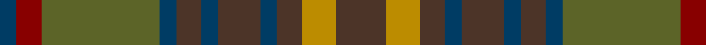

**Bands:** [BRGBBBBBBYB](/stripes/brgbbbbbbyb/) · **Stripes:** [DT R Y DT DO DT DO DT DO LO DO](/stripes/stripes11/) DT R Y DT DO DT DO DT DO LO DO

This was sourced from register-of-tartans.  It is a [11 band tartan](/bands/bands11/).

Original link https://www.tartanregister.gov.uk/tartanDetails.aspx?ref=2113

## Attestations

This cloth appears in 2 source records; the oldest owns this page.

- 01/01/1996 — Limerick, County (register-of-tartans, [record](https://www.tartanregister.gov.uk/tartanDetails.aspx?ref=2113))
- 1996 — Limerick, County (District) (tartans-authority, [record](http://www.tartansauthority.com/tartan-ferret/display/2272/))

## Register references

External register numbers recorded for this tartan.

- Scottish Register of Tartans: [2113](https://www.tartanregister.gov.uk/tartanDetails.aspx?ref=2113)
- Scottish Tartans Authority (ITI): 2272
- Scottish Tartans World Register: 2272

## Thread count
DB/4 DR6 G28 DB4 T6 DB4 T10 DB4 T6 DY8 T/12

## Palette
Each colour and its ΔE from the base-6 reference it is a variant of.

| Colour | Shade | Base | ΔE (OKLab) |
|---|---|---|---|
| DB | <code style="background-color:#003C64;">#003C64</code> `#003C64` | B <code style="background-color:#2A418A;">#2A418A</code> | 0.08 |
| DR | <code style="background-color:#880000;">#880000</code> `#880000` | R <code style="background-color:#CC0000;">#CC0000</code> | 0.15 |
| DY | <code style="background-color:#BC8C00;">#BC8C00</code> `#BC8C00` | Y <code style="background-color:#F2BF00;">#F2BF00</code> | 0.16 |
| G | <code style="background-color:#5C6428;">#5C6428</code> `#5C6428` | G <code style="background-color:#006100;">#006100</code> | 0.10 |
| T | <code style="background-color:#4C3428;">#4C3428</code> `#4C3428` | B <code style="background-color:#2A418A;">#2A418A</code> | 0.17 |

## Nearest tartans

The nearest existing variants by ΔTartan distance.

1. [MacVicar, McVicar, McVicker](/setts/s13/n12dy2ly2dy2n2dy10y12dy3y12dy10n11r2ly2~x2/) — ΔT 0.79
1. [Maple Leaf (District)](/setts/s12/r15g3r3g19dy6y6o6g19r3g3r15y13~x2/) — ΔT 0.90
1. [Hash House Harriers Hunting (Corp)](/setts/s13/g7dy1lb1dy1lo1dy7n7dy1n7dy7g7dy1r1~x4/) — ΔT 1.18
1. [MacAart (Personal)](/setts/s10/dy9k2dy2r2g6k1lo1k1g6r3~x4/) — ΔT 1.22
1. [Lochaber (Ingles Buchan)](/setts/s10/do6o4n22r4k22do22k2r5k2do6~x2/) — ΔT 1.24
1. [United Distillers Corporate Tartan Tartan Number: 2098. Earliest known date: 1989 An expression of evocative Scottish colours to reflect the corporate image of quality and style. (weft) lb4 b24 lb2 dg24 g24 r4 See products available Copyright © Blair Urquhart, Comrie, 2015](/setts/s10/dr12dy1dg12dy12ly2dy12dg12dy1dr12t2~x2/) — ΔT 1.28
1. [Kerry, County](/setts/s15/lo2dt3dy3dt4y16dt3dy3dt4y3dt3dy16dt4y3dt3lo2~x2/) — ΔT 1.30
1. [Jardine, of Castlemilk](/setts/s8/dr9o9n9r1db1o9db1r1~x4/) — ΔT 1.33
1. [Roscommon Irish County Tartan Tartan Number: 2246. Earliest known date: 1996 One of a series of Irish District tartans designed by Polly Wittering of the House of Edgar, with colours reminiscent of the Country with soft warm colours dominating. See products available Copyright © Blair Urquhart, Comrie, 2015](/setts/s10/o5lo3o19do6lo5do6dg12n5dg12n3~x2/) — ΔT 1.33
1. [Lander (2013)](/setts/s15/lo18do3lo3do3lo3do16y16r2ly2r2y16do16lo17do3lo3~x2/) — ΔT 1.35

## Neighbour map

Every grey dot is one of 14313 variants placed by the first two principal components of the ΔTartan feature space (44% of its variance). Red is this tartan; blue dots are its nearest — click one to open its page.

<svg viewBox="0 0 640 380" role="img" style="max-width:100%;height:auto;border:1px solid #e0e0e0;border-radius:4px;display:block" xmlns="http://www.w3.org/2000/svg"><image href="/nn/cloud.v1.png" width="640" height="380"/><a href="/setts/s13/n12dy2ly2dy2n2dy10y12dy3y12dy10n11r2ly2~x2/"><circle cx="200.8" cy="231.6" r="4" fill="#3465a4"><title>MacVicar, McVicar, McVicker</title></circle></a><a href="/setts/s12/r15g3r3g19dy6y6o6g19r3g3r15y13~x2/"><circle cx="228.5" cy="238.1" r="4" fill="#3465a4"><title>Maple Leaf (District)</title></circle></a><a href="/setts/s13/g7dy1lb1dy1lo1dy7n7dy1n7dy7g7dy1r1~x4/"><circle cx="217.9" cy="213.7" r="4" fill="#3465a4"><title>Hash House Harriers Hunting (Corp)</title></circle></a><a href="/setts/s10/dy9k2dy2r2g6k1lo1k1g6r3~x4/"><circle cx="217.3" cy="215.8" r="4" fill="#3465a4"><title>MacAart (Personal)</title></circle></a><a href="/setts/s10/do6o4n22r4k22do22k2r5k2do6~x2/"><circle cx="236.1" cy="205.9" r="4" fill="#3465a4"><title>Lochaber (Ingles Buchan)</title></circle></a><a href="/setts/s10/dr12dy1dg12dy12ly2dy12dg12dy1dr12t2~x2/"><circle cx="234.0" cy="226.1" r="4" fill="#3465a4"><title>United Distillers Corporate Tartan Tartan Number: 2098. Earliest known date: 1989 An expression of evocative Scottish colours to reflect the corporate image of quality and style. (weft) lb4 b24 lb2 dg24 g24 r4 See products available Copyright © Blair Urquhart, Comrie, 2015</title></circle></a><a href="/setts/s15/lo2dt3dy3dt4y16dt3dy3dt4y3dt3dy16dt4y3dt3lo2~x2/"><circle cx="249.6" cy="221.0" r="4" fill="#3465a4"><title>Kerry, County</title></circle></a><a href="/setts/s8/dr9o9n9r1db1o9db1r1~x4/"><circle cx="291.9" cy="233.5" r="4" fill="#3465a4"><title>Jardine, of Castlemilk</title></circle></a><a href="/setts/s10/o5lo3o19do6lo5do6dg12n5dg12n3~x2/"><circle cx="166.9" cy="233.6" r="4" fill="#3465a4"><title>Roscommon Irish County Tartan Tartan Number: 2246. Earliest known date: 1996 One of a series of Irish District tartans designed by Polly Wittering of the House of Edgar, with colours reminiscent of the Country with soft warm colours dominating. See products available Copyright © Blair Urquhart, Comrie, 2015</title></circle></a><a href="/setts/s15/lo18do3lo3do3lo3do16y16r2ly2r2y16do16lo17do3lo3~x2/"><circle cx="222.4" cy="189.6" r="4" fill="#3465a4"><title>Lander (2013)</title></circle></a><circle cx="224.6" cy="228.0" r="5" fill="#c00000"/></svg>

ID: /setts/s11/do6lo4do3dt2do5dt2do3dt2y14r3dt2~x2/
