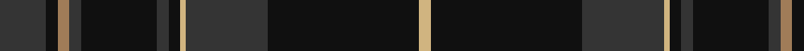

This page is one **sett** — a single exact thread-count. It belongs to the [tartan](/tartans/dn8k2lt2dn2k13dn2k2lg1dn14k26lg2/)
(the same proportion at any scale), whose colour order is pattern [BKRBKBKYBKY](/stripes/bkrbkbkybky/).

Sourced from tartans-authority.  It is a [11 stripe tartan](/stripes/stripes11/).

Original link http://www.tartansauthority.com/tartan-ferret/display/7520/

## Also known as

This cloth is also recorded under:

- Pride of Scotland Hunting/Dark
- Pride of Scotland, Dark

3 attestations — the source records this cloth was collapsed from (oldest owns this page)

<ul>
<li>pre 2008 — Pride of Scotland, Dark (Fashion) (tartans-authority, <a href="http://www.tartansauthority.com/tartan-ferret/display/7520/">record</a>)</li>
<li>undated — Pride of Scotland Dark (register-of-tartans, <a href="https://www.tartanregister.gov.uk/tartanDetails.aspx?ref=5558">record</a>)</li>
<li>undated — Pride of Scotland Hunting/Dark Fashion Tartan Tartan Number: 7520. Earliest known date: 2008 One of a series of tartans from McCalls of Aberdeen based on the Pride of Scotland (2469). See products available Copyright © Blair Urquhart, Comrie, 2015 (house-of-tartan, <a href="http://www.house-of-tartan.scotland.net/house/TartanViewjs.asp?colr=Def&tnam=7520">record</a>)</li>
</ul>

## Register references

External register numbers recorded for this tartan.

- Scottish Register of Tartans: [5558](https://www.tartanregister.gov.uk/tartanDetails.aspx?ref=5558)
- Scottish Tartans Authority (ITI): 7520

## Thread count
DN/16 K4 LT4 DN4 K26 DN4 K4 LG2 DN28 K52 LG/4

## Palette
Each colour and the base-6 reference it is a variant of.

| Colour | Shade | Base |
|---|---|---|
| DN | <code style="background-color:#343434;">#343434</code> `oklch(32.5% 0.000 89.9)` <small>#343434</small> | B <code style="background-color:#2A418A;">#2A418A</code> |
| K | <code style="background-color:#101010;">#101010</code> `oklch(17.3% 0.000 89.9)` <small>#101010</small> | K <code style="background-color:#000000;">#000000</code> |
| LG | <code style="background-color:#D0B480;">#D0B480</code> `oklch(78.2% 0.076 82.6)` <small>#D0B480</small> | Y <code style="background-color:#F2BF00;">#F2BF00</code> |
| LT | <code style="background-color:#A07C58;">#A07C58</code> `oklch(61.2% 0.067 66.0)` <small>#A07C58</small> | R <code style="background-color:#CC0000;">#CC0000</code> |

## Nearest tartans

The nearest existing variants by ΔTartan distance, with this tartan at the top so the swatches line up against it.

ΔTartan

Tartan

Sett

—

<a href="/ttd/edit/#slug=do8k2o2do2k13do2k2ly1do14k26ly2~x2">Pride of Scotland, Dark (Fashion)</a> <a class="nn-out" href="/setts/s11/do8k2o2do2k13do2k2ly1do14k26ly2~x2/" title="open its dictionary page">↗</a>

0.97

<a href="/ttd/edit/#slug=do8k2do2k14do2k2ly1do19k27ly2~x2">Pride of Scotland, Muted (Fashion)</a> <a class="nn-out" href="/setts/s10/do8k2do2k14do2k2ly1do19k27ly2~x2/" title="open its dictionary page">↗</a>

1.10

<a href="/ttd/edit/#slug=k8n1k40n1k16n16dt6n3r3n6~x2">Lochnagar Dark Fashion Tartan Tartan Number: 7327. Earliest known date: 01/01/1999 Inspired by the original works of Fenton Wyness, Dark Lochnagar tartan was designed to encapsulate Lochnagar in all its glory, including the Royal connections. Black &amp; Grey are the primary colours of the tartan and were chosen to reflect 'The steep frowning glories of Dark Lochnagar', a line from Byron's verse. Purple was used for the Royal connections i.e. Queen Victoria's love of the district and Prince Charles book 'The Old Man of Lochnagar'. For the red we used a dye which we have called 'Red Granite' which Lochnagar has an abundance.'/Threadcount and colours aren't 100% original. Generated manually./ See products available Copyright © Blair Urquhart, Comrie, 2015</a> <a class="nn-out" href="/setts/s10/k8n1k40n1k16n16dt6n3r3n6~x2/" title="open its dictionary page">↗</a>

1.13

<a href="/ttd/edit/#slug=k20r1dg3k8dg2k2dg20w2~x2">Scottish Chieftain (Universal)</a> <a class="nn-out" href="/setts/s8/k20r1dg3k8dg2k2dg20w2~x2/" title="open its dictionary page">↗</a>

1.16

<a href="/ttd/edit/#slug=lo4do37db17do4db8do6r2do5db2do3lo4">Griffiths Welsh Name Tartan Tartan Number: 5733. Earliest known date: 2002 The tartan for this Welsh surname and its variation, Griffith, is actually woven in Wales at the Cambrian Woollen Mill, weaving on the same site since 1830. This tartan differs from many traditional patterns in that the warp and weft differ, giving the finished worsted wool cloth more of a predominant stripe, vertically noticeable in the finished Kilt, or Cilt in Wales. Available from Wales Tartan Centres in Swansea See products available Copyright © Blair Urquhart, Comrie, 2015</a> <a class="nn-out" href="/setts/s11/lo4do37db17do4db8do6r2do5db2do3lo4/" title="open its dictionary page">↗</a>

1.27

<a href="/ttd/edit/#slug=k20dg1k2dg1k20ly1dg16r2dg16ly1k30dg1~x2">Milne of Corstorphine #1 (Personal)</a> <a class="nn-out" href="/setts/s12/k20dg1k2dg1k20ly1dg16r2dg16ly1k30dg1~x2/" title="open its dictionary page">↗</a>

1.29

<a href="/ttd/edit/#slug=k10db4k34dt2k2dt30w3~x2">Patriot, The (Fashion)</a> <a class="nn-out" href="/setts/s7/k10db4k34dt2k2dt30w3~x2/" title="open its dictionary page">↗</a>

1.29

<a href="/ttd/edit/#slug=r1k1dt30k6dt1k6dy8k1r1~x2">Klappert Original (Odsherred, Denmark) (Personal)</a> <a class="nn-out" href="/setts/s9/r1k1dt30k6dt1k6dy8k1r1~x2/" title="open its dictionary page">↗</a>

1.34

<a href="/ttd/edit/#slug=k28r1k2r1k8db24dg2db3~x2">Home or Hume (Vestiarium Scoticum)</a> <a class="nn-out" href="/setts/s8/k28r1k2r1k8db24dg2db3~x2/" title="open its dictionary page">↗</a>

1.34

<a href="/ttd/edit/#slug=r4dg10lo1lb1dt4lb1dt25r2~x2">Raymond of Doune</a> <a class="nn-out" href="/setts/s8/r4dg10lo1lb1dt4lb1dt25r2~x2/" title="open its dictionary page">↗</a>

1.37

<a href="/ttd/edit/#slug=k48dp5k9g3k2g3k2g14dp7k2dp10~x2">Paxton (Personal)</a> <a class="nn-out" href="/setts/s11/k48dp5k9g3k2g3k2g14dp7k2dp10~x2/" title="open its dictionary page">↗</a>

## Neighbour map

Every grey dot is one of 14299 variants placed by the first two principal components of the ΔTartan feature space (44% of its variance). Red is this tartan; blue dots are its nearest — click one to open its page.

<svg viewBox="0 0 640 380" role="img" style="max-width:100%;height:auto;border:1px solid #e0e0e0;border-radius:4px;display:block" xmlns="http://www.w3.org/2000/svg"><image href="/nn/cloud.v1.png" width="640" height="380"/><a href="/setts/s10/do8k2do2k14do2k2ly1do19k27ly2~x2/"><circle cx="458.9" cy="202.1" r="4" fill="#3465a4"><title>Pride of Scotland, Muted (Fashion)</title></circle></a><a href="/setts/s10/k8n1k40n1k16n16dt6n3r3n6~x2/"><circle cx="469.4" cy="159.2" r="4" fill="#3465a4"><title>Lochnagar Dark Fashion Tartan Tartan Number: 7327. Earliest known date: 01/01/1999 Inspired by the original works of Fenton Wyness, Dark Lochnagar tartan was designed to encapsulate Lochnagar in all its glory, including the Royal connections. Black &amp; Grey are the primary colours of the tartan and were chosen to reflect 'The steep frowning glories of Dark Lochnagar', a line from Byron's verse. Purple was used for the Royal connections i.e. Queen Victoria's love of the district and Prince Charles book 'The Old Man of Lochnagar'. For the red we used a dye which we have called 'Red Granite' which Lochnagar has an abundance.'/Threadcount and colours aren't 100% original. Generated manually./ See products available Copyright © Blair Urquhart, Comrie, 2015</title></circle></a><a href="/setts/s8/k20r1dg3k8dg2k2dg20w2~x2/"><circle cx="393.1" cy="205.7" r="4" fill="#3465a4"><title>Scottish Chieftain (Universal)</title></circle></a><a href="/setts/s11/lo4do37db17do4db8do6r2do5db2do3lo4/"><circle cx="429.5" cy="176.6" r="4" fill="#3465a4"><title>Griffiths Welsh Name Tartan Tartan Number: 5733. Earliest known date: 2002 The tartan for this Welsh surname and its variation, Griffith, is actually woven in Wales at the Cambrian Woollen Mill, weaving on the same site since 1830. This tartan differs from many traditional patterns in that the warp and weft differ, giving the finished worsted wool cloth more of a predominant stripe, vertically noticeable in the finished Kilt, or Cilt in Wales. Available from Wales Tartan Centres in Swansea See products available Copyright © Blair Urquhart, Comrie, 2015</title></circle></a><a href="/setts/s12/k20dg1k2dg1k20ly1dg16r2dg16ly1k30dg1~x2/"><circle cx="462.2" cy="168.4" r="4" fill="#3465a4"><title>Milne of Corstorphine #1 (Personal)</title></circle></a><a href="/setts/s7/k10db4k34dt2k2dt30w3~x2/"><circle cx="388.7" cy="210.9" r="4" fill="#3465a4"><title>Patriot, The (Fashion)</title></circle></a><a href="/setts/s9/r1k1dt30k6dt1k6dy8k1r1~x2/"><circle cx="444.3" cy="164.8" r="4" fill="#3465a4"><title>Klappert Original (Odsherred, Denmark) (Personal)</title></circle></a><a href="/setts/s8/k28r1k2r1k8db24dg2db3~x2/"><circle cx="424.4" cy="177.9" r="4" fill="#3465a4"><title>Home or Hume (Vestiarium Scoticum)</title></circle></a><a href="/setts/s8/r4dg10lo1lb1dt4lb1dt25r2~x2/"><circle cx="416.3" cy="162.5" r="4" fill="#3465a4"><title>Raymond of Doune</title></circle></a><a href="/setts/s11/k48dp5k9g3k2g3k2g14dp7k2dp10~x2/"><circle cx="394.6" cy="147.1" r="4" fill="#3465a4"><title>Paxton (Personal)</title></circle></a><circle cx="429.6" cy="175.7" r="5" fill="#c00000"/></svg>

ID: /setts/s11/do8k2o2do2k13do2k2ly1do14k26ly2~x2/
