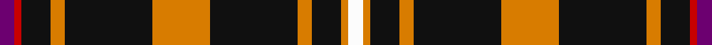

In pattern [BRKYKYKYKYW](/stripes/brkykykykyw/).

This was sourced from register-of-tartans.  It is a [11 stripe tartan](/stripes/stripes11/).

Original link https://www.tartanregister.gov.uk/tartanDetails.aspx?ref=1314

## Register references

External register numbers recorded for this tartan.

- Scottish Register of Tartans: [1314](https://www.tartanregister.gov.uk/tartanDetails.aspx?ref=1314)
- Scottish Tartans Authority (ITI): 564
- Scottish Tartans World Register: 564

## Thread count
P/8 R4 K16 O8 K48 O32 K48 O8 K16 O4 W/8

## Palette
Each colour and the base-6 reference it is a variant of.

| Colour | Shade | Base |
|---|---|---|
| K | <code style="background-color:#101010;">#101010</code> `oklch(17.3% 0.000 89.9)` <small>#101010</small> | K <code style="background-color:#000000;">#000000</code> |
| O | <code style="background-color:#D87C00;">#D87C00</code> `oklch(67.3% 0.155 61.8)` <small>#D87C00</small> | Y <code style="background-color:#F2BF00;">#F2BF00</code> |
| P | <code style="background-color:#6C0070;">#6C0070</code> `oklch(37.6% 0.174 326.5)` <small>#6C0070</small> | B <code style="background-color:#2A418A;">#2A418A</code> |
| R | <code style="background-color:#C80000;">#C80000</code> `oklch(52.3% 0.215 29.2)` <small>#C80000</small> | R <code style="background-color:#CC0000;">#CC0000</code> |
| W | <code style="background-color:#FCFCFC;">#FCFCFC</code> `oklch(99.1% 0.000 89.9)` <small>#FCFCFC</small> | W <code style="background-color:#F7F7F7;">#F7F7F7</code> |

## Nearest tartans

The nearest existing variants by ΔTartan distance.

1. [Gary Personal Tartan Tartan Number: 564. Earliest known date: 1985 Restricted See products available Copyright © Blair Urquhart, Comrie, 2015](/setts/s11/dp2r1k4ly2k12ly8k12ly2k4ly1w2~x2/) — ΔT 0.66
1. [Gary](/setts/s11/p2r1k4ly2k12ly8k12ly2k4ly1w2~x2/) — ΔT 0.98
1. [Muylle, Jelle (Personal)](/setts/s9/k5r1ly1k1ly1r1k8b1w1~x6/) — ΔT 1.21
1. [Malt, The (Corporate)](/setts/s12/k20r2k4r2k19o17k10o10k6o5ly2o2~x2/) — ΔT 1.30
1. [Woodberry Forest School (Corporate)](/setts/s10/r6k3w3k3w3k34r6g5r6k5~x2/) — ΔT 1.35
1. [Holestone (Corporate)](/setts/s8/k4lo8k26o6g15o6k26w2~x2/) — ΔT 1.35
1. [Malt, The](/setts/s12/k20r2k4r2k19r17k10r10k6r5ly2r2~x2/) — ΔT 1.38
1. [Callaway Corporate Tartan Tartan Number: 2313. Earliest known date: pre 1997 Designed by Arthur Bell (Scotch Tweeds) for a golf course and golf merchandising company in California. See products available Copyright © Blair Urquhart, Comrie, 2015](/setts/s10/k10n2lb5k5r1k5lb5n2k10r1~x4/) — ΔT 1.40
1. [Livingston Football Club](/setts/s11/ly11k4m2k3ly2k4ly15k32ly2k5w2~x2/) — ΔT 1.43
1. [St Patrick's Krewe](/setts/s8/dg50r5dg8w10dg8db8dg8lo21~x2/) — ΔT 1.44

## Neighbour map

Every grey dot is one of 14299 variants placed by the first two principal components of the ΔTartan feature space (44% of its variance). Red is this tartan; blue dots are its nearest — click one to open its page.

<svg viewBox="0 0 640 380" role="img" style="max-width:100%;height:auto;border:1px solid #e0e0e0;border-radius:4px;display:block" xmlns="http://www.w3.org/2000/svg"><image href="/nn/cloud.v1.png" width="640" height="380"/><a href="/setts/s11/dp2r1k4ly2k12ly8k12ly2k4ly1w2~x2/"><circle cx="298.1" cy="147.3" r="4" fill="#3465a4"><title>Gary Personal Tartan Tartan Number: 564. Earliest known date: 1985 Restricted See products available Copyright © Blair Urquhart, Comrie, 2015</title></circle></a><a href="/setts/s11/p2r1k4ly2k12ly8k12ly2k4ly1w2~x2/"><circle cx="294.6" cy="150.2" r="4" fill="#3465a4"><title>Gary</title></circle></a><a href="/setts/s9/k5r1ly1k1ly1r1k8b1w1~x6/"><circle cx="338.6" cy="160.4" r="4" fill="#3465a4"><title>Muylle, Jelle (Personal)</title></circle></a><a href="/setts/s12/k20r2k4r2k19o17k10o10k6o5ly2o2~x2/"><circle cx="321.2" cy="184.0" r="4" fill="#3465a4"><title>Malt, The (Corporate)</title></circle></a><a href="/setts/s10/r6k3w3k3w3k34r6g5r6k5~x2/"><circle cx="325.5" cy="150.1" r="4" fill="#3465a4"><title>Woodberry Forest School (Corporate)</title></circle></a><a href="/setts/s8/k4lo8k26o6g15o6k26w2~x2/"><circle cx="287.6" cy="180.9" r="4" fill="#3465a4"><title>Holestone (Corporate)</title></circle></a><a href="/setts/s12/k20r2k4r2k19r17k10r10k6r5ly2r2~x2/"><circle cx="307.2" cy="171.2" r="4" fill="#3465a4"><title>Malt, The</title></circle></a><a href="/setts/s10/k10n2lb5k5r1k5lb5n2k10r1~x4/"><circle cx="308.6" cy="199.3" r="4" fill="#3465a4"><title>Callaway Corporate Tartan Tartan Number: 2313. Earliest known date: pre 1997 Designed by Arthur Bell (Scotch Tweeds) for a golf course and golf merchandising company in California. See products available Copyright © Blair Urquhart, Comrie, 2015</title></circle></a><a href="/setts/s11/ly11k4m2k3ly2k4ly15k32ly2k5w2~x2/"><circle cx="304.3" cy="116.6" r="4" fill="#3465a4"><title>Livingston Football Club</title></circle></a><a href="/setts/s8/dg50r5dg8w10dg8db8dg8lo21~x2/"><circle cx="294.4" cy="164.9" r="4" fill="#3465a4"><title>St Patrick's Krewe</title></circle></a><circle cx="311.6" cy="151.6" r="5" fill="#c00000"/></svg>

ID: /setts/s11/dp2r1k4lo2k12lo8k12lo2k4lo1w2~x4/
