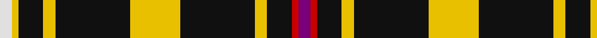

**Bands:** [BRKYKYKYKYW](/stripes/brkykykykyw/) · **Stripes:** [DP R K LY K LY K LY K LY W](/stripes/stripes11/) DP R K LY K LY K LY K LY W

This was sourced from house-of-tartan.  It is a [11 band tartan](/bands/bands11/).

Original link http://www.house-of-tartan.scotland.net/house/TartanViewjs.asp?colr=Def&tnam=564

## Thread count
LN/4 Y2 K8 Y4 K24 Y16 K24 Y4 K8 R2 P/4

## Palette
Each colour and its ΔE from the base-6 reference it is a variant of.

| Colour | Shade | Base | ΔE (OKLab) |
|---|---|---|---|
| K | <code style="background-color:#101010;">#101010</code> `#101010` | K <code style="background-color:#000000;">#000000</code> | 0.17 |
| LN | <code style="background-color:#E0E0E0;">#E0E0E0</code> `#E0E0E0` | W <code style="background-color:#F7F7F7;">#F7F7F7</code> | 0.07 |
| P | <code style="background-color:#780078;">#780078</code> `#780078` | B <code style="background-color:#2A418A;">#2A418A</code> | 0.17 |
| R | <code style="background-color:#C80000;">#C80000</code> `#C80000` | R <code style="background-color:#CC0000;">#CC0000</code> | 0.01 |
| Y | <code style="background-color:#E8C000;">#E8C000</code> `#E8C000` | Y <code style="background-color:#F2BF00;">#F2BF00</code> | 0.02 |

## Nearest tartans

The nearest existing variants by ΔTartan distance.

1. [Gary (Personal)](/setts/s11/dp2r1k4lo2k12lo8k12lo2k4lo1w2~x4/) — ΔT 0.66
1. [Gary](/setts/s11/p2r1k4ly2k12ly8k12ly2k4ly1w2~x2/) — ΔT 0.97
1. [Livingston Football Club](/setts/s11/ly11k4m2k3ly2k4ly15k32ly2k5w2~x2/) — ΔT 1.12
1. [St Patrick's Krewe](/setts/s8/dg50r5dg8w10dg8db8dg8lo21~x2/) — ΔT 1.17
1. [Muylle, Jelle (Personal)](/setts/s9/k5r1ly1k1ly1r1k8b1w1~x6/) — ΔT 1.28
1. [Ashers of Nairn](/setts/s10/lo4k3w3k44lo4k22lb22w3k3lo4/) — ΔT 1.38
1. [Holestone (Corporate)](/setts/s8/k4lo8k26o6g15o6k26w2~x2/) — ΔT 1.44
1. [Callaway Corporate Tartan Tartan Number: 2313. Earliest known date: pre 1997 Designed by Arthur Bell (Scotch Tweeds) for a golf course and golf merchandising company in California. See products available Copyright © Blair Urquhart, Comrie, 2015](/setts/s10/k10n2lb5k5r1k5lb5n2k10r1~x4/) — ΔT 1.48
1. [Woodberry Forest School (Corporate)](/setts/s10/r6k3w3k3w3k34r6g5r6k5~x2/) — ΔT 1.49
1. [Braddock Family (Northumberland) (Personal)](/setts/s11/w5k4db2k5ly2r2ly2k30g3w7k4~x2/) — ΔT 1.56

## Neighbour map

Every grey dot is one of 14313 variants placed by the first two principal components of the ΔTartan feature space (44% of its variance). Red is this tartan; blue dots are its nearest — click one to open its page.

<svg viewBox="0 0 640 380" role="img" style="max-width:100%;height:auto;border:1px solid #e0e0e0;border-radius:4px;display:block" xmlns="http://www.w3.org/2000/svg"><image href="/nn/cloud.v1.png" width="640" height="380"/><a href="/setts/s11/dp2r1k4lo2k12lo8k12lo2k4lo1w2~x4/"><circle cx="311.8" cy="151.8" r="4" fill="#3465a4"><title>Gary (Personal)</title></circle></a><a href="/setts/s11/p2r1k4ly2k12ly8k12ly2k4ly1w2~x2/"><circle cx="294.7" cy="150.4" r="4" fill="#3465a4"><title>Gary</title></circle></a><a href="/setts/s11/ly11k4m2k3ly2k4ly15k32ly2k5w2~x2/"><circle cx="304.5" cy="116.7" r="4" fill="#3465a4"><title>Livingston Football Club</title></circle></a><a href="/setts/s8/dg50r5dg8w10dg8db8dg8lo21~x2/"><circle cx="294.5" cy="165.1" r="4" fill="#3465a4"><title>St Patrick's Krewe</title></circle></a><a href="/setts/s9/k5r1ly1k1ly1r1k8b1w1~x6/"><circle cx="338.7" cy="160.6" r="4" fill="#3465a4"><title>Muylle, Jelle (Personal)</title></circle></a><a href="/setts/s10/lo4k3w3k44lo4k22lb22w3k3lo4/"><circle cx="336.1" cy="137.7" r="4" fill="#3465a4"><title>Ashers of Nairn</title></circle></a><a href="/setts/s8/k4lo8k26o6g15o6k26w2~x2/"><circle cx="287.6" cy="181.0" r="4" fill="#3465a4"><title>Holestone (Corporate)</title></circle></a><a href="/setts/s10/k10n2lb5k5r1k5lb5n2k10r1~x4/"><circle cx="308.6" cy="199.5" r="4" fill="#3465a4"><title>Callaway Corporate Tartan Tartan Number: 2313. Earliest known date: pre 1997 Designed by Arthur Bell (Scotch Tweeds) for a golf course and golf merchandising company in California. See products available Copyright © Blair Urquhart, Comrie, 2015</title></circle></a><a href="/setts/s10/r6k3w3k3w3k34r6g5r6k5~x2/"><circle cx="325.7" cy="150.3" r="4" fill="#3465a4"><title>Woodberry Forest School (Corporate)</title></circle></a><a href="/setts/s11/w5k4db2k5ly2r2ly2k30g3w7k4~x2/"><circle cx="312.3" cy="98.8" r="4" fill="#3465a4"><title>Braddock Family (Northumberland) (Personal)</title></circle></a><circle cx="298.3" cy="147.5" r="5" fill="#c00000"/></svg>

ID: /setts/s11/dp2r1k4ly2k12ly8k12ly2k4ly1w2~x2/
