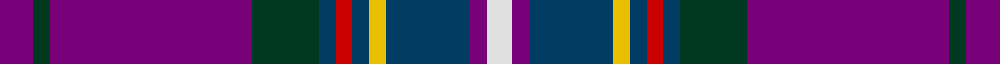

This page is one **sett** — a single exact thread-count. It belongs to the [tartan](/tartans/p4dg2p24dg8db2r2db2y2db10p2ln3/)
(the same proportion at any scale), whose colour order is pattern [BGBGBRBYBBW](/stripes/bgbgbrbybbw/).

Sourced from register-of-tartans.  It is a [11 stripe tartan](/stripes/stripes11/).

Original link https://www.tartanregister.gov.uk/tartanDetails.aspx?ref=2875

2 attestations — the source records this cloth was collapsed from (oldest owns this page)

<ul>
<li>01/06/1997 — McCartney (Day) (register-of-tartans, <a href="https://www.tartanregister.gov.uk/tartanDetails.aspx?ref=2875">record</a>)</li>
<li>June 1997 — McCartney (Day) (Corporate) (tartans-authority, <a href="http://www.tartansauthority.com/tartan-ferret/display/2593/">record</a>)</li>
</ul>

## Register references

External register numbers recorded for this tartan.

- Scottish Register of Tartans: [2875](https://www.tartanregister.gov.uk/tartanDetails.aspx?ref=2875)
- Scottish Tartans Authority (ITI): 2593
- Scottish Tartans World Register: 2593

## Thread count
P/8 DG4 P48 DG16 DB4 R4 DB4 Y4 DB20 P4 LN/6

## Palette
Each colour and the base-6 reference it is a variant of.

| Colour | Shade | Base |
|---|---|---|
| DB | <code style="background-color:#003C64;">#003C64</code> `oklch(34.5% 0.089 246.0)` <small>#003C64</small> | B <code style="background-color:#2A418A;">#2A418A</code> |
| DG | <code style="background-color:#003820;">#003820</code> `oklch(30.0% 0.070 158.3)` <small>#003820</small> | G <code style="background-color:#006100;">#006100</code> |
| LN | <code style="background-color:#E0E0E0;">#E0E0E0</code> `oklch(90.7% 0.000 89.9)` <small>#E0E0E0</small> | W <code style="background-color:#F7F7F7;">#F7F7F7</code> |
| P | <code style="background-color:#780078;">#780078</code> `oklch(40.2% 0.185 328.4)` <small>#780078</small> | B <code style="background-color:#2A418A;">#2A418A</code> |
| R | <code style="background-color:#C80000;">#C80000</code> `oklch(52.3% 0.215 29.2)` <small>#C80000</small> | R <code style="background-color:#CC0000;">#CC0000</code> |
| Y | <code style="background-color:#E8C000;">#E8C000</code> `oklch(81.9% 0.168 93.7)` <small>#E8C000</small> | Y <code style="background-color:#F2BF00;">#F2BF00</code> |

## Nearest tartans

The nearest existing variants by ΔTartan distance, with this tartan at the top so the swatches line up against it.

ΔTartan

Tartan

Sett

—

<a href="/ttd/edit/#slug=dp4dg2dp24dg8dt2r2dt2ly2dt10dp2w3~x2">McCartney (Day)</a> <a class="nn-out" href="/setts/s11/dp4dg2dp24dg8dt2r2dt2ly2dt10dp2w3~x2/" title="open its dictionary page">↗</a>

0.77

<a href="/ttd/edit/#slug=dp10db1dp2db1b1db1b2m2b1k1ly2~x10">Lieuwen, Jeffrey Pascal (Personal)</a> <a class="nn-out" href="/setts/s11/dp10db1dp2db1b1db1b2m2b1k1ly2~x10/" title="open its dictionary page">↗</a>

0.99

<a href="/ttd/edit/#slug=p4dg2p24dg8k2r2k2ly2k10p2w3~x2">McCartney (Day)</a> <a class="nn-out" href="/setts/s11/p4dg2p24dg8k2r2k2ly2k10p2w3~x2/" title="open its dictionary page">↗</a>

1.04

<a href="/setts/s10/g4ly3db35r13dp8w3~x2/">Kilsyth</a>

1.05

<a href="/ttd/edit/#slug=w1db11ly1r2o1r2r2w1r2r2o1r2ly1db11ly1~x8">Wisconsin in Scotland (Corporate)</a> <a class="nn-out" href="/setts/s15/w1db11ly1r2o1r2r2w1r2r2o1r2ly1db11ly1~x8/" title="open its dictionary page">↗</a>

1.08

<a href="/ttd/edit/#slug=db20ly1dy1db3k1o2k1r10k1o2r4~x4">Blais (Personal)</a> <a class="nn-out" href="/setts/s11/db20ly1dy1db3k1o2k1r10k1o2r4~x4/" title="open its dictionary page">↗</a>

1.09

<a href="/ttd/edit/#slug=dp10db1dp2db1lg1db1lg2lp2lg1k1ly2~x10">Lieuwen (2013)</a> <a class="nn-out" href="/setts/s11/dp10db1dp2db1lg1db1lg2lp2lg1k1ly2~x10/" title="open its dictionary page">↗</a>

1.19

<a href="/ttd/edit/#slug=dg4t2db18r2k4r6t1w1~x4">Glenn</a> <a class="nn-out" href="/setts/s8/dg4t2db18r2k4r6t1w1~x4/" title="open its dictionary page">↗</a>

1.19

<a href="/ttd/edit/#slug=n31k4n4k4n4k4n6w5k4o3dp19o3n4r3~x2">Sydney Academy</a> <a class="nn-out" href="/setts/s14/n31k4n4k4n4k4n6w5k4o3dp19o3n4r3~x2/" title="open its dictionary page">↗</a>

1.22

<a href="/ttd/edit/#slug=db20ly1o1db3k1y2k1r10k1y2r4~x2">Blais</a> <a class="nn-out" href="/setts/s11/db20ly1o1db3k1y2k1r10k1y2r4~x2/" title="open its dictionary page">↗</a>

1.26

<a href="/setts/s16/db4lb3o30lb3dp16lb3dp10dp48g4~x2/">Heather (RSPCC)</a>

## Neighbour map

Every grey dot is one of 14299 variants placed by the first two principal components of the ΔTartan feature space (44% of its variance). Red is this tartan; blue dots are its nearest — click one to open its page.

<svg viewBox="0 0 640 380" role="img" style="max-width:100%;height:auto;border:1px solid #e0e0e0;border-radius:4px;display:block" xmlns="http://www.w3.org/2000/svg"><image href="/nn/cloud.v1.png" width="640" height="380"/><a href="/setts/s11/dp10db1dp2db1b1db1b2m2b1k1ly2~x10/"><circle cx="234.5" cy="128.6" r="4" fill="#3465a4"><title>Lieuwen, Jeffrey Pascal (Personal)</title></circle></a><a href="/setts/s11/p4dg2p24dg8k2r2k2ly2k10p2w3~x2/"><circle cx="225.1" cy="115.5" r="4" fill="#3465a4"><title>McCartney (Day)</title></circle></a><a href="/setts/s10/g4ly3db35r13dp8w3~x2/"><circle cx="264.9" cy="141.5" r="4" fill="#3465a4"><title>Kilsyth</title></circle></a><a href="/setts/s15/w1db11ly1r2o1r2r2w1r2r2o1r2ly1db11ly1~x8/"><circle cx="244.1" cy="105.3" r="4" fill="#3465a4"><title>Wisconsin in Scotland (Corporate)</title></circle></a><a href="/setts/s11/db20ly1dy1db3k1o2k1r10k1o2r4~x4/"><circle cx="285.5" cy="95.2" r="4" fill="#3465a4"><title>Blais (Personal)</title></circle></a><a href="/setts/s11/dp10db1dp2db1lg1db1lg2lp2lg1k1ly2~x10/"><circle cx="214.7" cy="116.6" r="4" fill="#3465a4"><title>Lieuwen (2013)</title></circle></a><a href="/setts/s8/dg4t2db18r2k4r6t1w1~x4/"><circle cx="237.4" cy="127.7" r="4" fill="#3465a4"><title>Glenn</title></circle></a><a href="/setts/s14/n31k4n4k4n4k4n6w5k4o3dp19o3n4r3~x2/"><circle cx="229.6" cy="123.4" r="4" fill="#3465a4"><title>Sydney Academy</title></circle></a><a href="/setts/s11/db20ly1o1db3k1y2k1r10k1y2r4~x2/"><circle cx="283.4" cy="95.2" r="4" fill="#3465a4"><title>Blais</title></circle></a><a href="/setts/s16/db4lb3o30lb3dp16lb3dp10dp48g4~x2/"><circle cx="207.2" cy="104.1" r="4" fill="#3465a4"><title>Heather (RSPCC)</title></circle></a><circle cx="246.8" cy="127.2" r="5" fill="#c00000"/></svg>

ID: /setts/s11/dp4dg2dp24dg8dt2r2dt2ly2dt10dp2w3~x2/
