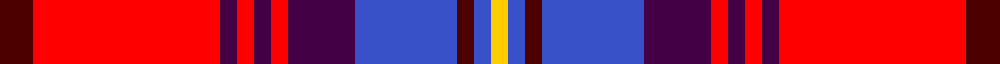

This page is one **sett** — a single exact thread-count. It belongs to the [tartan](/tartans/dr2r11dp1r1dp1r1dp4b6dr1b1ly1/)
(the same proportion at any scale), whose colour order is pattern [BRBRBRBBBBY](/stripes/brbrbrbbbby/).

Sourced from register-of-tartans.  It is a [11 stripe tartan](/stripes/stripes11/).

Original link https://www.tartanregister.gov.uk/tartanDetails.aspx?ref=11135

## Register references

External register numbers recorded for this tartan.

- Scottish Register of Tartans: [11135](https://www.tartanregister.gov.uk/tartanDetails.aspx?ref=11135)

## Thread count
DR/8 R44 DP4 R4 DP4 R4 DP16 B24 DR4 B4 Y/4

## Palette

Palette: <strong>Tartan Register</strong> <small style="color:#888">(4 of 5 colours)</small>
<table><thead><tr><th>Colour</th><th>Threads</th><th>Shade</th><th>Base</th><th>OKLCh</th></tr></thead><tbody><tr><td>DR/</td><td style="text-align:right;font-variant-numeric:tabular-nums">8</td><td><code style="background-color:#4C0000;">#4C0000</code> <small style="color:#888">#4C0000</small></td><td>B <code style="background-color:#2A418A;">#2A418A</code></td><td><small style="color:#888">oklch(26.2% 0.107 29.2)</small></td></tr><tr><td>R</td><td style="text-align:right;font-variant-numeric:tabular-nums">44</td><td><code style="background-color:#FF0000;">#FF0000</code> <small style="color:#888">#FF0000</small></td><td>R <code style="background-color:#CC0000;">#CC0000</code></td><td><small style="color:#888">oklch(62.8% 0.258 29.2)</small></td></tr><tr><td>DP</td><td style="text-align:right;font-variant-numeric:tabular-nums">4</td><td><code style="background-color:#440044;">#440044</code> <small style="color:#888">#440044</small></td><td>B <code style="background-color:#2A418A;">#2A418A</code></td><td><small style="color:#888">oklch(27.1% 0.125 328.4)</small></td></tr><tr><td>R</td><td style="text-align:right;font-variant-numeric:tabular-nums">4</td><td><code style="background-color:#FF0000;">#FF0000</code> <small style="color:#888">#FF0000</small></td><td>R <code style="background-color:#CC0000;">#CC0000</code></td><td><small style="color:#888">oklch(62.8% 0.258 29.2)</small></td></tr><tr><td>DP</td><td style="text-align:right;font-variant-numeric:tabular-nums">4</td><td><code style="background-color:#440044;">#440044</code> <small style="color:#888">#440044</small></td><td>B <code style="background-color:#2A418A;">#2A418A</code></td><td><small style="color:#888">oklch(27.1% 0.125 328.4)</small></td></tr><tr><td>R</td><td style="text-align:right;font-variant-numeric:tabular-nums">4</td><td><code style="background-color:#FF0000;">#FF0000</code> <small style="color:#888">#FF0000</small></td><td>R <code style="background-color:#CC0000;">#CC0000</code></td><td><small style="color:#888">oklch(62.8% 0.258 29.2)</small></td></tr><tr><td>DP</td><td style="text-align:right;font-variant-numeric:tabular-nums">16</td><td><code style="background-color:#440044;">#440044</code> <small style="color:#888">#440044</small></td><td>B <code style="background-color:#2A418A;">#2A418A</code></td><td><small style="color:#888">oklch(27.1% 0.125 328.4)</small></td></tr><tr><td>B</td><td style="text-align:right;font-variant-numeric:tabular-nums">24</td><td><code style="background-color:#3850C8;">#3850C8</code> <small style="color:#888">#3850C8</small></td><td>B <code style="background-color:#2A418A;">#2A418A</code></td><td><small style="color:#888">oklch(48.8% 0.188 269.4)</small></td></tr><tr><td>DR</td><td style="text-align:right;font-variant-numeric:tabular-nums">4</td><td><code style="background-color:#4C0000;">#4C0000</code> <small style="color:#888">#4C0000</small></td><td>B <code style="background-color:#2A418A;">#2A418A</code></td><td><small style="color:#888">oklch(26.2% 0.107 29.2)</small></td></tr><tr><td>B</td><td style="text-align:right;font-variant-numeric:tabular-nums">4</td><td><code style="background-color:#3850C8;">#3850C8</code> <small style="color:#888">#3850C8</small></td><td>B <code style="background-color:#2A418A;">#2A418A</code></td><td><small style="color:#888">oklch(48.8% 0.188 269.4)</small></td></tr><tr><td>Y/</td><td style="text-align:right;font-variant-numeric:tabular-nums">4</td><td><code style="background-color:#FFCC00;">#FFCC00</code> <small style="color:#888">#FFCC00</small></td><td>Y <code style="background-color:#F2BF00;">#F2BF00</code></td><td><small style="color:#888">oklch(86.5% 0.177 90.4)</small></td></tr></tbody></table>

## Nearest tartans

The nearest existing variants by ΔTartan distance, with this tartan at the top so the swatches line up against it.

ΔTartan

Tartan

Sett

—

<a href="/ttd/edit/#slug=dr2r11dp1r1dp1r1dp4b6dr1b1ly1~x4">NHK Asaichi</a> <a class="nn-out" href="/setts/s11/dr2r11dp1r1dp1r1dp4b6dr1b1ly1~x4/" title="open its dictionary page">↗</a>

1.07

<a href="/ttd/edit/#slug=k4r32db9ri6db2ri3db2ri12lb3">Rose VS</a> <a class="nn-out" href="/setts/s9/k4r32db9ri6db2ri3db2ri12lb3/" title="open its dictionary page">↗</a>

1.14

<a href="/ttd/edit/#slug=ly4r2k9r25k3r2k3r4db15w3~x2">Royal &amp; Ancient/Golfing Stewart</a> <a class="nn-out" href="/setts/s10/ly4r2k9r25k3r2k3r4db15w3~x2/" title="open its dictionary page">↗</a>

1.25

<a href="/ttd/edit/#slug=r7ly3r27k14m5k3m5k3m8g3m4g4~x2">Scotland's People</a> <a class="nn-out" href="/setts/s12/r7ly3r27k14m5k3m5k3m8g3m4g4~x2/" title="open its dictionary page">↗</a>

1.30

<a href="/ttd/edit/#slug=dy2r11db1r1db1r1db4dbi6dy1dbi1ly1~x4">NHK Asaichi</a> <a class="nn-out" href="/setts/s11/dy2r11db1r1db1r1db4dbi6dy1dbi1ly1~x4/" title="open its dictionary page">↗</a>

1.30

<a href="/ttd/edit/#slug=r9k1g1k1dp6k1dp6ly1k2~x6">Red Chapeau</a> <a class="nn-out" href="/setts/s9/r9k1g1k1dp6k1dp6ly1k2~x6/" title="open its dictionary page">↗</a>

1.31

<a href="/ttd/edit/#slug=r24ri5lr7dt2lr4dt14r11dt3r3w4~x2">MIT1951</a> <a class="nn-out" href="/setts/s10/r24ri5lr7dt2lr4dt14r11dt3r3w4~x2/" title="open its dictionary page">↗</a>

1.38

<a href="/ttd/edit/#slug=db3w12k11r4w2r2w2r24ly3~x2">Hearts Football Club (Corporate)</a> <a class="nn-out" href="/setts/s9/db3w12k11r4w2r2w2r24ly3~x2/" title="open its dictionary page">↗</a>

1.41

<a href="/ttd/edit/#slug=w4k1r12db3r3db16r3db3r12k1ly4~x2">MacKeever</a> <a class="nn-out" href="/setts/s11/w4k1r12db3r3db16r3db3r12k1ly4~x2/" title="open its dictionary page">↗</a>

1.42

<a href="/ttd/edit/#slug=lo4r2k9r25k3r2k3r4db15w3~x2">Golfers</a> <a class="nn-out" href="/setts/s10/lo4r2k9r25k3r2k3r4db15w3~x2/" title="open its dictionary page">↗</a>

1.45

<a href="/ttd/edit/#slug=k3r4db2r20db20r2dg2r6dg10r6w2r3k2~x2">Cameron of Locheil (Bonner collection)</a> <a class="nn-out" href="/setts/s13/k3r4db2r20db20r2dg2r6dg10r6w2r3k2~x2/" title="open its dictionary page">↗</a>

## Neighbour map

Every grey dot is one of 14359 variants placed by the first two principal components of the ΔTartan feature space (44% of its variance). Red is this tartan; blue dots are its nearest — click one to open its page.

<svg viewBox="0 0 640 380" role="img" style="max-width:100%;height:auto;border:1px solid #e0e0e0;border-radius:4px;display:block" xmlns="http://www.w3.org/2000/svg"><image href="/nn/cloud.v1.png" width="640" height="380"/><a href="/setts/s9/k4r32db9ri6db2ri3db2ri12lb3/"><circle cx="237.4" cy="114.1" r="4" fill="#3465a4"><title>Rose VS</title></circle></a><a href="/setts/s10/ly4r2k9r25k3r2k3r4db15w3~x2/"><circle cx="221.8" cy="129.0" r="4" fill="#3465a4"><title>Royal &amp; Ancient/Golfing Stewart</title></circle></a><a href="/setts/s12/r7ly3r27k14m5k3m5k3m8g3m4g4~x2/"><circle cx="170.9" cy="139.8" r="4" fill="#3465a4"><title>Scotland's People</title></circle></a><a href="/setts/s11/dy2r11db1r1db1r1db4dbi6dy1dbi1ly1~x4/"><circle cx="230.2" cy="139.5" r="4" fill="#3465a4"><title>NHK Asaichi</title></circle></a><a href="/setts/s9/r9k1g1k1dp6k1dp6ly1k2~x6/"><circle cx="225.7" cy="165.2" r="4" fill="#3465a4"><title>Red Chapeau</title></circle></a><a href="/setts/s10/r24ri5lr7dt2lr4dt14r11dt3r3w4~x2/"><circle cx="231.1" cy="143.8" r="4" fill="#3465a4"><title>MIT1951</title></circle></a><a href="/setts/s9/db3w12k11r4w2r2w2r24ly3~x2/"><circle cx="211.2" cy="126.1" r="4" fill="#3465a4"><title>Hearts Football Club (Corporate)</title></circle></a><a href="/setts/s11/w4k1r12db3r3db16r3db3r12k1ly4~x2/"><circle cx="241.9" cy="127.3" r="4" fill="#3465a4"><title>MacKeever</title></circle></a><a href="/setts/s10/lo4r2k9r25k3r2k3r4db15w3~x2/"><circle cx="217.4" cy="129.1" r="4" fill="#3465a4"><title>Golfers</title></circle></a><a href="/setts/s13/k3r4db2r20db20r2dg2r6dg10r6w2r3k2~x2/"><circle cx="244.5" cy="137.3" r="4" fill="#3465a4"><title>Cameron of Locheil (Bonner collection)</title></circle></a><circle cx="207.2" cy="117.8" r="5" fill="#c00000"/></svg>

ID: /setts/s11/dr2r11dp1r1dp1r1dp4b6dr1b1ly1~x4/
