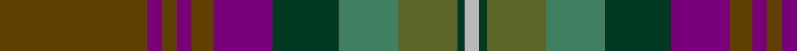

This page is one **sett** — a single exact thread-count. It belongs to the [tartan](/tartans/dy20dp2dy2dp2dy3dp8dg9g8y8dg1lr2/)
(the same proportion at any scale), whose colour order is pattern [GBGBGBGGGGY](/stripes/gbgbgbggggy/).

Sourced from house-of-tartan.  It is a [11 stripe tartan](/stripes/stripes11/).

Original link http://www.house-of-tartan.scotland.net/house/TartanViewjs.asp?colr=Def&tnam=2155

## Thread count
T/40 P4 T4 P4 T6 P16 DG18 Ga16 G16 DG2 N/4

## Palette

Palette: <strong>Tartan Register</strong> <small style="color:#888">(5 of 6 colours)</small>
<table><thead><tr><th>Colour</th><th>Threads</th><th>Shade</th><th>Base</th><th>OKLCh</th></tr></thead><tbody><tr><td>T/</td><td style="text-align:right;font-variant-numeric:tabular-nums">40</td><td><code style="background-color:#604000;">#604000</code> <small style="color:#888">#604000</small></td><td>G <code style="background-color:#006100;">#006100</code></td><td><small style="color:#888">oklch(39.8% 0.083 76.8)</small></td></tr><tr><td>P</td><td style="text-align:right;font-variant-numeric:tabular-nums">4</td><td><code style="background-color:#780078;">#780078</code> <small style="color:#888">#780078</small></td><td>B <code style="background-color:#2A418A;">#2A418A</code></td><td><small style="color:#888">oklch(40.2% 0.185 328.4)</small></td></tr><tr><td>T</td><td style="text-align:right;font-variant-numeric:tabular-nums">4</td><td><code style="background-color:#604000;">#604000</code> <small style="color:#888">#604000</small></td><td>G <code style="background-color:#006100;">#006100</code></td><td><small style="color:#888">oklch(39.8% 0.083 76.8)</small></td></tr><tr><td>P</td><td style="text-align:right;font-variant-numeric:tabular-nums">4</td><td><code style="background-color:#780078;">#780078</code> <small style="color:#888">#780078</small></td><td>B <code style="background-color:#2A418A;">#2A418A</code></td><td><small style="color:#888">oklch(40.2% 0.185 328.4)</small></td></tr><tr><td>T</td><td style="text-align:right;font-variant-numeric:tabular-nums">6</td><td><code style="background-color:#604000;">#604000</code> <small style="color:#888">#604000</small></td><td>G <code style="background-color:#006100;">#006100</code></td><td><small style="color:#888">oklch(39.8% 0.083 76.8)</small></td></tr><tr><td>P</td><td style="text-align:right;font-variant-numeric:tabular-nums">16</td><td><code style="background-color:#780078;">#780078</code> <small style="color:#888">#780078</small></td><td>B <code style="background-color:#2A418A;">#2A418A</code></td><td><small style="color:#888">oklch(40.2% 0.185 328.4)</small></td></tr><tr><td>DG</td><td style="text-align:right;font-variant-numeric:tabular-nums">18</td><td><code style="background-color:#003820;">#003820</code> <small style="color:#888">#003820</small></td><td>G <code style="background-color:#006100;">#006100</code></td><td><small style="color:#888">oklch(30.0% 0.070 158.3)</small></td></tr><tr><td>Ga</td><td style="text-align:right;font-variant-numeric:tabular-nums">16</td><td><code style="background-color:#408060;">#408060</code> <small style="color:#888">#408060</small></td><td>G <code style="background-color:#006100;">#006100</code></td><td><small style="color:#888">oklch(54.8% 0.084 160.1)</small></td></tr><tr><td>G</td><td style="text-align:right;font-variant-numeric:tabular-nums">16</td><td><code style="background-color:#5C6428;">#5C6428</code> <small style="color:#888">#5C6428</small></td><td>G <code style="background-color:#006100;">#006100</code></td><td><small style="color:#888">oklch(48.3% 0.084 116.0)</small></td></tr><tr><td>DG</td><td style="text-align:right;font-variant-numeric:tabular-nums">2</td><td><code style="background-color:#003820;">#003820</code> <small style="color:#888">#003820</small></td><td>G <code style="background-color:#006100;">#006100</code></td><td><small style="color:#888">oklch(30.0% 0.070 158.3)</small></td></tr><tr><td>N/</td><td style="text-align:right;font-variant-numeric:tabular-nums">4</td><td><code style="background-color:#B8B8B8;">#B8B8B8</code> <small style="color:#888">#B8B8B8</small></td><td>Y <code style="background-color:#F2BF00;">#F2BF00</code></td><td><small style="color:#888">oklch(78.3% 0.000 89.9)</small></td></tr></tbody></table>

## Nearest tartans

The nearest existing variants by ΔTartan distance, with this tartan at the top so the swatches line up against it.

ΔTartan

Tartan

Sett

—

<a href="/ttd/edit/#slug=dy20dp2dy2dp2dy3dp8dg9g8y8dg1lr2~x2">Isle of Skye District Tartan Tartan Number: 2155. Earliest known date: 1993 The tartan was instigated and registered by Mrs Rosemary Nicolson Samios in 1992, an Australian of Skye descent, now living in Skye. It was selected through a worldwide competition won by Angus MacLeod from Lewis. Angus, a weaver by trade, produced the first commercial quantities in the traditional kilt weight in 1993 at Lochcarron Weavers in North Strome. The colours of the tartan depict those of the island, often called the 'Misty Isle'. Worn by the Torphican and Bathgate pipe band. (A patented design No. 0600930) See products available Copyright © Blair Urquhart, Comrie, 2015</a> <a class="nn-out" href="/setts/s11/dy20dp2dy2dp2dy3dp8dg9g8y8dg1lr2~x2/" title="open its dictionary page">↗</a>

1.07

<a href="/ttd/edit/#slug=db1r4db12r1k7y12k7dy21lb1~x2">Redgate Htg #1 (Name)</a> <a class="nn-out" href="/setts/s9/db1r4db12r1k7y12k7dy21lb1~x2/" title="open its dictionary page">↗</a>

1.13

<a href="/ttd/edit/#slug=n3dgi10n2dt25do3lr4do3dg10dt3n2lr3n1~x2">Bowhunter</a> <a class="nn-out" href="/setts/s12/n3dgi10n2dt25do3lr4do3dg10dt3n2lr3n1~x2/" title="open its dictionary page">↗</a>

1.16

<a href="/ttd/edit/#slug=db9k2db4k2dr6o3dy2db2dr11dy23t1k8~x2">Kelvin Family (Personal)</a> <a class="nn-out" href="/setts/s12/db9k2db4k2dr6o3dy2db2dr11dy23t1k8~x2/" title="open its dictionary page">↗</a>

1.22

<a href="/ttd/edit/#slug=dpi10k2dg10dp30dg30dgi55k4r8">Batten of Argyll (Baddenach)</a> <a class="nn-out" href="/setts/s8/dpi10k2dg10dp30dg30dgi55k4r8/" title="open its dictionary page">↗</a>

1.26

<a href="/ttd/edit/#slug=m8k2y10dp30y30g55k4o6">Aberuchill District Tartan Tartan Number: 6814. Earliest known date: 2005 Aberuchill lends it name to the area south of Comrie where the river Ruchil meets the river Earn. The two rivers form the boundaries of the Aberuchill Estate for which this tartan was created. See products available Copyright © Blair Urquhart, Comrie, 2015</a> <a class="nn-out" href="/setts/s8/m8k2y10dp30y30g55k4o6/" title="open its dictionary page">↗</a>

1.27

<a href="/ttd/edit/#slug=lo3n1lo1n16do2n2do2n3do12doi26ly2doi3lb2~x2">Buglass</a> <a class="nn-out" href="/setts/s13/lo3n1lo1n16do2n2do2n3do12doi26ly2doi3lb2~x2/" title="open its dictionary page">↗</a>

1.30

<a href="/ttd/edit/#slug=o20dp2o2dp2o3dp8dg9g8y8dg1lr2~x2">Isle of Skye</a> <a class="nn-out" href="/setts/s11/o20dp2o2dp2o3dp8dg9g8y8dg1lr2~x2/" title="open its dictionary page">↗</a>

1.33

<a href="/ttd/edit/#slug=t27dt2t2dt16g5r5lo2dt2dy14dt2~x2">Lyon, Jeffrey M (Hunting) (Personal)</a> <a class="nn-out" href="/setts/s10/t27dt2t2dt16g5r5lo2dt2dy14dt2~x2/" title="open its dictionary page">↗</a>

1.36

<a href="/ttd/edit/#slug=do31lo6lr3db36do8dg60lo7t7~x2">Little-Dowse Wedding</a> <a class="nn-out" href="/setts/s8/do31lo6lr3db36do8dg60lo7t7~x2/" title="open its dictionary page">↗</a>

1.36

<a href="/ttd/edit/#slug=y15dt3y3dt3y3dt16o16k5lo2k5o16dt16y15r1k4~x2">Loseby, Luke (Personal)</a> <a class="nn-out" href="/setts/s15/y15dt3y3dt3y3dt16o16k5lo2k5o16dt16y15r1k4~x2/" title="open its dictionary page">↗</a>

## Neighbour map

Every grey dot is one of 14359 variants placed by the first two principal components of the ΔTartan feature space (44% of its variance). Red is this tartan; blue dots are its nearest — click one to open its page.

<svg viewBox="0 0 640 380" role="img" style="max-width:100%;height:auto;border:1px solid #e0e0e0;border-radius:4px;display:block" xmlns="http://www.w3.org/2000/svg"><image href="/nn/cloud.v1.png" width="640" height="380"/><a href="/setts/s9/db1r4db12r1k7y12k7dy21lb1~x2/"><circle cx="191.0" cy="160.2" r="4" fill="#3465a4"><title>Redgate Htg #1 (Name)</title></circle></a><a href="/setts/s12/n3dgi10n2dt25do3lr4do3dg10dt3n2lr3n1~x2/"><circle cx="252.1" cy="133.1" r="4" fill="#3465a4"><title>Bowhunter</title></circle></a><a href="/setts/s12/db9k2db4k2dr6o3dy2db2dr11dy23t1k8~x2/"><circle cx="242.8" cy="150.3" r="4" fill="#3465a4"><title>Kelvin Family (Personal)</title></circle></a><a href="/setts/s8/dpi10k2dg10dp30dg30dgi55k4r8/"><circle cx="256.0" cy="168.3" r="4" fill="#3465a4"><title>Batten of Argyll (Baddenach)</title></circle></a><a href="/setts/s8/m8k2y10dp30y30g55k4o6/"><circle cx="243.4" cy="151.3" r="4" fill="#3465a4"><title>Aberuchill District Tartan Tartan Number: 6814. Earliest known date: 2005 Aberuchill lends it name to the area south of Comrie where the river Ruchil meets the river Earn. The two rivers form the boundaries of the Aberuchill Estate for which this tartan was created. See products available Copyright © Blair Urquhart, Comrie, 2015</title></circle></a><a href="/setts/s13/lo3n1lo1n16do2n2do2n3do12doi26ly2doi3lb2~x2/"><circle cx="280.8" cy="122.0" r="4" fill="#3465a4"><title>Buglass</title></circle></a><a href="/setts/s11/o20dp2o2dp2o3dp8dg9g8y8dg1lr2~x2/"><circle cx="192.2" cy="138.7" r="4" fill="#3465a4"><title>Isle of Skye</title></circle></a><a href="/setts/s10/t27dt2t2dt16g5r5lo2dt2dy14dt2~x2/"><circle cx="219.1" cy="157.8" r="4" fill="#3465a4"><title>Lyon, Jeffrey M (Hunting) (Personal)</title></circle></a><a href="/setts/s8/do31lo6lr3db36do8dg60lo7t7~x2/"><circle cx="254.2" cy="177.3" r="4" fill="#3465a4"><title>Little-Dowse Wedding</title></circle></a><a href="/setts/s15/y15dt3y3dt3y3dt16o16k5lo2k5o16dt16y15r1k4~x2/"><circle cx="168.5" cy="156.0" r="4" fill="#3465a4"><title>Loseby, Luke (Personal)</title></circle></a><circle cx="227.7" cy="155.3" r="5" fill="#c00000"/></svg>

ID: /setts/s11/dy20dp2dy2dp2dy3dp8dg9g8y8dg1lr2~x2/
