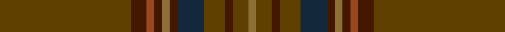

In pattern [GBRBGBBGBGG](/stripes/gbrbgbbgbgg/).

This was sourced from tartans-authority.  It is a [11 stripe tartan](/stripes/stripes11/).

Original link http://www.tartansauthority.com/tartan-ferret/display/4245/

## Thread count
Ta/100 DR12 T6 DR6 LT6 DR6 DN20 Ta16 DR6 Ta12 LT/6

## Palette
Each colour and the base-6 reference it is a variant of.

| Colour | Shade | Base |
|---|---|---|
| DN | <code style="background-color:#14283C;">#14283C</code> `oklch(27.1% 0.046 249.9)` <small>#14283C</small> | B <code style="background-color:#2A418A;">#2A418A</code> |
| DR | <code style="background-color:#441800;">#441800</code> `oklch(27.3% 0.076 46.3)` <small>#441800</small> | B <code style="background-color:#2A418A;">#2A418A</code> |
| LT | <code style="background-color:#8C7038;">#8C7038</code> `oklch(56.0% 0.082 83.0)` <small>#8C7038</small> | G <code style="background-color:#006100;">#006100</code> |
| T | <code style="background-color:#98481C;">#98481C</code> `oklch(49.6% 0.121 46.1)` <small>#98481C</small> | R <code style="background-color:#CC0000;">#CC0000</code> |
| Ta | <code style="background-color:#604000;">#604000</code> `oklch(39.8% 0.083 76.8)` <small>#604000</small> | G <code style="background-color:#006100;">#006100</code> |

## Nearest tartans

The nearest existing variants by ΔTartan distance.

1. [Ulster (Peat) (District](/setts/s10/y28k2y28k2y2k2dy29k2r2k2~x2/) — ΔT 1.42
1. [Huntsman](/setts/s8/y3dy3y4k4dy14k3y41g2~x2/) — ΔT 1.59
1. [Glen Clova #2 (Fashion)](/setts/s12/dr39dy4dr6lo2dr2w2dr2dy12dr6dr2dr6lo2~x2/) — ΔT 1.66
1. [Historic Scotland Corporate Tartan Tartan Number: 2122. Earliest known date: 1988 Custodians at Historic Scotland properties throughout Scotland, including Edinburgh Castle, wear this distinctive tartan. See products available Copyright © Blair Urquhart, Comrie, 2015](/setts/s9/k2y7k1y9dy21o2dy1o1dy2~x2/) — ΔT 1.87
1. [Tricor (Corporate)](/setts/s7/y23o4dy6g6y4lb1y4~x4/) — ΔT 2.04
1. [Wicklow, County (District)](/setts/s10/do1n2g6n1do3t1n12do1n1g1~x4/) — ΔT 2.20
1. [Yarrow](/setts/s11/dy42do10t2do2lo2do2dy10lo6do2lo3dy2~x2/) — ΔT 2.20
1. [Bartlett, Chris (Personal)](/setts/s13/r4y40dt12y2dt12y30k2y4k2y4y2y3k3~x2/) — ΔT 2.27
1. [Ensign of Ontario (Fashion)](/setts/s15/dg21k1r4k1dy21dg3dy3dg3dy21dg3lo4dg21dy3dg3dy3~x2/) — ΔT 2.31
1. [Unidentified Plaid](/setts/s14/dr48dg13dr2dg7dr2dg7dr2dg11dr50y11dr2y7dr2y7~x2/) — ΔT 2.35

## Neighbour map

Every grey dot is one of 14299 variants placed by the first two principal components of the ΔTartan feature space (44% of its variance). Red is this tartan; blue dots are its nearest — click one to open its page.

<svg viewBox="0 0 640 380" role="img" style="max-width:100%;height:auto;border:1px solid #e0e0e0;border-radius:4px;display:block" xmlns="http://www.w3.org/2000/svg"><image href="/nn/cloud.v1.png" width="640" height="380"/><a href="/setts/s10/y28k2y28k2y2k2dy29k2r2k2~x2/"><circle cx="480.9" cy="219.9" r="4" fill="#3465a4"><title>Ulster (Peat) (District</title></circle></a><a href="/setts/s8/y3dy3y4k4dy14k3y41g2~x2/"><circle cx="499.9" cy="192.6" r="4" fill="#3465a4"><title>Huntsman</title></circle></a><a href="/setts/s12/dr39dy4dr6lo2dr2w2dr2dy12dr6dr2dr6lo2~x2/"><circle cx="463.3" cy="166.9" r="4" fill="#3465a4"><title>Glen Clova #2 (Fashion)</title></circle></a><a href="/setts/s9/k2y7k1y9dy21o2dy1o1dy2~x2/"><circle cx="457.3" cy="212.9" r="4" fill="#3465a4"><title>Historic Scotland Corporate Tartan Tartan Number: 2122. Earliest known date: 1988 Custodians at Historic Scotland properties throughout Scotland, including Edinburgh Castle, wear this distinctive tartan. See products available Copyright © Blair Urquhart, Comrie, 2015</title></circle></a><a href="/setts/s7/y23o4dy6g6y4lb1y4~x4/"><circle cx="506.5" cy="221.6" r="4" fill="#3465a4"><title>Tricor (Corporate)</title></circle></a><a href="/setts/s10/do1n2g6n1do3t1n12do1n1g1~x4/"><circle cx="455.6" cy="245.1" r="4" fill="#3465a4"><title>Wicklow, County (District)</title></circle></a><a href="/setts/s11/dy42do10t2do2lo2do2dy10lo6do2lo3dy2~x2/"><circle cx="505.9" cy="169.0" r="4" fill="#3465a4"><title>Yarrow</title></circle></a><a href="/setts/s13/r4y40dt12y2dt12y30k2y4k2y4y2y3k3~x2/"><circle cx="487.1" cy="166.2" r="4" fill="#3465a4"><title>Bartlett, Chris (Personal)</title></circle></a><a href="/setts/s15/dg21k1r4k1dy21dg3dy3dg3dy21dg3lo4dg21dy3dg3dy3~x2/"><circle cx="406.3" cy="190.1" r="4" fill="#3465a4"><title>Ensign of Ontario (Fashion)</title></circle></a><a href="/setts/s14/dr48dg13dr2dg7dr2dg7dr2dg11dr50y11dr2y7dr2y7~x2/"><circle cx="554.0" cy="207.6" r="4" fill="#3465a4"><title>Unidentified Plaid</title></circle></a><circle cx="527.7" cy="193.4" r="5" fill="#c00000"/></svg>

ID: /setts/s11/dy50do6o3do3y3do3dt10dy8do3dy6y3~x2/
