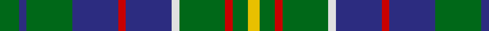

In pattern [GBGBRBWGRGY](/patterns/gbgbrbwgrgy/).

This was sourced from house-of-tartan.  It is a [11 stripes tartan](/stripes/stripes11/).

Original link http://www.house-of-tartan.scotland.net/house/TartanViewjs.asp?colr=Def&tnam=719

## Thread count
G/10 DB4 G24 DB24 R4 DB24 LN4 G24 R4 G8 Y/6

## Palette
Each colour and its ΔE from the base-6 reference it is a variant of.

| Colour | Shade | Base | ΔE (OKLab) |
|---|---|---|---|
| DB | <code style="background-color:#2C2C80;">#2C2C80</code> `#2C2C80` | B <code style="background-color:#2A418A;">#2A418A</code> | 0.06 |
| G | <code style="background-color:#006818;">#006818</code> `#006818` | G <code style="background-color:#006100;">#006100</code> | 0.02 |
| LN | <code style="background-color:#E0E0E0;">#E0E0E0</code> `#E0E0E0` | W <code style="background-color:#F7F7F7;">#F7F7F7</code> | 0.07 |
| R | <code style="background-color:#C80000;">#C80000</code> `#C80000` | R <code style="background-color:#CC0000;">#CC0000</code> | 0.01 |
| Y | <code style="background-color:#E8C000;">#E8C000</code> `#E8C000` | Y <code style="background-color:#F2BF00;">#F2BF00</code> | 0.02 |

## Nearest tartans

The nearest existing variants by ΔTartan distance.

1. [Hunter of Hunterston (Clan)](/setts/s11/g10b4g28b28r4b28w4g28r4g8y6-b2c2c80-g007800-rc80000-wfcfcfc-yd8d078/) — ΔT 0.54
1. [Hunter of Hunterston](/setts/s11/g10b4g24b24r4b24w4g24r4g8y6-b304080-g008000-rc00000-we0e0e0-yf0c000/) — ΔT 0.75
1. [Harkness](/setts/s10/g21b4w4b32g12y4g8r4g6b12-b304080-g008000-rc00000-we0e0e0-yf0c000/) — ΔT 0.84
1. [Harkness Hunting](/setts/s10/g21b4w4b32g12y4g8r4g6b12-b2c4084-g005020-rdc0000-we0e0e0-ye8c000/) — ΔT 1.01
1. [O'Connell, William (Name)](/setts/s10/b38g14b14ba4g40k18g12k8g20w6-b2c2c80-ba2888c4-g006818-k101010-we0e0e0/) — ΔT 1.04
1. [Manx Ellan Vannin](/setts/s10/g56w8b12y28g8y28b12w8g56ba8-b202060-ba5c8ca8-g003820-we0e0e0-y98b480/) — ΔT 1.04
1. [Blarney Castle](/setts/s9/g64y12b36r12b36g24b12g12k12-b2c2c80-g00643c-k101010-rdc0000-ye0a126/) — ΔT 1.06
1. [Greylock Corporate Tartan Tartan Number: 944. Earliest known date: 1987 . See products available Copyright © Blair Urquhart, Comrie, 2015](/setts/s13/g20w4g20k6b24r6b24g30w4b6k4g6y6-b2c2c80-g006818-k101010-rc80000-we0e0e0-ye8c000/) — ΔT 1.07
1. [MacConnell Clan Tartan Tartan Number: 141. Earliest known date: 1989 Based on MacDonald Hunting without the black. For use by the McConnells in addition to the MacDonald. Sample in STA Johnston Collection states 'from Margaret McConnel of Highland Heritage (USA). See products available Copyright © Blair Urquhart, Comrie, 2015](/setts/s10/b44g12b10ba4g44r12g10r8g18w6-b2c2c80-ba5c8ca8-g006818-rc80000-we0e0e0/) — ΔT 1.08
1. [Seaford House](/setts/s9/w3b3w12b26g26r3g26b28wa3-b202060-g006818-rc80000-w98c8e8-wafcfcfc/) — ΔT 1.11

## Neighbour map

Every grey dot is one of 15726 variants placed by the first two principal components of the ΔTartan feature space (44% of its variance). Red is this tartan; blue dots are its nearest — click one to open its page.

<svg viewBox="0 0 640 380" role="img" style="max-width:100%;height:auto;border:1px solid #e0e0e0;border-radius:4px;display:block" xmlns="http://www.w3.org/2000/svg"><image href="/nn/cloud.v1.png" width="640" height="380"/><a href="/setts/s11/g10b4g28b28r4b28w4g28r4g8y6-b2c2c80-g007800-rc80000-wfcfcfc-yd8d078/"><circle cx="211.1" cy="189.5" r="4" fill="#3465a4"><title>Hunter of Hunterston (Clan)</title></circle></a><a href="/setts/s11/g10b4g24b24r4b24w4g24r4g8y6-b304080-g008000-rc00000-we0e0e0-yf0c000/"><circle cx="205.8" cy="203.7" r="4" fill="#3465a4"><title>Hunter of Hunterston</title></circle></a><a href="/setts/s10/g21b4w4b32g12y4g8r4g6b12-b304080-g008000-rc00000-we0e0e0-yf0c000/"><circle cx="218.0" cy="189.7" r="4" fill="#3465a4"><title>Harkness</title></circle></a><a href="/setts/s10/g21b4w4b32g12y4g8r4g6b12-b2c4084-g005020-rdc0000-we0e0e0-ye8c000/"><circle cx="236.7" cy="198.8" r="4" fill="#3465a4"><title>Harkness Hunting</title></circle></a><a href="/setts/s10/b38g14b14ba4g40k18g12k8g20w6-b2c2c80-ba2888c4-g006818-k101010-we0e0e0/"><circle cx="220.7" cy="201.5" r="4" fill="#3465a4"><title>O'Connell, William (Name)</title></circle></a><a href="/setts/s10/g56w8b12y28g8y28b12w8g56ba8-b202060-ba5c8ca8-g003820-we0e0e0-y98b480/"><circle cx="207.0" cy="183.6" r="4" fill="#3465a4"><title>Manx Ellan Vannin</title></circle></a><a href="/setts/s9/g64y12b36r12b36g24b12g12k12-b2c2c80-g00643c-k101010-rdc0000-ye0a126/"><circle cx="204.8" cy="227.9" r="4" fill="#3465a4"><title>Blarney Castle</title></circle></a><a href="/setts/s13/g20w4g20k6b24r6b24g30w4b6k4g6y6-b2c2c80-g006818-k101010-rc80000-we0e0e0-ye8c000/"><circle cx="170.7" cy="168.0" r="4" fill="#3465a4"><title>Greylock Corporate Tartan Tartan Number: 944. Earliest known date: 1987 . See products available Copyright © Blair Urquhart, Comrie, 2015</title></circle></a><a href="/setts/s10/b44g12b10ba4g44r12g10r8g18w6-b2c2c80-ba5c8ca8-g006818-rc80000-we0e0e0/"><circle cx="244.9" cy="177.7" r="4" fill="#3465a4"><title>MacConnell Clan Tartan Tartan Number: 141. Earliest known date: 1989 Based on MacDonald Hunting without the black. For use by the McConnells in addition to the MacDonald. Sample in STA Johnston Collection states 'from Margaret McConnel of Highland Heritage (USA). See products available Copyright © Blair Urquhart, Comrie, 2015</title></circle></a><a href="/setts/s9/w3b3w12b26g26r3g26b28wa3-b202060-g006818-rc80000-w98c8e8-wafcfcfc/"><circle cx="192.8" cy="187.2" r="4" fill="#3465a4"><title>Seaford House</title></circle></a><circle cx="206.7" cy="204.2" r="5" fill="#c00000"/></svg>

ID: /setts/s11/g10b4g24b24r4b24w4g24r4g8y6-b2c2c80-g006818-rc80000-we0e0e0-ye8c000/
