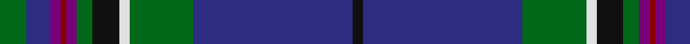

This page is one **sett** — a single exact thread-count. It belongs to the [tartan](/tartans/g10db9dp4r2dp4g6k10w4g24db60k4/)
(the same proportion at any scale), whose colour order is pattern [GBBRBGKWGBK](/stripes/gbbrbgkwgbk/).

Sourced from tartans-authority.  It is a [11 stripe tartan](/stripes/stripes11/).

Original link http://www.tartansauthority.com/tartan-ferret/display/11152/

## Register references

External register numbers recorded for this tartan.

- Scottish Register of Tartans: [11152](https://www.tartanregister.gov.uk/tartanDetails?ref=11152)
- Scottish Tartans Authority (ITI): 11152

## Thread count
G/10 DB9 P4 DR2 P4 G6 K10 LN4 G24 DB60 K/4

## Palette

Palette: <strong>Tartan Register</strong>
<table><thead><tr><th>Colour</th><th>Threads</th><th>Shade</th><th>Base</th><th>OKLCh</th></tr></thead><tbody><tr><td>G/</td><td style="text-align:right;font-variant-numeric:tabular-nums">10</td><td><code style="background-color:#006818;">#006818</code> <small style="color:#888">#006818</small></td><td>G <code style="background-color:#006100;">#006100</code></td><td><small style="color:#888">oklch(45.0% 0.142 145.0)</small></td></tr><tr><td>DB</td><td style="text-align:right;font-variant-numeric:tabular-nums">9</td><td><code style="background-color:#2C2C80;">#2C2C80</code> <small style="color:#888">#2C2C80</small></td><td>B <code style="background-color:#2A418A;">#2A418A</code></td><td><small style="color:#888">oklch(35.0% 0.138 276.6)</small></td></tr><tr><td>P</td><td style="text-align:right;font-variant-numeric:tabular-nums">4</td><td><code style="background-color:#780078;">#780078</code> <small style="color:#888">#780078</small></td><td>B <code style="background-color:#2A418A;">#2A418A</code></td><td><small style="color:#888">oklch(40.2% 0.185 328.4)</small></td></tr><tr><td>DR</td><td style="text-align:right;font-variant-numeric:tabular-nums">2</td><td><code style="background-color:#880000;">#880000</code> <small style="color:#888">#880000</small></td><td>R <code style="background-color:#CC0000;">#CC0000</code></td><td><small style="color:#888">oklch(39.4% 0.162 29.2)</small></td></tr><tr><td>P</td><td style="text-align:right;font-variant-numeric:tabular-nums">4</td><td><code style="background-color:#780078;">#780078</code> <small style="color:#888">#780078</small></td><td>B <code style="background-color:#2A418A;">#2A418A</code></td><td><small style="color:#888">oklch(40.2% 0.185 328.4)</small></td></tr><tr><td>G</td><td style="text-align:right;font-variant-numeric:tabular-nums">6</td><td><code style="background-color:#006818;">#006818</code> <small style="color:#888">#006818</small></td><td>G <code style="background-color:#006100;">#006100</code></td><td><small style="color:#888">oklch(45.0% 0.142 145.0)</small></td></tr><tr><td>K</td><td style="text-align:right;font-variant-numeric:tabular-nums">10</td><td><code style="background-color:#101010;">#101010</code> <small style="color:#888">#101010</small></td><td>K <code style="background-color:#000000;">#000000</code></td><td><small style="color:#888">oklch(17.3% 0.000 89.9)</small></td></tr><tr><td>LN</td><td style="text-align:right;font-variant-numeric:tabular-nums">4</td><td><code style="background-color:#E0E0E0;">#E0E0E0</code> <small style="color:#888">#E0E0E0</small></td><td>W <code style="background-color:#F7F7F7;">#F7F7F7</code></td><td><small style="color:#888">oklch(90.7% 0.000 89.9)</small></td></tr><tr><td>G</td><td style="text-align:right;font-variant-numeric:tabular-nums">24</td><td><code style="background-color:#006818;">#006818</code> <small style="color:#888">#006818</small></td><td>G <code style="background-color:#006100;">#006100</code></td><td><small style="color:#888">oklch(45.0% 0.142 145.0)</small></td></tr><tr><td>DB</td><td style="text-align:right;font-variant-numeric:tabular-nums">60</td><td><code style="background-color:#2C2C80;">#2C2C80</code> <small style="color:#888">#2C2C80</small></td><td>B <code style="background-color:#2A418A;">#2A418A</code></td><td><small style="color:#888">oklch(35.0% 0.138 276.6)</small></td></tr><tr><td>K/</td><td style="text-align:right;font-variant-numeric:tabular-nums">4</td><td><code style="background-color:#101010;">#101010</code> <small style="color:#888">#101010</small></td><td>K <code style="background-color:#000000;">#000000</code></td><td><small style="color:#888">oklch(17.3% 0.000 89.9)</small></td></tr></tbody></table>

## Nearest tartans

The nearest existing variants by ΔTartan distance, with this tartan at the top so the swatches line up against it.

ΔTartan

Tartan

Sett

—

<a href="/ttd/edit/#slug=g10db9dp4r2dp4g6k10w4g24db60k4">Huaum, Patrick Antoine (Personal))</a> <a class="nn-out" href="/setts/s11/g10db9dp4r2dp4g6k10w4g24db60k4/" title="open its dictionary page">↗</a>

0.54

<a href="/ttd/edit/#slug=g10db9m4r2m4g6k10w4g24db60k4">Huaumé, Patrick Antoine (Personal)</a> <a class="nn-out" href="/setts/s11/g10db9m4r2m4g6k10w4g24db60k4/" title="open its dictionary page">↗</a>

0.68

<a href="/ttd/edit/#slug=db33k1db5k8g8r2g15ly1w2~x2">Mulcahy (Name)</a> <a class="nn-out" href="/setts/s9/db33k1db5k8g8r2g15ly1w2~x2/" title="open its dictionary page">↗</a>

0.79

<a href="/ttd/edit/#slug=db6w1db40m1k12dg12m6dg2dp2dg4~x2">Scotland the Brave (Fashion)</a> <a class="nn-out" href="/setts/s10/db6w1db40m1k12dg12m6dg2dp2dg4~x2/" title="open its dictionary page">↗</a>

0.80

<a href="/ttd/edit/#slug=db66k2db10k15g15r4g15r4g30ly2w4">Mulcahy</a> <a class="nn-out" href="/setts/s11/db66k2db10k15g15r4g15r4g30ly2w4/" title="open its dictionary page">↗</a>

0.90

<a href="/ttd/edit/#slug=db60loi3db5lo5db9do20loi4g32lb4~x2">State Seal of Ohio (Fashion)</a> <a class="nn-out" href="/setts/s9/db60loi3db5lo5db9do20loi4g32lb4~x2/" title="open its dictionary page">↗</a>

0.96

<a href="/ttd/edit/#slug=r3dg1db2dg4db30k2db4k2db30dg27ly3k3w3~x2">Joss (Clan)</a> <a class="nn-out" href="/setts/s13/r3dg1db2dg4db30k2db4k2db30dg27ly3k3w3~x2/" title="open its dictionary page">↗</a>

0.96

<a href="/ttd/edit/#slug=db64r3k3lb2db3r28dg26db3r3k3ly2db3dg16~x2">Wcwm 1571</a> <a class="nn-out" href="/setts/s13/db64r3k3lb2db3r28dg26db3r3k3ly2db3dg16~x2/" title="open its dictionary page">↗</a>

1.02

<a href="/ttd/edit/#slug=db54dbi14ly3dbi3w3dbi3g9dr7dbi2dr9w2~x2">Holyrood Corporate Tartan Tartan Number: 98. Earliest known date: 1980 Holyrood is the Scottish equivalent of Buckingham Palace, the Queens official residence in Scotland. She is guarded by 'The Royal Company of Archers', a non military force provided by the chiefs of the clans. A sample of the Holyrood tartan was presented to the Scottish Tartans Society by Lochcarron Weavers in 1980. See products available Copyright © Blair Urquhart, Comrie, 2015</a> <a class="nn-out" href="/setts/s11/db54dbi14ly3dbi3w3dbi3g9dr7dbi2dr9w2~x2/" title="open its dictionary page">↗</a>

1.03

<a href="/ttd/edit/#slug=dt40lb3dt3lb3dt3lb4dg8g8n8w2~x2">Greenshields, Simon (Personal)</a> <a class="nn-out" href="/setts/s10/dt40lb3dt3lb3dt3lb4dg8g8n8w2~x2/" title="open its dictionary page">↗</a>

1.06

<a href="/ttd/edit/#slug=dp4db5dp3db50k15g3k5g32w2g3">Spirit of Morningside (Fashion)</a> <a class="nn-out" href="/setts/s10/dp4db5dp3db50k15g3k5g32w2g3/" title="open its dictionary page">↗</a>

## Neighbour map

Every grey dot is one of 14359 variants placed by the first two principal components of the ΔTartan feature space (44% of its variance). Red is this tartan; blue dots are its nearest — click one to open its page.

<svg viewBox="0 0 640 380" role="img" style="max-width:100%;height:auto;border:1px solid #e0e0e0;border-radius:4px;display:block" xmlns="http://www.w3.org/2000/svg"><image href="/nn/cloud.v1.png" width="640" height="380"/><a href="/setts/s11/g10db9m4r2m4g6k10w4g24db60k4/"><circle cx="301.0" cy="107.0" r="4" fill="#3465a4"><title>Huaumé, Patrick Antoine (Personal)</title></circle></a><a href="/setts/s9/db33k1db5k8g8r2g15ly1w2~x2/"><circle cx="300.8" cy="113.8" r="4" fill="#3465a4"><title>Mulcahy (Name)</title></circle></a><a href="/setts/s10/db6w1db40m1k12dg12m6dg2dp2dg4~x2/"><circle cx="338.5" cy="103.7" r="4" fill="#3465a4"><title>Scotland the Brave (Fashion)</title></circle></a><a href="/setts/s11/db66k2db10k15g15r4g15r4g30ly2w4/"><circle cx="273.7" cy="102.8" r="4" fill="#3465a4"><title>Mulcahy</title></circle></a><a href="/setts/s9/db60loi3db5lo5db9do20loi4g32lb4~x2/"><circle cx="285.6" cy="132.2" r="4" fill="#3465a4"><title>State Seal of Ohio (Fashion)</title></circle></a><a href="/setts/s13/r3dg1db2dg4db30k2db4k2db30dg27ly3k3w3~x2/"><circle cx="343.0" cy="98.0" r="4" fill="#3465a4"><title>Joss (Clan)</title></circle></a><a href="/setts/s13/db64r3k3lb2db3r28dg26db3r3k3ly2db3dg16~x2/"><circle cx="272.6" cy="81.9" r="4" fill="#3465a4"><title>Wcwm 1571</title></circle></a><a href="/setts/s11/db54dbi14ly3dbi3w3dbi3g9dr7dbi2dr9w2~x2/"><circle cx="296.2" cy="101.1" r="4" fill="#3465a4"><title>Holyrood Corporate Tartan Tartan Number: 98. Earliest known date: 1980 Holyrood is the Scottish equivalent of Buckingham Palace, the Queens official residence in Scotland. She is guarded by 'The Royal Company of Archers', a non military force provided by the chiefs of the clans. A sample of the Holyrood tartan was presented to the Scottish Tartans Society by Lochcarron Weavers in 1980. See products available Copyright © Blair Urquhart, Comrie, 2015</title></circle></a><a href="/setts/s10/dt40lb3dt3lb3dt3lb4dg8g8n8w2~x2/"><circle cx="311.0" cy="124.1" r="4" fill="#3465a4"><title>Greenshields, Simon (Personal)</title></circle></a><a href="/setts/s10/dp4db5dp3db50k15g3k5g32w2g3/"><circle cx="293.2" cy="135.9" r="4" fill="#3465a4"><title>Spirit of Morningside (Fashion)</title></circle></a><circle cx="303.8" cy="105.3" r="5" fill="#c00000"/></svg>

ID: /setts/s11/g10db9dp4r2dp4g6k10w4g24db60k4/
