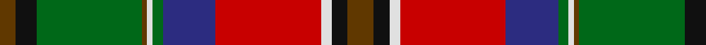

In pattern [GKGGWGBRWKG](/patterns/gkggwgbrwkg/).

This was sourced from tartans-authority.  It is a [11 stripes tartan](/stripes/stripes11/).

Original link http://www.tartansauthority.com/tartan-ferret/display/3340/

## Attestations

This cloth appears in 2 source records; the oldest owns this page.

- 2000 — MacCulloch (Name) (tartans-authority, [record](http://www.tartansauthority.com/tartan-ferret/display/3340/))
- 04/04/2004 — MacCulloch (register-of-tartans, [record](https://www.tartanregister.gov.uk/tartanDetails.aspx?ref=5356))

## Thread count
T/6 K8 G40 T2 LN2 G4 DB20 R40 LN4 K6 T/10

## Palette
Each colour and its ΔE from the base-6 reference it is a variant of.

| Colour | Shade | Base | ΔE (OKLab) |
|---|---|---|---|
| DB | <code style="background-color:#2C2C80;">#2C2C80</code> `#2C2C80` | B <code style="background-color:#2A418A;">#2A418A</code> | 0.06 |
| G | <code style="background-color:#006818;">#006818</code> `#006818` | G <code style="background-color:#006100;">#006100</code> | 0.02 |
| K | <code style="background-color:#101010;">#101010</code> `#101010` | K <code style="background-color:#000000;">#000000</code> | 0.17 |
| LN | <code style="background-color:#E0E0E0;">#E0E0E0</code> `#E0E0E0` | W <code style="background-color:#F7F7F7;">#F7F7F7</code> | 0.07 |
| R | <code style="background-color:#C80000;">#C80000</code> `#C80000` | R <code style="background-color:#CC0000;">#CC0000</code> | 0.01 |
| T | <code style="background-color:#603800;">#603800</code> `#603800` | G <code style="background-color:#006100;">#006100</code> | 0.16 |

## Nearest tartans

The nearest existing variants by ΔTartan distance.

1. [MacCullough Family Tartan Tartan Number: 3214. Earliest known date: 2000 I would like to let you know that working with Peter MacDonald, he designed a tartan for me that was registered with the Scottish Tartan Authority on 5 December 2000 See products available Copyright © Blair Urquhart, Comrie, 2015](/setts/s11/r10k6w4ra40b20g4w2ra2g40k8r6-b2c2c80-g006818-k101010-rb45804-rac80000-we0e0e0/) — ΔT 0.30
1. [Steiff](/setts/s10/r15g6b36w2k6w2g30r32k6ba4-b2c2c80-ba5c8ca8-g006818-k101010-rc80000-we0e0e0/) — ΔT 0.88
1. [Unnamed No 1 Tartan Tartan Number: 1340. Earliest known date: 1870 This sett is taken from the records of Messrs Bolingbroke and Jones of Norwich, who were weavers around 1870. Some of the tartans have been adopted or modified in recent times as the copyright of the designs is now in the public domain. See products available Copyright © Blair Urquhart, Comrie, 2015](/setts/s12/r16b14k16y4k2w4k2g38k2r16b6r16-b5c8ca8-g006818-k101010-rc80000-we0e0e0-ye8c000/) — ΔT 0.92
1. [Roman (Personal)](/setts/s14/r54g40k14w6y6r4y6w6y12b12k4r6y8b6-b780078-g006818-k101010-r880000-we0e0e0-ya08858/) — ΔT 0.93
1. [Scottish Wildcat](/setts/s14/r20w4b2w4ba20r16b4k34b4r14ba38k6y2k2-b441800-ba5c5c5c-k101010-r98481c-wf0e0c8-yc89800/) — ΔT 0.94
1. [Buchanan D](/setts/s13/b4g32k2b4k2y8k2y8k2b4k2r32ya4-b4367ae-g11450d-k000000-raa0000-yaaaa00-yaaaaaaa/) — ΔT 0.95
1. [Buchanan D](/setts/s13/b2g16k1b2k1y4k1y4k1b2k1r16ya2-b4367ae-g11450d-k000000-raa0000-yaaaa00-yaaaaaaa/) — ΔT 0.95
1. [Unidentified No 1](/setts/s12/r16b14k16y4k2w4k2g38k2r16b6r16-b3c82af-g005020-k101010-rdc0000-we0e0e0-ye8c000/) — ΔT 0.98
1. [Baxter](/setts/s13/b8g64k4b8k4y16k4y16k4b8k4r64w8-b2474e8-g006818-k101010-r880000-wfcfcfc-yd09800/) — ΔT 1.00
1. [Moray of Abercairny](/setts/s11/w2b6ba4r36ra4g32ra4r4ra4b6w2-b5c8ca8-ba1c1c50-g006818-r880000-rad05054-wf8f8f8/) — ΔT 1.00

## Neighbour map

Every grey dot is one of 15726 variants placed by the first two principal components of the ΔTartan feature space (44% of its variance). Red is this tartan; blue dots are its nearest — click one to open its page.

<svg viewBox="0 0 640 380" role="img" style="max-width:100%;height:auto;border:1px solid #e0e0e0;border-radius:4px;display:block" xmlns="http://www.w3.org/2000/svg"><image href="/nn/cloud.v1.png" width="640" height="380"/><a href="/setts/s11/r10k6w4ra40b20g4w2ra2g40k8r6-b2c2c80-g006818-k101010-rb45804-rac80000-we0e0e0/"><circle cx="145.6" cy="101.9" r="4" fill="#3465a4"><title>MacCullough Family Tartan Tartan Number: 3214. Earliest known date: 2000 I would like to let you know that working with Peter MacDonald, he designed a tartan for me that was registered with the Scottish Tartan Authority on 5 December 2000 See products available Copyright © Blair Urquhart, Comrie, 2015</title></circle></a><a href="/setts/s10/r15g6b36w2k6w2g30r32k6ba4-b2c2c80-ba5c8ca8-g006818-k101010-rc80000-we0e0e0/"><circle cx="154.4" cy="120.9" r="4" fill="#3465a4"><title>Steiff</title></circle></a><a href="/setts/s12/r16b14k16y4k2w4k2g38k2r16b6r16-b5c8ca8-g006818-k101010-rc80000-we0e0e0-ye8c000/"><circle cx="144.5" cy="109.1" r="4" fill="#3465a4"><title>Unnamed No 1 Tartan Tartan Number: 1340. Earliest known date: 1870 This sett is taken from the records of Messrs Bolingbroke and Jones of Norwich, who were weavers around 1870. Some of the tartans have been adopted or modified in recent times as the copyright of the designs is now in the public domain. See products available Copyright © Blair Urquhart, Comrie, 2015</title></circle></a><a href="/setts/s14/r54g40k14w6y6r4y6w6y12b12k4r6y8b6-b780078-g006818-k101010-r880000-we0e0e0-ya08858/"><circle cx="140.2" cy="102.2" r="4" fill="#3465a4"><title>Roman (Personal)</title></circle></a><a href="/setts/s14/r20w4b2w4ba20r16b4k34b4r14ba38k6y2k2-b441800-ba5c5c5c-k101010-r98481c-wf0e0c8-yc89800/"><circle cx="174.0" cy="112.7" r="4" fill="#3465a4"><title>Scottish Wildcat</title></circle></a><a href="/setts/s13/b4g32k2b4k2y8k2y8k2b4k2r32ya4-b4367ae-g11450d-k000000-raa0000-yaaaa00-yaaaaaaa/"><circle cx="129.9" cy="86.6" r="4" fill="#3465a4"><title>Buchanan D</title></circle></a><a href="/setts/s13/b2g16k1b2k1y4k1y4k1b2k1r16ya2-b4367ae-g11450d-k000000-raa0000-yaaaa00-yaaaaaaa/"><circle cx="129.9" cy="86.6" r="4" fill="#3465a4"><title>Buchanan D</title></circle></a><a href="/setts/s12/r16b14k16y4k2w4k2g38k2r16b6r16-b3c82af-g005020-k101010-rdc0000-we0e0e0-ye8c000/"><circle cx="141.7" cy="107.0" r="4" fill="#3465a4"><title>Unidentified No 1</title></circle></a><a href="/setts/s13/b8g64k4b8k4y16k4y16k4b8k4r64w8-b2474e8-g006818-k101010-r880000-wfcfcfc-yd09800/"><circle cx="129.4" cy="86.6" r="4" fill="#3465a4"><title>Baxter</title></circle></a><a href="/setts/s11/w2b6ba4r36ra4g32ra4r4ra4b6w2-b5c8ca8-ba1c1c50-g006818-r880000-rad05054-wf8f8f8/"><circle cx="204.3" cy="100.3" r="4" fill="#3465a4"><title>Moray of Abercairny</title></circle></a><circle cx="146.6" cy="105.6" r="5" fill="#c00000"/></svg>

ID: /setts/s11/g10k6w4r40b20ga4w2g2ga40k8g6-b2c2c80-g603800-ga006818-k101010-rc80000-we0e0e0/
