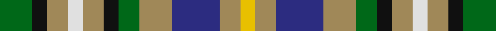

In pattern [GKYWYKGYBYY](/stripes/gkywykgybyy/).

This was sourced from tartans-authority.  It is a [11 stripe tartan](/stripes/stripes11/).

Original link http://www.tartansauthority.com/tartan-ferret/display/7429/

## Also known as

This cloth is also recorded under:

- Roscommon County, Crest Range

## Attestations

This cloth appears in 2 source records; the oldest owns this page.

- 2004 — Roscommon County Crest (Fashion) (tartans-authority, [record](http://www.tartansauthority.com/tartan-ferret/display/7429/))
- 01/05/2005 — Roscommon County, Crest Range (register-of-tartans, [record](https://www.tartanregister.gov.uk/tartanDetails.aspx?ref=5057))

## Register references

External register numbers recorded for this tartan.

- Scottish Register of Tartans: [5057](https://www.tartanregister.gov.uk/tartanDetails.aspx?ref=5057)
- Scottish Tartans Authority (ITI): 7429
- Scottish Tartans World Register: 3098

## Thread count
G/22 K10 LT14 LN10 LT14 K10 G14 LT22 DB32 LT14 Y/10

## Palette
Each colour and the base-6 reference it is a variant of.

| Colour | Shade | Base |
|---|---|---|
| DB | <code style="background-color:#2C2C80;">#2C2C80</code> `oklch(35.0% 0.138 276.6)` <small>#2C2C80</small> | B <code style="background-color:#2A418A;">#2A418A</code> |
| G | <code style="background-color:#006818;">#006818</code> `oklch(45.0% 0.142 145.0)` <small>#006818</small> | G <code style="background-color:#006100;">#006100</code> |
| K | <code style="background-color:#101010;">#101010</code> `oklch(17.3% 0.000 89.9)` <small>#101010</small> | K <code style="background-color:#000000;">#000000</code> |
| LN | <code style="background-color:#E0E0E0;">#E0E0E0</code> `oklch(90.7% 0.000 89.9)` <small>#E0E0E0</small> | W <code style="background-color:#F7F7F7;">#F7F7F7</code> |
| LT | <code style="background-color:#A08858;">#A08858</code> `oklch(63.7% 0.071 84.0)` <small>#A08858</small> | Y <code style="background-color:#F2BF00;">#F2BF00</code> |
| Y | <code style="background-color:#E8C000;">#E8C000</code> `oklch(81.9% 0.168 93.7)` <small>#E8C000</small> | Y <code style="background-color:#F2BF00;">#F2BF00</code> |

## Nearest tartans

The nearest existing variants by ΔTartan distance.

1. [Scandinavian](/setts/s14/g10k6t10ly4t10k3g10k3g10k3r10w4r10k6~x2/) — ΔT 0.88
1. [DunBroch (Corporate)](/setts/s11/db4lb8k2lb5lb2lb5dg8r7dg2r7dg3~x2/) — ΔT 1.14
1. [Belwade](/setts/s11/db4g4db4w1db1w1m4lo4w1g4m4~x4/) — ΔT 1.25
1. [Spirit of 1994](/setts/s9/k13ly4g15w4r13w4g15w4db13~x2/) — ΔT 1.27
1. [Callanish, The](/setts/s13/o2lr2do2y2lr6y3do3y4lr2do3y2lr2o2~x2/) — ΔT 1.28
1. [DunBroch](/setts/s11/db4t8k2t5lb2t5dg8dr7dg2dr7dg3~x2/) — ΔT 1.32
1. [Redgate (Name)](/setts/s13/t10r3t10k7lo5w2lo5w2lo5k7g10r3g7~x2/) — ΔT 1.32
1. [British Columbia](/setts/s12/g2k1g4t4ly1t4r4k1r4t2r4w1~x4/) — ΔT 1.36
1. [Stanners (Personal)](/setts/s13/lr4k4n4k4g4w1g4w1n3r4n3r4w1~x4/) — ΔT 1.38
1. [Northern College (Ontario)](/setts/s10/g5db3t3g5w4ly2t1ly2db1r1~x6/) — ΔT 1.42

## Neighbour map

Every grey dot is one of 14299 variants placed by the first two principal components of the ΔTartan feature space (44% of its variance). Red is this tartan; blue dots are its nearest — click one to open its page.

<svg viewBox="0 0 640 380" role="img" style="max-width:100%;height:auto;border:1px solid #e0e0e0;border-radius:4px;display:block" xmlns="http://www.w3.org/2000/svg"><image href="/nn/cloud.v1.png" width="640" height="380"/><a href="/setts/s14/g10k6t10ly4t10k3g10k3g10k3r10w4r10k6~x2/"><circle cx="14.0" cy="208.2" r="4" fill="#3465a4"><title>Scandinavian</title></circle></a><a href="/setts/s11/db4lb8k2lb5lb2lb5dg8r7dg2r7dg3~x2/"><circle cx="27.3" cy="203.4" r="4" fill="#3465a4"><title>DunBroch (Corporate)</title></circle></a><a href="/setts/s11/db4g4db4w1db1w1m4lo4w1g4m4~x4/"><circle cx="14.0" cy="205.4" r="4" fill="#3465a4"><title>Belwade</title></circle></a><a href="/setts/s9/k13ly4g15w4r13w4g15w4db13~x2/"><circle cx="14.0" cy="200.0" r="4" fill="#3465a4"><title>Spirit of 1994</title></circle></a><a href="/setts/s13/o2lr2do2y2lr6y3do3y4lr2do3y2lr2o2~x2/"><circle cx="39.0" cy="236.0" r="4" fill="#3465a4"><title>Callanish, The</title></circle></a><a href="/setts/s11/db4t8k2t5lb2t5dg8dr7dg2dr7dg3~x2/"><circle cx="55.6" cy="222.2" r="4" fill="#3465a4"><title>DunBroch</title></circle></a><a href="/setts/s13/t10r3t10k7lo5w2lo5w2lo5k7g10r3g7~x2/"><circle cx="14.0" cy="202.8" r="4" fill="#3465a4"><title>Redgate (Name)</title></circle></a><a href="/setts/s12/g2k1g4t4ly1t4r4k1r4t2r4w1~x4/"><circle cx="69.2" cy="197.7" r="4" fill="#3465a4"><title>British Columbia</title></circle></a><a href="/setts/s13/lr4k4n4k4g4w1g4w1n3r4n3r4w1~x4/"><circle cx="14.0" cy="215.9" r="4" fill="#3465a4"><title>Stanners (Personal)</title></circle></a><a href="/setts/s10/g5db3t3g5w4ly2t1ly2db1r1~x6/"><circle cx="52.0" cy="194.1" r="4" fill="#3465a4"><title>Northern College (Ontario)</title></circle></a><circle cx="27.8" cy="227.0" r="5" fill="#c00000"/></svg>

ID: /setts/s11/g11k5lo7w5lo7k5g7lo11db16lo7ly5~x2/
