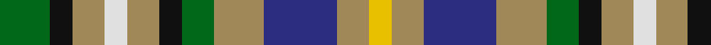

In pattern [GKYWYKGYBYY](/patterns/gkywykgybyy/).

This was sourced from tartans-authority.  It is a [11 stripes tartan](/stripes/stripes11/).

Original link http://www.tartansauthority.com/tartan-ferret/display/7429/

## Attestations

This cloth appears in 2 source records; the oldest owns this page.

- 2004 — Roscommon County Crest (Fashion) (tartans-authority, [record](http://www.tartansauthority.com/tartan-ferret/display/7429/))
- 01/05/2005 — Roscommon County, Crest Range (register-of-tartans, [record](https://www.tartanregister.gov.uk/tartanDetails.aspx?ref=5057))

## Thread count
G/22 K10 LT14 LN10 LT14 K10 G14 LT22 DB32 LT14 Y/10

## Palette
Each colour and its ΔE from the base-6 reference it is a variant of.

| Colour | Shade | Base | ΔE (OKLab) |
|---|---|---|---|
| DB | <code style="background-color:#2C2C80;">#2C2C80</code> `#2C2C80` | B <code style="background-color:#2A418A;">#2A418A</code> | 0.06 |
| G | <code style="background-color:#006818;">#006818</code> `#006818` | G <code style="background-color:#006100;">#006100</code> | 0.02 |
| K | <code style="background-color:#101010;">#101010</code> `#101010` | K <code style="background-color:#000000;">#000000</code> | 0.17 |
| LN | <code style="background-color:#E0E0E0;">#E0E0E0</code> `#E0E0E0` | W <code style="background-color:#F7F7F7;">#F7F7F7</code> | 0.07 |
| LT | <code style="background-color:#A08858;">#A08858</code> `#A08858` | Y <code style="background-color:#F2BF00;">#F2BF00</code> | 0.21 |
| Y | <code style="background-color:#E8C000;">#E8C000</code> `#E8C000` | Y <code style="background-color:#F2BF00;">#F2BF00</code> | 0.02 |

## Nearest tartans

The nearest existing variants by ΔTartan distance.

1. [Scandinavian](/setts/s14/g10k6b10y4b10k3g10k3g10k3r10w4r10k6~b7098b4-g008040-k101010-rc80000-wfcfcfc-yf0c800~x2/) — ΔT 0.88
1. [Spirit of 1994 (Fashion)](/setts/s9/b13w4g15w4r13w4g15y4k13~b2c2c80-g006818-k101010-rc80000-we0e0e0-yfccc00~x2/) — ΔT 0.96
1. [DunBroch (Corporate)](/setts/s11/b4w8k2w5wa2w5g8r7g2r7g3~b202060-g003820-k101010-r880000-w98c8e8-wac0c0c0~x2/) — ΔT 1.13
1. [Belwade](/setts/s11/b4g4b4w1ba1w1r4y4w1g4r4~b2c4084-ba141e46-g007800-r781c38-wffffff-ydc943c~x4/) — ΔT 1.25
1. [Callanish, The](/setts/s13/r2y2b2g2y6ga3b3g4y2b3ga2y2r2~b383131-g6b560f-ga647052-r7c1000-ycbc1b9~x2/) — ΔT 1.27
1. [Spirit of 1994](/setts/s9/b13w4g15w4r13w4g15y4k13~b0000cd-g008b00-k101010-rff0000-wffffff-yffe600~x2/) — ΔT 1.27
1. [Northern College Corporate Tartan Tartan Number: 690. Earliest known date: 1983 Northern College, Ontario, Canada See products available Copyright © Blair Urquhart, Comrie, 2015](/setts/s10/g10b6ba6g10w8y3ba2y3b2r2~b2c2c80-ba5c8ca8-g006818-rc80000-we0e0e0-ye8c000/) — ΔT 1.31
1. [DunBroch](/setts/s11/b4ba8k2ba5w2ba5g8bb7g2bb7g3~b483d8b-ba539dc2-bb700038-g00572b-k101010-we1cdb2~x2/) — ΔT 1.32
1. [Redgate (Name)](/setts/s13/b10r3b10k7y5w2y5w2y5k7g10r3g7~b5c8ca8-g00643c-k101010-r880000-we0e0e0-ya08858~x2/) — ΔT 1.32
1. [British Columbia](/setts/s12/g2k1g4b4y1b4r4k1r4b2r4w1~b5480b0-g008000-k000000-rc00000-we0e0e0-yf0c000~x4/) — ΔT 1.35

## Neighbour map

Every grey dot is one of 15726 variants placed by the first two principal components of the ΔTartan feature space (44% of its variance). Red is this tartan; blue dots are its nearest — click one to open its page.

<svg viewBox="0 0 640 380" role="img" style="max-width:100%;height:auto;border:1px solid #e0e0e0;border-radius:4px;display:block" xmlns="http://www.w3.org/2000/svg"><image href="/nn/cloud.v1.png" width="640" height="380"/><a href="/setts/s14/g10k6b10y4b10k3g10k3g10k3r10w4r10k6~b7098b4-g008040-k101010-rc80000-wfcfcfc-yf0c800~x2/"><circle cx="14.0" cy="206.1" r="4" fill="#3465a4"><title>Scandinavian</title></circle></a><a href="/setts/s9/b13w4g15w4r13w4g15y4k13~b2c2c80-g006818-k101010-rc80000-we0e0e0-yfccc00~x2/"><circle cx="20.7" cy="208.6" r="4" fill="#3465a4"><title>Spirit of 1994 (Fashion)</title></circle></a><a href="/setts/s11/b4w8k2w5wa2w5g8r7g2r7g3~b202060-g003820-k101010-r880000-w98c8e8-wac0c0c0~x2/"><circle cx="24.5" cy="202.8" r="4" fill="#3465a4"><title>DunBroch (Corporate)</title></circle></a><a href="/setts/s11/b4g4b4w1ba1w1r4y4w1g4r4~b2c4084-ba141e46-g007800-r781c38-wffffff-ydc943c~x4/"><circle cx="14.0" cy="202.6" r="4" fill="#3465a4"><title>Belwade</title></circle></a><a href="/setts/s13/r2y2b2g2y6ga3b3g4y2b3ga2y2r2~b383131-g6b560f-ga647052-r7c1000-ycbc1b9~x2/"><circle cx="36.9" cy="233.6" r="4" fill="#3465a4"><title>Callanish, The</title></circle></a><a href="/setts/s9/b13w4g15w4r13w4g15y4k13~b0000cd-g008b00-k101010-rff0000-wffffff-yffe600~x2/"><circle cx="14.0" cy="200.7" r="4" fill="#3465a4"><title>Spirit of 1994</title></circle></a><a href="/setts/s10/g10b6ba6g10w8y3ba2y3b2r2~b2c2c80-ba5c8ca8-g006818-rc80000-we0e0e0-ye8c000/"><circle cx="57.6" cy="189.5" r="4" fill="#3465a4"><title>Northern College Corporate Tartan Tartan Number: 690. Earliest known date: 1983 Northern College, Ontario, Canada See products available Copyright © Blair Urquhart, Comrie, 2015</title></circle></a><a href="/setts/s11/b4ba8k2ba5w2ba5g8bb7g2bb7g3~b483d8b-ba539dc2-bb700038-g00572b-k101010-we1cdb2~x2/"><circle cx="52.7" cy="217.7" r="4" fill="#3465a4"><title>DunBroch</title></circle></a><a href="/setts/s13/b10r3b10k7y5w2y5w2y5k7g10r3g7~b5c8ca8-g00643c-k101010-r880000-we0e0e0-ya08858~x2/"><circle cx="14.0" cy="197.5" r="4" fill="#3465a4"><title>Redgate (Name)</title></circle></a><a href="/setts/s12/g2k1g4b4y1b4r4k1r4b2r4w1~b5480b0-g008000-k000000-rc00000-we0e0e0-yf0c000~x4/"><circle cx="67.3" cy="196.9" r="4" fill="#3465a4"><title>British Columbia</title></circle></a><circle cx="25.0" cy="224.5" r="5" fill="#c00000"/></svg>

ID: /setts/s11/g11k5y7w5y7k5g7y11b16y7ya5~b2c2c80-g006818-k101010-we0e0e0-ya08858-yae8c000~x2/
