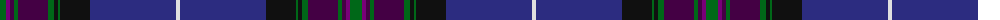

In pattern [GBBGBGKGKBW](/patterns/gbbgbgkgkbw/).

This was sourced from tartans-authority.  It is a [11 stripes tartan](/stripes/stripes11/).

Original link http://www.tartansauthority.com/tartan-ferret/display/6492/

## Thread count
G/12 P4 DP4 G4 DP30 G6 K4 G2 K30 DB86 LN/4

## Palette
Each colour and its ΔE from the base-6 reference it is a variant of.

| Colour | Shade | Base | ΔE (OKLab) |
|---|---|---|---|
| DB | <code style="background-color:#2C2C80;">#2C2C80</code> `#2C2C80` | B <code style="background-color:#2C4084;">#2C4084</code> | 0.05 |
| DP | <code style="background-color:#440044;">#440044</code> `#440044` | B <code style="background-color:#2C4084;">#2C4084</code> | 0.17 |
| G | <code style="background-color:#006818;">#006818</code> `#006818` | G <code style="background-color:#006400;">#006400</code> | 0.02 |
| K | <code style="background-color:#101010;">#101010</code> `#101010` | K <code style="background-color:#000000;">#000000</code> | 0.17 |
| LN | <code style="background-color:#E0E0E0;">#E0E0E0</code> `#E0E0E0` | W <code style="background-color:#F4F4F0;">#F4F4F0</code> | 0.06 |
| P | <code style="background-color:#780078;">#780078</code> `#780078` | B <code style="background-color:#2C4084;">#2C4084</code> | 0.16 |

## Nearest tartans

The nearest existing variants by ΔTartan distance.

1. [Highland Pride of Scotland (Fashion)](/setts/s11/b18g4ba4bb4g36ba4k4g2k38b66w4-b202060-ba780078-bb440044-g285800-k101010-we0e0e0/) — ΔT 1.01
1. [Holyrood Corporate Tartan Tartan Number: 98. Earliest known date: 1980 Holyrood is the Scottish equivalent of Buckingham Palace, the Queens official residence in Scotland. She is guarded by 'The Royal Company of Archers', a non military force provided by the chiefs of the clans. A sample of the Holyrood tartan was presented to the Scottish Tartans Society by Lochcarron Weavers in 1980. See products available Copyright © Blair Urquhart, Comrie, 2015](/setts/s11/b108ba28y6ba6w6ba6g18bb14ba4bb18w4-b202060-ba2c2c80-bb480800-g006818-we0e0e0-ye8c000/) — ΔT 1.02
1. [Muir Homes](/setts/s11/b66k20ba7g4ba5g4ba5g4ba7k2y6-b141e46-ba2c4084-g808080-k101010-yb0b0b0/) — ΔT 1.12
1. [Scotland the Brave (Fashion)](/setts/s10/b12w2b80r2k24g24r12g4ba4g8-b202060-ba780078-g285800-k101010-rb468ac-wf8f8f8/) — ΔT 1.13
1. [Heart of Scotland (Fashion)](/setts/s10/b10w2b88ba2g24k24ba10k4r4k6-b202060-ba6c0070-g006818-k101010-r9c68a4-wf8f8f8/) — ΔT 1.19
1. [University of Dundee](/setts/s10/b10r8ra12y2ra18ba70b10y2b24w2-b1c1c50-ba2c2c80-r888888-rac80000-we0e0e0-ybc8c00/) — ΔT 1.20
1. [McGuirk (2013)](/setts/s12/g8r2g2r6g32k24r2b54w4b6w2y4-b202060-g003820-k101010-ra00000-wa8ace8-ye8c000/) — ΔT 1.26
1. [Kirkcaldy Tartan Army (Corporate)](/setts/s12/b72r6b2r4b6r12ba2r4ba70w2ba2y4-b14283c-ba202060-rc8002c-wf8f8f8-ybc8c00/) — ΔT 1.34
1. [Pride of Scotland General Tartan Tartan Number: 2469. Earliest known date: 1997 The Pride of Scotland tartan was designed by Kenneth Dalgleish of D C Dalgleish, Selkirk and promoted by McCalls of Aberdeen who own copyright and patent. See products available Copyright © Blair Urquhart, Comrie, 2015](/setts/s11/g16b4ba4g6ba32g4k4g2k32bb60w4-b780078-ba583058-bb140058-g005030-k101010-wd8d8d8/) — ΔT 1.35
1. [Scottish Pride](/setts/s20/g12b4ba4g4ba30g6k4g2k30bb86w4bb86k30g2k4g4ba30g6ba4b4-b780078-ba440044-bb2c2c80-g006818-k101010-we0e0e0/) — ΔT 1.37

## Neighbour map

Every grey dot is one of 15726 variants placed by the first two principal components of the ΔTartan feature space (44% of its variance). Red is this tartan; blue dots are its nearest — click one to open its page.

<svg viewBox="0 0 640 380" role="img" style="max-width:100%;height:auto;border:1px solid #e0e0e0;border-radius:4px;display:block" xmlns="http://www.w3.org/2000/svg"><image href="/nn/cloud.v1.png" width="640" height="380"/><a href="/setts/s11/b18g4ba4bb4g36ba4k4g2k38b66w4-b202060-ba780078-bb440044-g285800-k101010-we0e0e0/"><circle cx="290.2" cy="112.1" r="4" fill="#3465a4"><title>Highland Pride of Scotland (Fashion)</title></circle></a><a href="/setts/s11/b108ba28y6ba6w6ba6g18bb14ba4bb18w4-b202060-ba2c2c80-bb480800-g006818-we0e0e0-ye8c000/"><circle cx="289.7" cy="94.8" r="4" fill="#3465a4"><title>Holyrood Corporate Tartan Tartan Number: 98. Earliest known date: 1980 Holyrood is the Scottish equivalent of Buckingham Palace, the Queens official residence in Scotland. She is guarded by 'The Royal Company of Archers', a non military force provided by the chiefs of the clans. A sample of the Holyrood tartan was presented to the Scottish Tartans Society by Lochcarron Weavers in 1980. See products available Copyright © Blair Urquhart, Comrie, 2015</title></circle></a><a href="/setts/s11/b66k20ba7g4ba5g4ba5g4ba7k2y6-b141e46-ba2c4084-g808080-k101010-yb0b0b0/"><circle cx="344.1" cy="112.8" r="4" fill="#3465a4"><title>Muir Homes</title></circle></a><a href="/setts/s10/b12w2b80r2k24g24r12g4ba4g8-b202060-ba780078-g285800-k101010-rb468ac-wf8f8f8/"><circle cx="332.6" cy="97.4" r="4" fill="#3465a4"><title>Scotland the Brave (Fashion)</title></circle></a><a href="/setts/s10/b10w2b88ba2g24k24ba10k4r4k6-b202060-ba6c0070-g006818-k101010-r9c68a4-wf8f8f8/"><circle cx="377.1" cy="97.7" r="4" fill="#3465a4"><title>Heart of Scotland (Fashion)</title></circle></a><a href="/setts/s10/b10r8ra12y2ra18ba70b10y2b24w2-b1c1c50-ba2c2c80-r888888-rac80000-we0e0e0-ybc8c00/"><circle cx="276.6" cy="95.6" r="4" fill="#3465a4"><title>University of Dundee</title></circle></a><a href="/setts/s12/g8r2g2r6g32k24r2b54w4b6w2y4-b202060-g003820-k101010-ra00000-wa8ace8-ye8c000/"><circle cx="250.3" cy="105.1" r="4" fill="#3465a4"><title>McGuirk (2013)</title></circle></a><a href="/setts/s12/b72r6b2r4b6r12ba2r4ba70w2ba2y4-b14283c-ba202060-rc8002c-wf8f8f8-ybc8c00/"><circle cx="349.2" cy="103.3" r="4" fill="#3465a4"><title>Kirkcaldy Tartan Army (Corporate)</title></circle></a><a href="/setts/s11/g16b4ba4g6ba32g4k4g2k32bb60w4-b780078-ba583058-bb140058-g005030-k101010-wd8d8d8/"><circle cx="236.6" cy="119.2" r="4" fill="#3465a4"><title>Pride of Scotland General Tartan Tartan Number: 2469. Earliest known date: 1997 The Pride of Scotland tartan was designed by Kenneth Dalgleish of D C Dalgleish, Selkirk and promoted by McCalls of Aberdeen who own copyright and patent. See products available Copyright © Blair Urquhart, Comrie, 2015</title></circle></a><a href="/setts/s20/g12b4ba4g4ba30g6k4g2k30bb86w4bb86k30g2k4g4ba30g6ba4b4-b780078-ba440044-bb2c2c80-g006818-k101010-we0e0e0/"><circle cx="324.3" cy="72.2" r="4" fill="#3465a4"><title>Scottish Pride</title></circle></a><circle cx="306.6" cy="88.1" r="5" fill="#c00000"/></svg>

ID: /setts/s11/g12b4ba4g4ba30g6k4g2k30bb86w4-b780078-ba440044-bb2c2c80-g006818-k101010-we0e0e0/
