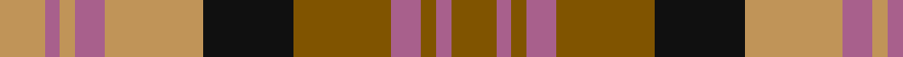

In pattern [GRGRGKYRYRY](/patterns/grgrgkyryry/).

This was sourced from register-of-tartans.  It is a [11 stripes tartan](/stripes/stripes11/).

Original link https://www.tartanregister.gov.uk/tartanDetails.aspx?ref=4868

## Thread count
LT/12 LP4 LT4 LP8 LT26 K24 T26 LP8 T4 LP4 T/12

## Palette
Each colour and its ΔE from the base-6 reference it is a variant of.

| Colour | Shade | Base | ΔE (OKLab) |
|---|---|---|---|
| K | <code style="background-color:#101010;">#101010</code> `#101010` | K <code style="background-color:#000000;">#000000</code> | 0.17 |
| LP | <code style="background-color:#A8608C;">#A8608C</code> `#A8608C` | R <code style="background-color:#C80000;">#C80000</code> | 0.17 |
| LT | <code style="background-color:#C09458;">#C09458</code> `#C09458` | Y <code style="background-color:#E8C000;">#E8C000</code> | 0.15 |
| T | <code style="background-color:#805400;">#805400</code> `#805400` | G <code style="background-color:#006400;">#006400</code> | 0.15 |

ID: /setts/s11/g12r4g4r8g26k24y26r8y4r4y12-g805400-k101010-ra8608c-yc09458/
c09458/
