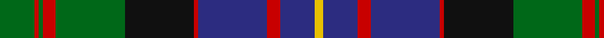

In pattern [GRGRGKRBRBY](/patterns/grgrgkrbrby/).

This was sourced from tartans-authority.  It is a [11 stripes tartan](/stripes/stripes11/).

Original link http://www.tartansauthority.com/tartan-ferret/display/993/

## Attestations

This cloth appears in 3 source records; the oldest owns this page.

- 1793 — Cameron of Erracht (Clan) (tartans-authority, [record](http://www.tartansauthority.com/tartan-ferret/display/993/))
- 01/01/1831 — Cameron of Erracht (register-of-tartans, [record](https://www.tartanregister.gov.uk/tartanDetails.aspx?ref=495))
- undated — Cameron of Erracht Regimental Tartan Tartan Number: 993. Earliest known date: 1793 Designed for the Queen's Own Cameron Highlanders raised by Alan Cameron of Erracht in 1793. It was never adopted by the clan. A sample of this tartan exists in the Cockburn Collection (1810-20) in the Mitchell Library in Glasgow. See products available Copyright © Blair Urquhart, Comrie, 2015 (house-of-tartan, [record](http://www.house-of-tartan.scotland.net/house/TartanViewjs.asp?colr=Def&tnam=993))

## Thread count
G/16 R2 G2 R6 G32 K32 R2 DB32 R6 DB16 Y/4

## Palette
Each colour and its ΔE from the base-6 reference it is a variant of.

| Colour | Shade | Base | ΔE (OKLab) |
|---|---|---|---|
| DB | <code style="background-color:#2C2C80;">#2C2C80</code> `#2C2C80` | B <code style="background-color:#2C4084;">#2C4084</code> | 0.05 |
| G | <code style="background-color:#006818;">#006818</code> `#006818` | G <code style="background-color:#006400;">#006400</code> | 0.02 |
| K | <code style="background-color:#101010;">#101010</code> `#101010` | K <code style="background-color:#000000;">#000000</code> | 0.17 |
| R | <code style="background-color:#C80000;">#C80000</code> `#C80000` | R <code style="background-color:#C80000;">#C80000</code> | 0.00 |
| Y | <code style="background-color:#E8C000;">#E8C000</code> `#E8C000` | Y <code style="background-color:#E8C000;">#E8C000</code> | 0.00 |

## Nearest tartans

The nearest existing variants by ΔTartan distance.

1. [MacDonell of Glengarry #3](/setts/s11/b16r5b30r2k33g30r5g2r2g7w4-b202060-g006818-k101010-rc80000-we0e0e0/) — ΔT 0.37
1. [Ofally, County](/setts/s10/r12b4g10b36g20b4k56b4g20y6-b1c0070-g006818-k101010-rd05054-yd09800/) — ΔT 0.59
1. [MacDonald of Clanranald #2](/setts/s13/b32r4b4r14b62r4k64w6g62r14g4r4g32-b2c4084-g005020-k101010-rdc0000-we0e0e0/) — ΔT 0.61
1. [Bowie, Black (Name)](/setts/s12/b18r6b6r10b32r4k34g32r10g6y2k18-b1870a4-g285800-k101010-rc80000-yd09800/) — ΔT 0.63
1. [Logan #7](/setts/s11/r12b6r4b4r4b32k24g32r2k2y4-b2c2c80-g006818-k101010-rc80000-ye8c000/) — ΔT 0.63
1. [MacDonell of Glengarry Clan Tartan Tartan Number: 471. Earliest known date: 1906 The Setts No: 112. W & A K Johnston (1906). There is a sample certified by 'Glengarry' in the collection of the Highland Society of London from the period 1815-16 but it is not known whether the threadcount corresponds to MacKays record illustrated here. See products available Copyright © Blair Urquhart, Comrie, 2015](/setts/s13/b16r2b4r6b24r2k24g24r6g4r2g8w2-b2c2c80-g006818-k101010-rc80000-we0e0e0/) — ΔT 0.67
1. [Grant Hunting Clan Tartan Tartan Number: 311. Earliest known date: 1819 This sample comes from the MacGregor-Hastie collection which forms the basis of the cloth archive of the Scottish Tartans Society. James Cant notes say: "This clan had no hunting tartan of its own until about 1730. At that time many of the Cadets of the Clan were officers in the Black Watch and they adopted the tartan of the Watch as their Hunting Tartan". See products available Copyright © Blair Urquhart, Comrie, 2015](/setts/s11/b22k4b4k4b4k22g22r4g6k2y6-b2c2c80-g006818-k101010-rc80000-ye8c000/) — ΔT 0.67
1. [MacMillan Htg (1906) (Clan)](/setts/s10/b12y4b48k16y8k16g32r8g32r4-b2c2c80-g285800-k101010-rc80000-ye8c000/) — ΔT 0.67
1. [MacDonell of Glengarry #2](/setts/s11/b16r8b24r2k24g24r6g4r2g8w2-b2c4084-g005020-k101010-rdc0000-we0e0e0/) — ΔT 0.68
1. [New Zealand (2003)](/setts/s10/k6b18k4y10b2y10k4g30k2r6-b2c2c80-g285800-k101010-rc80000-ya08858/) — ΔT 0.69

## Neighbour map

Every grey dot is one of 15726 variants placed by the first two principal components of the ΔTartan feature space (44% of its variance). Red is this tartan; blue dots are its nearest — click one to open its page.

<svg viewBox="0 0 640 380" role="img" style="max-width:100%;height:auto;border:1px solid #e0e0e0;border-radius:4px;display:block" xmlns="http://www.w3.org/2000/svg"><image href="/nn/cloud.v1.png" width="640" height="380"/><a href="/setts/s11/b16r5b30r2k33g30r5g2r2g7w4-b202060-g006818-k101010-rc80000-we0e0e0/"><circle cx="176.5" cy="146.2" r="4" fill="#3465a4"><title>MacDonell of Glengarry #3</title></circle></a><a href="/setts/s10/r12b4g10b36g20b4k56b4g20y6-b1c0070-g006818-k101010-rd05054-yd09800/"><circle cx="166.2" cy="160.0" r="4" fill="#3465a4"><title>Ofally, County</title></circle></a><a href="/setts/s13/b32r4b4r14b62r4k64w6g62r14g4r4g32-b2c4084-g005020-k101010-rdc0000-we0e0e0/"><circle cx="176.3" cy="140.7" r="4" fill="#3465a4"><title>MacDonald of Clanranald #2</title></circle></a><a href="/setts/s12/b18r6b6r10b32r4k34g32r10g6y2k18-b1870a4-g285800-k101010-rc80000-yd09800/"><circle cx="146.2" cy="153.3" r="4" fill="#3465a4"><title>Bowie, Black (Name)</title></circle></a><a href="/setts/s11/r12b6r4b4r4b32k24g32r2k2y4-b2c2c80-g006818-k101010-rc80000-ye8c000/"><circle cx="166.0" cy="138.8" r="4" fill="#3465a4"><title>Logan #7</title></circle></a><a href="/setts/s13/b16r2b4r6b24r2k24g24r6g4r2g8w2-b2c2c80-g006818-k101010-rc80000-we0e0e0/"><circle cx="164.6" cy="152.8" r="4" fill="#3465a4"><title>MacDonell of Glengarry Clan Tartan Tartan Number: 471. Earliest known date: 1906 The Setts No: 112. W &amp; A K Johnston (1906). There is a sample certified by 'Glengarry' in the collection of the Highland Society of London from the period 1815-16 but it is not known whether the threadcount corresponds to MacKays record illustrated here. See products available Copyright © Blair Urquhart, Comrie, 2015</title></circle></a><a href="/setts/s11/b22k4b4k4b4k22g22r4g6k2y6-b2c2c80-g006818-k101010-rc80000-ye8c000/"><circle cx="145.0" cy="166.4" r="4" fill="#3465a4"><title>Grant Hunting Clan Tartan Tartan Number: 311. Earliest known date: 1819 This sample comes from the MacGregor-Hastie collection which forms the basis of the cloth archive of the Scottish Tartans Society. James Cant notes say: &quot;This clan had no hunting tartan of its own until about 1730. At that time many of the Cadets of the Clan were officers in the Black Watch and they adopted the tartan of the Watch as their Hunting Tartan&quot;. See products available Copyright © Blair Urquhart, Comrie, 2015</title></circle></a><a href="/setts/s10/b12y4b48k16y8k16g32r8g32r4-b2c2c80-g285800-k101010-rc80000-ye8c000/"><circle cx="158.4" cy="175.9" r="4" fill="#3465a4"><title>MacMillan Htg (1906) (Clan)</title></circle></a><a href="/setts/s11/b16r8b24r2k24g24r6g4r2g8w2-b2c4084-g005020-k101010-rdc0000-we0e0e0/"><circle cx="158.9" cy="170.7" r="4" fill="#3465a4"><title>MacDonell of Glengarry #2</title></circle></a><a href="/setts/s10/k6b18k4y10b2y10k4g30k2r6-b2c2c80-g285800-k101010-rc80000-ya08858/"><circle cx="157.3" cy="155.6" r="4" fill="#3465a4"><title>New Zealand (2003)</title></circle></a><circle cx="169.8" cy="152.6" r="5" fill="#c00000"/></svg>

ID: /setts/s11/g16r2g2r6g32k32r2b32r6b16y4-b2c2c80-g006818-k101010-rc80000-ye8c000/
