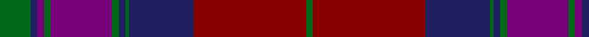

In pattern [GBBGBGBGBRG](/patterns/gbbgbgbgbrg/).

This was sourced from tartans-authority.  It is a [11 stripes tartan](/stripes/stripes11/).

Original link http://www.tartansauthority.com/tartan-ferret/display/6479/

## Thread count
G/18 DB4 P4 G4 P36 G4 DB4 G2 DB38 DR66 G/4

## Palette
Each colour and its ΔE from the base-6 reference it is a variant of.

| Colour | Shade | Base | ΔE (OKLab) |
|---|---|---|---|
| DB | <code style="background-color:#202060;">#202060</code> `#202060` | B <code style="background-color:#2C4084;">#2C4084</code> | 0.11 |
| DR | <code style="background-color:#880000;">#880000</code> `#880000` | R <code style="background-color:#C80000;">#C80000</code> | 0.14 |
| G | <code style="background-color:#006818;">#006818</code> `#006818` | G <code style="background-color:#006400;">#006400</code> | 0.02 |
| P | <code style="background-color:#780078;">#780078</code> `#780078` | B <code style="background-color:#2C4084;">#2C4084</code> | 0.16 |

ID: /setts/s11/g18b4ba4g4ba36g4b4g2b38r66g4-b202060-ba780078-g006818-r880000/
