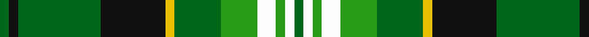

In pattern [GKGKYGGWGWG](/patterns/gkgkyggwgwg/).

This was sourced from register-of-tartans.  It is a [11 stripes tartan](/stripes/stripes11/).

Original link https://www.tartanregister.gov.uk/tartanDetails.aspx?ref=3294

## Attestations

This cloth appears in 2 source records; the oldest owns this page.

- 01/09/2003 — Parkhead (register-of-tartans, [record](https://www.tartanregister.gov.uk/tartanDetails.aspx?ref=3294))
- pre 2004 — Parkhead (District) (tartans-authority, [record](http://www.tartansauthority.com/tartan-ferret/display/6220/))

## Thread count
Ga/4 K4 Ga36 K28 Y4 Ga20 G16 W8 G4 W4 Ga/4

## Palette
Each colour and its ΔE from the base-6 reference it is a variant of.

| Colour | Shade | Base | ΔE (OKLab) |
|---|---|---|---|
| G | <code style="background-color:#289C18;">#289C18</code> `#289C18` | G <code style="background-color:#006100;">#006100</code> | 0.19 |
| Ga | <code style="background-color:#006818;">#006818</code> `#006818` | G <code style="background-color:#006100;">#006100</code> | 0.02 |
| K | <code style="background-color:#101010;">#101010</code> `#101010` | K <code style="background-color:#000000;">#000000</code> | 0.17 |
| W | <code style="background-color:#FCFCFC;">#FCFCFC</code> `#FCFCFC` | W <code style="background-color:#F7F7F7;">#F7F7F7</code> | 0.01 |
| Y | <code style="background-color:#E8C000;">#E8C000</code> `#E8C000` | Y <code style="background-color:#F2BF00;">#F2BF00</code> | 0.02 |

## Nearest tartans

The nearest existing variants by ΔTartan distance.

1. [Forrester/Foster Hunting](/setts/s10/k3y2g18w3g13k3y4k3ga18w3~g006818-ga289c18-k101010-wfcfcfc-ye8c000~x2/) — ΔT 0.91
1. [Forrester Hunting Clan Tartan Tartan Number: 2385. Earliest known date: 1997 A clan society that has been in existence since the 1980's. This hunting tartan was fully adopted in 1997. Can be worn with anyone with the name. Note from EBW "From the book "The Forresters" by Colin D.I.G.Forrester, 1988" See products available Copyright © Blair Urquhart, Comrie, 2015](/setts/s10/k3y2g18w3g18k3y4k3ga18w3~g006818-ga289c18-k101010-we0e0e0-ye8c000~x2/) — ΔT 0.91
1. [Casey of West Virginia (Personal)](/setts/s9/g4y1b1y1b2g9r1b6w1~b14283c-g007800-rc80000-wf8f8f8-yc88c00~x4/) — ΔT 1.03
1. [Forrester / Foster, hunting](/setts/s10/k3y2g18w3g18k3y4k3ga18w3~g008000-ga30a010-k000000-we0e0e0-yf0c000~x2/) — ΔT 1.07
1. [Maitland](/setts/s9/g5b24g7k10g24y2b2y2r2~b304080-g008000-k000000-rc00000-yf0c000~x2/) — ΔT 1.18
1. [Gayre Dress](/setts/s15/g8ga2k2w2ga8g2ga8w2k2gb3ga2w2ga1g2k2~g789484-ga006818-gb006400-k101010-wffffff~x2/) — ΔT 1.23
1. [Skene](/setts/s12/k4b24k4r3k4g24k4y3k4g24r3k4~b304080-g008000-k000000-rc00000-yff8500~x2/) — ΔT 1.23
1. [Wellecomme, Bernard (Personal)](/setts/s10/b4g8k8b4y3g21k3w4k3w4~b000080-g004c00-k1c1714-we8ccb8-yffff00~x2/) — ΔT 1.24
1. [Confessore Family Tartan Tartan Number: 2165. Earliest known date: 1994 Designed for Mr Confessore of Napoli, Italy in 1994 by Mr. Keith Lumsden, researcher at the Scottish Tartans Society. The colours reflect the shades and tones of the Italian countryside. See products available Copyright © Blair Urquhart, Comrie, 2015](/setts/s15/g12ga2g2ga7y4r2y8r2y4ga7g2ga2g16w2g4~g003820-ga5c6428-ra03400-we0e0e0-ye8c000~x2/) — ΔT 1.25
1. [Cochrane, -1974](/setts/s13/g22r4g2r2g2r4g12k12r2b10r4b4y3~b304080-g008000-k000000-rc00000-yf0c000~x2/) — ΔT 1.26

## Neighbour map

Every grey dot is one of 15726 variants placed by the first two principal components of the ΔTartan feature space (44% of its variance). Red is this tartan; blue dots are its nearest — click one to open its page.

<svg viewBox="0 0 640 380" role="img" style="max-width:100%;height:auto;border:1px solid #e0e0e0;border-radius:4px;display:block" xmlns="http://www.w3.org/2000/svg"><image href="/nn/cloud.v1.png" width="640" height="380"/><a href="/setts/s10/k3y2g18w3g13k3y4k3ga18w3~g006818-ga289c18-k101010-wfcfcfc-ye8c000~x2/"><circle cx="162.0" cy="166.3" r="4" fill="#3465a4"><title>Forrester/Foster Hunting</title></circle></a><a href="/setts/s10/k3y2g18w3g18k3y4k3ga18w3~g006818-ga289c18-k101010-we0e0e0-ye8c000~x2/"><circle cx="193.9" cy="170.4" r="4" fill="#3465a4"><title>Forrester Hunting Clan Tartan Tartan Number: 2385. Earliest known date: 1997 A clan society that has been in existence since the 1980's. This hunting tartan was fully adopted in 1997. Can be worn with anyone with the name. Note from EBW &quot;From the book &quot;The Forresters&quot; by Colin D.I.G.Forrester, 1988&quot; See products available Copyright © Blair Urquhart, Comrie, 2015</title></circle></a><a href="/setts/s9/g4y1b1y1b2g9r1b6w1~b14283c-g007800-rc80000-wf8f8f8-yc88c00~x4/"><circle cx="237.6" cy="178.7" r="4" fill="#3465a4"><title>Casey of West Virginia (Personal)</title></circle></a><a href="/setts/s10/k3y2g18w3g18k3y4k3ga18w3~g008000-ga30a010-k000000-we0e0e0-yf0c000~x2/"><circle cx="176.0" cy="164.0" r="4" fill="#3465a4"><title>Forrester / Foster, hunting</title></circle></a><a href="/setts/s9/g5b24g7k10g24y2b2y2r2~b304080-g008000-k000000-rc00000-yf0c000~x2/"><circle cx="210.5" cy="158.9" r="4" fill="#3465a4"><title>Maitland</title></circle></a><a href="/setts/s15/g8ga2k2w2ga8g2ga8w2k2gb3ga2w2ga1g2k2~g789484-ga006818-gb006400-k101010-wffffff~x2/"><circle cx="135.9" cy="162.6" r="4" fill="#3465a4"><title>Gayre Dress</title></circle></a><a href="/setts/s12/k4b24k4r3k4g24k4y3k4g24r3k4~b304080-g008000-k000000-rc00000-yff8500~x2/"><circle cx="174.7" cy="156.8" r="4" fill="#3465a4"><title>Skene</title></circle></a><a href="/setts/s10/b4g8k8b4y3g21k3w4k3w4~b000080-g004c00-k1c1714-we8ccb8-yffff00~x2/"><circle cx="159.8" cy="179.5" r="4" fill="#3465a4"><title>Wellecomme, Bernard (Personal)</title></circle></a><a href="/setts/s15/g12ga2g2ga7y4r2y8r2y4ga7g2ga2g16w2g4~g003820-ga5c6428-ra03400-we0e0e0-ye8c000~x2/"><circle cx="177.7" cy="160.2" r="4" fill="#3465a4"><title>Confessore Family Tartan Tartan Number: 2165. Earliest known date: 1994 Designed for Mr Confessore of Napoli, Italy in 1994 by Mr. Keith Lumsden, researcher at the Scottish Tartans Society. The colours reflect the shades and tones of the Italian countryside. See products available Copyright © Blair Urquhart, Comrie, 2015</title></circle></a><a href="/setts/s13/g22r4g2r2g2r4g12k12r2b10r4b4y3~b304080-g008000-k000000-rc00000-yf0c000~x2/"><circle cx="175.0" cy="144.5" r="4" fill="#3465a4"><title>Cochrane, -1974</title></circle></a><circle cx="183.8" cy="163.1" r="5" fill="#c00000"/></svg>

ID: /setts/s11/g1k1g9k7y1g5ga4w2ga1w1g1~g006818-ga289c18-k101010-wfcfcfc-ye8c000~x4/
