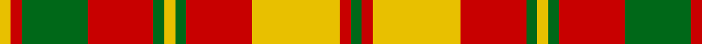

This page is one **sett** — a single exact thread-count. It belongs to the [tartan](/tartans/g1r1ly8r6g1ly1g1r6g6r1ly1/)
(the same proportion at any scale), whose colour order is pattern [GRYRGYGRGRY](/stripes/gryrgygrgry/).

Sourced from tartans-authority.  It is a [11 stripe tartan](/stripes/stripes11/).

Original link http://www.tartansauthority.com/tartan-ferret/display/1890/

## Thread count
Y/4 R4 G24 R24 G4 Y4 G4 R24 Y32 R4 G/4

## Palette

Palette: <strong>Tartan Register</strong>
<table><thead><tr><th>Colour</th><th>Threads</th><th>Shade</th><th>Base</th><th>OKLCh</th></tr></thead><tbody><tr><td>Y/</td><td style="text-align:right;font-variant-numeric:tabular-nums">4</td><td><code style="background-color:#E8C000;">#E8C000</code> <small style="color:#888">#E8C000</small></td><td>Y <code style="background-color:#F2BF00;">#F2BF00</code></td><td><small style="color:#888">oklch(81.9% 0.168 93.7)</small></td></tr><tr><td>R</td><td style="text-align:right;font-variant-numeric:tabular-nums">4</td><td><code style="background-color:#C80000;">#C80000</code> <small style="color:#888">#C80000</small></td><td>R <code style="background-color:#CC0000;">#CC0000</code></td><td><small style="color:#888">oklch(52.3% 0.215 29.2)</small></td></tr><tr><td>G</td><td style="text-align:right;font-variant-numeric:tabular-nums">24</td><td><code style="background-color:#006818;">#006818</code> <small style="color:#888">#006818</small></td><td>G <code style="background-color:#006100;">#006100</code></td><td><small style="color:#888">oklch(45.0% 0.142 145.0)</small></td></tr><tr><td>R</td><td style="text-align:right;font-variant-numeric:tabular-nums">24</td><td><code style="background-color:#C80000;">#C80000</code> <small style="color:#888">#C80000</small></td><td>R <code style="background-color:#CC0000;">#CC0000</code></td><td><small style="color:#888">oklch(52.3% 0.215 29.2)</small></td></tr><tr><td>G</td><td style="text-align:right;font-variant-numeric:tabular-nums">4</td><td><code style="background-color:#006818;">#006818</code> <small style="color:#888">#006818</small></td><td>G <code style="background-color:#006100;">#006100</code></td><td><small style="color:#888">oklch(45.0% 0.142 145.0)</small></td></tr><tr><td>Y</td><td style="text-align:right;font-variant-numeric:tabular-nums">4</td><td><code style="background-color:#E8C000;">#E8C000</code> <small style="color:#888">#E8C000</small></td><td>Y <code style="background-color:#F2BF00;">#F2BF00</code></td><td><small style="color:#888">oklch(81.9% 0.168 93.7)</small></td></tr><tr><td>G</td><td style="text-align:right;font-variant-numeric:tabular-nums">4</td><td><code style="background-color:#006818;">#006818</code> <small style="color:#888">#006818</small></td><td>G <code style="background-color:#006100;">#006100</code></td><td><small style="color:#888">oklch(45.0% 0.142 145.0)</small></td></tr><tr><td>R</td><td style="text-align:right;font-variant-numeric:tabular-nums">24</td><td><code style="background-color:#C80000;">#C80000</code> <small style="color:#888">#C80000</small></td><td>R <code style="background-color:#CC0000;">#CC0000</code></td><td><small style="color:#888">oklch(52.3% 0.215 29.2)</small></td></tr><tr><td>Y</td><td style="text-align:right;font-variant-numeric:tabular-nums">32</td><td><code style="background-color:#E8C000;">#E8C000</code> <small style="color:#888">#E8C000</small></td><td>Y <code style="background-color:#F2BF00;">#F2BF00</code></td><td><small style="color:#888">oklch(81.9% 0.168 93.7)</small></td></tr><tr><td>R</td><td style="text-align:right;font-variant-numeric:tabular-nums">4</td><td><code style="background-color:#C80000;">#C80000</code> <small style="color:#888">#C80000</small></td><td>R <code style="background-color:#CC0000;">#CC0000</code></td><td><small style="color:#888">oklch(52.3% 0.215 29.2)</small></td></tr><tr><td>G/</td><td style="text-align:right;font-variant-numeric:tabular-nums">4</td><td><code style="background-color:#006818;">#006818</code> <small style="color:#888">#006818</small></td><td>G <code style="background-color:#006100;">#006100</code></td><td><small style="color:#888">oklch(45.0% 0.142 145.0)</small></td></tr></tbody></table>

## Nearest tartans

The nearest existing variants by ΔTartan distance, with this tartan at the top so the swatches line up against it.

ΔTartan

Tartan

Sett

—

<a href="/ttd/edit/#slug=g1r1ly8r6g1ly1g1r6g6r1ly1~x4">Strathearn (Royal)</a> <a class="nn-out" href="/setts/s11/g1r1ly8r6g1ly1g1r6g6r1ly1~x4/" title="open its dictionary page">↗</a>

1.13

<a href="/ttd/edit/#slug=ly1r1g6ly8r1g1r1ly8r6g1ly1g1r6g6r1ly1~x2">Strathearn</a> <a class="nn-out" href="/setts/s16/ly1r1g6ly8r1g1r1ly8r6g1ly1g1r6g6r1ly1~x2/" title="open its dictionary page">↗</a>

1.39

<a href="/setts/s12/r32k3lo6g10r6k3lo32~x2/">Scrimgeour of Glassary</a>

1.40

<a href="/ttd/edit/#slug=w2r4g8r16t2r3g16r4t2r4w2~x2">MacKinnon 7</a> <a class="nn-out" href="/setts/s11/w2r4g8r16t2r3g16r4t2r4w2~x2/" title="open its dictionary page">↗</a>

1.43

<a href="/ttd/edit/#slug=g6r3k3r24g4k10r2g4r2g24r6g2~x2">MacNeish</a> <a class="nn-out" href="/setts/s12/g6r3k3r24g4k10r2g4r2g24r6g2~x2/" title="open its dictionary page">↗</a>

1.48

<a href="/ttd/edit/#slug=db4r1ly12r2ly2r12ly1db4~x4">Glassary #2</a> <a class="nn-out" href="/setts/s8/db4r1ly12r2ly2r12ly1db4~x4/" title="open its dictionary page">↗</a>

1.50

<a href="/ttd/edit/#slug=db4ly1r12ly2r2ly12r1ly4~x4">Glassary #3</a> <a class="nn-out" href="/setts/s8/db4ly1r12ly2r2ly12r1ly4~x4/" title="open its dictionary page">↗</a>

1.51

<a href="/ttd/edit/#slug=w6r2g16r3g2r3g6w2r2w2g6r7g6r2g2r16w2r2w2~x2">MacDougall (Lochcarron)</a> <a class="nn-out" href="/setts/s19/w6r2g16r3g2r3g6w2r2w2g6r7g6r2g2r16w2r2w2~x2/" title="open its dictionary page">↗</a>

1.55

<a href="/ttd/edit/#slug=r12w2lo3w2r3k5r2lo18w2~x2">Ballater Trade or 'Fancy' Tartan Tartan Number: 1708. Earliest known date: Modern Many new designs have been given district names to promote their Scottish connections. However, these names should not be confused with the District tartans which have earned their title through 'use and wont' and not a little history. See products available Copyright © Blair Urquhart, Comrie, 2015</a> <a class="nn-out" href="/setts/s9/r12w2lo3w2r3k5r2lo18w2~x2/" title="open its dictionary page">↗</a>

1.65

<a href="/ttd/edit/#slug=w2r4dg8r16t2r3dg16r4t2r4w2~x2">MacKinnon #10</a> <a class="nn-out" href="/setts/s11/w2r4dg8r16t2r3dg16r4t2r4w2~x2/" title="open its dictionary page">↗</a>

1.67

<a href="/ttd/edit/#slug=dg16m2dg2m2dg2m15r14m2r14m15dg16m2dg2~x2">MacNab (Clan)</a> <a class="nn-out" href="/setts/s13/dg16m2dg2m2dg2m15r14m2r14m15dg16m2dg2~x2/" title="open its dictionary page">↗</a>

## Neighbour map

Every grey dot is one of 14299 variants placed by the first two principal components of the ΔTartan feature space (44% of its variance). Red is this tartan; blue dots are its nearest — click one to open its page.

<svg viewBox="0 0 640 380" role="img" style="max-width:100%;height:auto;border:1px solid #e0e0e0;border-radius:4px;display:block" xmlns="http://www.w3.org/2000/svg"><image href="/nn/cloud.v1.png" width="640" height="380"/><a href="/setts/s16/ly1r1g6ly8r1g1r1ly8r6g1ly1g1r6g6r1ly1~x2/"><circle cx="203.2" cy="167.3" r="4" fill="#3465a4"><title>Strathearn</title></circle></a><a href="/setts/s12/r32k3lo6g10r6k3lo32~x2/"><circle cx="212.0" cy="149.3" r="4" fill="#3465a4"><title>Scrimgeour of Glassary</title></circle></a><a href="/setts/s11/w2r4g8r16t2r3g16r4t2r4w2~x2/"><circle cx="265.2" cy="179.4" r="4" fill="#3465a4"><title>MacKinnon 7</title></circle></a><a href="/setts/s12/g6r3k3r24g4k10r2g4r2g24r6g2~x2/"><circle cx="268.1" cy="162.8" r="4" fill="#3465a4"><title>MacNeish</title></circle></a><a href="/setts/s8/db4r1ly12r2ly2r12ly1db4~x4/"><circle cx="235.8" cy="169.8" r="4" fill="#3465a4"><title>Glassary #2</title></circle></a><a href="/setts/s8/db4ly1r12ly2r2ly12r1ly4~x4/"><circle cx="298.1" cy="171.5" r="4" fill="#3465a4"><title>Glassary #3</title></circle></a><a href="/setts/s19/w6r2g16r3g2r3g6w2r2w2g6r7g6r2g2r16w2r2w2~x2/"><circle cx="229.0" cy="162.6" r="4" fill="#3465a4"><title>MacDougall (Lochcarron)</title></circle></a><a href="/setts/s9/r12w2lo3w2r3k5r2lo18w2~x2/"><circle cx="230.0" cy="165.0" r="4" fill="#3465a4"><title>Ballater Trade or 'Fancy' Tartan Tartan Number: 1708. Earliest known date: Modern Many new designs have been given district names to promote their Scottish connections. However, these names should not be confused with the District tartans which have earned their title through 'use and wont' and not a little history. See products available Copyright © Blair Urquhart, Comrie, 2015</title></circle></a><a href="/setts/s11/w2r4dg8r16t2r3dg16r4t2r4w2~x2/"><circle cx="259.9" cy="173.5" r="4" fill="#3465a4"><title>MacKinnon #10</title></circle></a><a href="/setts/s13/dg16m2dg2m2dg2m15r14m2r14m15dg16m2dg2~x2/"><circle cx="220.9" cy="188.2" r="4" fill="#3465a4"><title>MacNab (Clan)</title></circle></a><circle cx="232.9" cy="182.0" r="5" fill="#c00000"/></svg>

ID: /setts/s11/g1r1ly8r6g1ly1g1r6g6r1ly1~x4/
