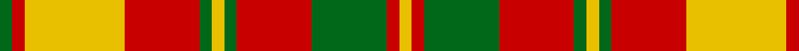

In pattern [GRYRGYGRGRY](/patterns/gryrgygrgry/).

This was sourced from tartans-authority.  It is a [11 stripes tartan](/stripes/stripes11/).

Original link http://www.tartansauthority.com/tartan-ferret/display/1890/

## Thread count
G/4 R4 Y32 R24 G4 Y4 G4 R24 G24 R4 Y/4

## Palette
Each colour and its ΔE from the base-6 reference it is a variant of.

| Colour | Shade | Base | ΔE (OKLab) |
|---|---|---|---|
| G | <code style="background-color:#006818;">#006818</code> `#006818` | G <code style="background-color:#006100;">#006100</code> | 0.02 |
| R | <code style="background-color:#C80000;">#C80000</code> `#C80000` | R <code style="background-color:#CC0000;">#CC0000</code> | 0.01 |
| Y | <code style="background-color:#E8C000;">#E8C000</code> `#E8C000` | Y <code style="background-color:#F2BF00;">#F2BF00</code> | 0.02 |

## Nearest tartans

The nearest existing variants by ΔTartan distance.

1. [Strathearn District Tartan Tartan Number: 1890. Earliest known date: 1812 Ref: The Setts No. 244 The Strathearn tartan is said to have been worn by the father of Queen Victoria H.R.H. Edward, Duke of Kent, who was also Duke of Strathearn. As Colonel of the Royal Scots Regiment 1801-1821, he apparently sent a sample to Wilson's of Bannockburn with a view to 'dressing the gallant corps'. It it also the adopted tartan of the Comrie Pipe Band who regularly march past the Scottish Tartans Museum in village main street. See products available Copyright © Blair Urquhart, Comrie, 2015](/setts/s16/y1r1g6y8r1g1r1y8r6g1y1g1r6g6r1y1x2~g006818-rc80000-ye8c000/) — ΔT 1.00
1. [Strathearn](/setts/s16/y1r1g6y8r1g1r1y8r6g1y1g1r6g6r1y1x2~g008000-rc00000-yf0c000/) — ΔT 1.13
1. [Scrimgeour of Glassary](/setts/s12/r32k3y6g10r6k3y32k3r6g10y6k3x2~g408060-k101010-rc80000-yd09800/) — ΔT 1.39
1. [MacKinnon 7](/setts/s11/w2r4g8r16b2r3g16r4b2r4w2x2~b5480b0-g008000-rc00000-we0e0e0/) — ΔT 1.40
1. [MacNeish](/setts/s12/g6r3k3r24g4k10r2g4r2g24r6g2x2~g289c18-k101010-rc80000/) — ΔT 1.42
1. [Glassary #2](/setts/s8/b4r1y12r2y2r12y1b4x4~b2c2c80-rc80000-ye8c000/) — ΔT 1.48
1. [Glassary #3](/setts/s8/b4y1r12y2r2y12r1y4x4~b2c2c80-rc80000-ye8c000/) — ΔT 1.50
1. [MacDougall (Lochcarron)](/setts/s19/w6r2g16r3g2r3g6w2r2w2g6r7g6r2g2r16w2r2w2x2~g006818-rc80000-we0e0e0/) — ΔT 1.51
1. [Ballater Trade or 'Fancy' Tartan Tartan Number: 1708. Earliest known date: Modern Many new designs have been given district names to promote their Scottish connections. However, these names should not be confused with the District tartans which have earned their title through 'use and wont' and not a little history. See products available Copyright © Blair Urquhart, Comrie, 2015](/setts/s9/r12w2y3w2r3k5r2y18w2x2~k101010-rc80000-we0e0e0-ya08858/) — ΔT 1.55
1. [MacKinnon #10](/setts/s11/w2r4g8r16b2r3g16r4b2r4w2x2~b3c82af-g005020-rdc0000-we0e0e0/) — ΔT 1.65

## Neighbour map

Every grey dot is one of 15726 variants placed by the first two principal components of the ΔTartan feature space (44% of its variance). Red is this tartan; blue dots are its nearest — click one to open its page.

<svg viewBox="0 0 640 380" role="img" style="max-width:100%;height:auto;border:1px solid #e0e0e0;border-radius:4px;display:block" xmlns="http://www.w3.org/2000/svg"><image href="/nn/cloud.v1.png" width="640" height="380"/><a href="/setts/s16/y1r1g6y8r1g1r1y8r6g1y1g1r6g6r1y1x2~g006818-rc80000-ye8c000/"><circle cx="200.2" cy="168.3" r="4" fill="#3465a4"><title>Strathearn District Tartan Tartan Number: 1890. Earliest known date: 1812 Ref: The Setts No. 244 The Strathearn tartan is said to have been worn by the father of Queen Victoria H.R.H. Edward, Duke of Kent, who was also Duke of Strathearn. As Colonel of the Royal Scots Regiment 1801-1821, he apparently sent a sample to Wilson's of Bannockburn with a view to 'dressing the gallant corps'. It it also the adopted tartan of the Comrie Pipe Band who regularly march past the Scottish Tartans Museum in village main street. See products available Copyright © Blair Urquhart, Comrie, 2015</title></circle></a><a href="/setts/s16/y1r1g6y8r1g1r1y8r6g1y1g1r6g6r1y1x2~g008000-rc00000-yf0c000/"><circle cx="202.4" cy="168.9" r="4" fill="#3465a4"><title>Strathearn</title></circle></a><a href="/setts/s12/r32k3y6g10r6k3y32k3r6g10y6k3x2~g408060-k101010-rc80000-yd09800/"><circle cx="211.5" cy="149.5" r="4" fill="#3465a4"><title>Scrimgeour of Glassary</title></circle></a><a href="/setts/s11/w2r4g8r16b2r3g16r4b2r4w2x2~b5480b0-g008000-rc00000-we0e0e0/"><circle cx="264.5" cy="180.7" r="4" fill="#3465a4"><title>MacKinnon 7</title></circle></a><a href="/setts/s12/g6r3k3r24g4k10r2g4r2g24r6g2x2~g289c18-k101010-rc80000/"><circle cx="266.7" cy="165.6" r="4" fill="#3465a4"><title>MacNeish</title></circle></a><a href="/setts/s8/b4r1y12r2y2r12y1b4x4~b2c2c80-rc80000-ye8c000/"><circle cx="235.3" cy="175.1" r="4" fill="#3465a4"><title>Glassary #2</title></circle></a><a href="/setts/s8/b4y1r12y2r2y12r1y4x4~b2c2c80-rc80000-ye8c000/"><circle cx="298.4" cy="177.8" r="4" fill="#3465a4"><title>Glassary #3</title></circle></a><a href="/setts/s19/w6r2g16r3g2r3g6w2r2w2g6r7g6r2g2r16w2r2w2x2~g006818-rc80000-we0e0e0/"><circle cx="227.7" cy="164.7" r="4" fill="#3465a4"><title>MacDougall (Lochcarron)</title></circle></a><a href="/setts/s9/r12w2y3w2r3k5r2y18w2x2~k101010-rc80000-we0e0e0-ya08858/"><circle cx="229.4" cy="166.9" r="4" fill="#3465a4"><title>Ballater Trade or 'Fancy' Tartan Tartan Number: 1708. Earliest known date: Modern Many new designs have been given district names to promote their Scottish connections. However, these names should not be confused with the District tartans which have earned their title through 'use and wont' and not a little history. See products available Copyright © Blair Urquhart, Comrie, 2015</title></circle></a><a href="/setts/s11/w2r4g8r16b2r3g16r4b2r4w2x2~b3c82af-g005020-rdc0000-we0e0e0/"><circle cx="259.3" cy="176.2" r="4" fill="#3465a4"><title>MacKinnon #10</title></circle></a><circle cx="232.5" cy="184.9" r="5" fill="#c00000"/></svg>

ID: /setts/s11/g1r1y8r6g1y1g1r6g6r1y1x4~g006818-rc80000-ye8c000/
