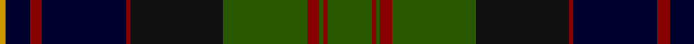

In pattern [GRGRGKRKRKY](/patterns/grgrgkrkrky/).

This was sourced from tartans-authority.  It is a [11 stripes tartan](/stripes/stripes11/).

Original link http://www.tartansauthority.com/tartan-ferret/display/3613/

## Thread count
DY/3 DB12 DR6 DB42 DR2 K46 G42 DR6 G2 DR2 G/22

## Palette
Each colour and its ΔE from the base-6 reference it is a variant of.

| Colour | Shade | Base | ΔE (OKLab) |
|---|---|---|---|
| DB | <code style="background-color:#00002C;">#00002C</code> `#00002C` | K <code style="background-color:#000000;">#000000</code> | 0.16 |
| DR | <code style="background-color:#880000;">#880000</code> `#880000` | R <code style="background-color:#CC0000;">#CC0000</code> | 0.15 |
| DY | <code style="background-color:#D09800;">#D09800</code> `#D09800` | Y <code style="background-color:#F2BF00;">#F2BF00</code> | 0.12 |
| G | <code style="background-color:#285800;">#285800</code> `#285800` | G <code style="background-color:#006100;">#006100</code> | 0.03 |
| K | <code style="background-color:#101010;">#101010</code> `#101010` | K <code style="background-color:#000000;">#000000</code> | 0.17 |

## Nearest tartans

The nearest existing variants by ΔTartan distance.

1. [Thomas, baron of Craigie, Robert (Personal)](/setts/s8/r2k4b23k14g16y1k4y2~b14283c-g285800-k101010-rdc0000-ye8c000~x2/) — ΔT 0.84
1. [Black Gold (Corporate)](/setts/s9/g3k3g3k18b28w1ga22k2g2~b3c5070-g604000-ga003820-k000000-wc8c8c8~x2/) — ΔT 0.89
1. [Thomas of Craigie (Personal)](/setts/s8/y2k4y1g16k14b23k4r1~b202060-g285800-k101010-rc80000-ye8c000~x2/) — ΔT 0.90
1. [Ogilvie of Inverarity (V.S.)](/setts/s14/b28y1b2k26g24k1g2r3g2k1g24k26b2y1~b2c2c80-g006818-k101010-rc80000-ye8c000~x2/) — ΔT 1.04
1. [Wcwm 1873-5](/setts/s9/k1b8r1g3r1g8k4ga14r1~b180064-g484800-ga004c00-k000000-r8c0000~x4/) — ΔT 1.07
1. [Campbell Red](/setts/s13/r3k1g21k19b19k3b3k3b19k19g21k1w3~b2c4084-g005020-k101010-rdc0000-we0e0e0~x2/) — ΔT 1.08
1. [Newman](/setts/s11/b10k10b10r2k20w1g10r2g4r2g4~b1c0070-g006818-k101010-r880000-wfcfcfc~x2/) — ΔT 1.10
1. [Clerke of Ulva Family Tartan Tartan Number: 168. Earliest known date: Unknown Said to have been copied from an old kilt. See products available Copyright © Blair Urquhart, Comrie, 2015](/setts/s11/b3g3k4g14k4g3k14ba18r1ba4r2~b5c8ca8-ba2c2c80-g006818-k101010-ra00048~x2/) — ΔT 1.11
1. [Urquhart - 1842 (Clan)](/setts/s12/b4w2b24k3b3k3b8k24g48k3g3r2~b202060-g006818-k101010-rc80000-we0e0e0~x2/) — ΔT 1.13
1. [Lochaber Cameron](/setts/s11/b8ba3b40r3k44ba3r3g40r2k4r7~b2c2c80-ba5c8ca8-g006818-k101010-rc80000~x2/) — ΔT 1.14

## Neighbour map

Every grey dot is one of 15726 variants placed by the first two principal components of the ΔTartan feature space (44% of its variance). Red is this tartan; blue dots are its nearest — click one to open its page.

<svg viewBox="0 0 640 380" role="img" style="max-width:100%;height:auto;border:1px solid #e0e0e0;border-radius:4px;display:block" xmlns="http://www.w3.org/2000/svg"><image href="/nn/cloud.v1.png" width="640" height="380"/><a href="/setts/s8/r2k4b23k14g16y1k4y2~b14283c-g285800-k101010-rdc0000-ye8c000~x2/"><circle cx="233.5" cy="165.4" r="4" fill="#3465a4"><title>Thomas, baron of Craigie, Robert (Personal)</title></circle></a><a href="/setts/s9/g3k3g3k18b28w1ga22k2g2~b3c5070-g604000-ga003820-k000000-wc8c8c8~x2/"><circle cx="218.7" cy="134.8" r="4" fill="#3465a4"><title>Black Gold (Corporate)</title></circle></a><a href="/setts/s8/y2k4y1g16k14b23k4r1~b202060-g285800-k101010-rc80000-ye8c000~x2/"><circle cx="232.0" cy="159.7" r="4" fill="#3465a4"><title>Thomas of Craigie (Personal)</title></circle></a><a href="/setts/s14/b28y1b2k26g24k1g2r3g2k1g24k26b2y1~b2c2c80-g006818-k101010-rc80000-ye8c000~x2/"><circle cx="248.5" cy="117.4" r="4" fill="#3465a4"><title>Ogilvie of Inverarity (V.S.)</title></circle></a><a href="/setts/s9/k1b8r1g3r1g8k4ga14r1~b180064-g484800-ga004c00-k000000-r8c0000~x4/"><circle cx="194.3" cy="175.9" r="4" fill="#3465a4"><title>Wcwm 1873-5</title></circle></a><a href="/setts/s13/r3k1g21k19b19k3b3k3b19k19g21k1w3~b2c4084-g005020-k101010-rdc0000-we0e0e0~x2/"><circle cx="213.4" cy="156.4" r="4" fill="#3465a4"><title>Campbell Red</title></circle></a><a href="/setts/s11/b10k10b10r2k20w1g10r2g4r2g4~b1c0070-g006818-k101010-r880000-wfcfcfc~x2/"><circle cx="215.5" cy="161.4" r="4" fill="#3465a4"><title>Newman</title></circle></a><a href="/setts/s11/b3g3k4g14k4g3k14ba18r1ba4r2~b5c8ca8-ba2c2c80-g006818-k101010-ra00048~x2/"><circle cx="190.7" cy="159.1" r="4" fill="#3465a4"><title>Clerke of Ulva Family Tartan Tartan Number: 168. Earliest known date: Unknown Said to have been copied from an old kilt. See products available Copyright © Blair Urquhart, Comrie, 2015</title></circle></a><a href="/setts/s12/b4w2b24k3b3k3b8k24g48k3g3r2~b202060-g006818-k101010-rc80000-we0e0e0~x2/"><circle cx="264.9" cy="121.8" r="4" fill="#3465a4"><title>Urquhart - 1842 (Clan)</title></circle></a><a href="/setts/s11/b8ba3b40r3k44ba3r3g40r2k4r7~b2c2c80-ba5c8ca8-g006818-k101010-rc80000~x2/"><circle cx="198.5" cy="125.4" r="4" fill="#3465a4"><title>Lochaber Cameron</title></circle></a><circle cx="227.8" cy="144.5" r="5" fill="#c00000"/></svg>

ID: /setts/s11/g22r2g2r6g42k46r2ka42r6ka12y3~g285800-k101010-ka00002c-r880000-yd09800/
