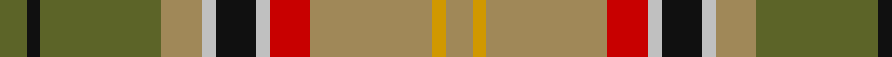

In pattern [GKGYWKWRYYY](/patterns/gkgywkwryyy/).

This was sourced from tartans-authority.  It is a [11 stripes tartan](/stripes/stripes11/).

Original link http://www.tartansauthority.com/tartan-ferret/display/3529/

## Attestations

This cloth appears in 3 source records; the oldest owns this page.

- pre 2002 — Asman, Day Tan (Name) (tartans-authority, [record](http://www.tartansauthority.com/tartan-ferret/display/3529/))
- undated — Asman, Day Tan (Personal) (register-of-tartans, [record](https://www.tartanregister.gov.uk/tartanDetails.aspx?ref=5273))
- undated — Asman Day Tan Family Tartan Tartan Number: 3529. Earliest known date: 2002 Based on a design by Phil Smith, woven by Peter MacDonald at the suggestion of David Asman for whom the original design was done. Intended for "day" wear. "Tan" is the name of the light brown colour. See products available Copyright © Blair Urquhart, Comrie, 2015 (house-of-tartan, [record](http://www.house-of-tartan.scotland.net/house/TartanViewjs.asp?colr=Def&tnam=3529))

## Thread count
G/8 K4 G36 LT12 N4 K12 N4 R12 LT36 DY4 LT/8

## Palette
Each colour and its ΔE from the base-6 reference it is a variant of.

| Colour | Shade | Base | ΔE (OKLab) |
|---|---|---|---|
| DY | <code style="background-color:#D09800;">#D09800</code> `#D09800` | Y <code style="background-color:#F2BF00;">#F2BF00</code> | 0.12 |
| G | <code style="background-color:#5C6428;">#5C6428</code> `#5C6428` | G <code style="background-color:#006100;">#006100</code> | 0.10 |
| K | <code style="background-color:#101010;">#101010</code> `#101010` | K <code style="background-color:#000000;">#000000</code> | 0.17 |
| LT | <code style="background-color:#A08858;">#A08858</code> `#A08858` | Y <code style="background-color:#F2BF00;">#F2BF00</code> | 0.21 |
| N | <code style="background-color:#C0C0C0;">#C0C0C0</code> `#C0C0C0` | W <code style="background-color:#F7F7F7;">#F7F7F7</code> | 0.17 |
| R | <code style="background-color:#C80000;">#C80000</code> `#C80000` | R <code style="background-color:#CC0000;">#CC0000</code> | 0.01 |

## Nearest tartans

The nearest existing variants by ΔTartan distance.

1. [Brittany National Walking](/setts/s9/b4g27y8k4y8k4y8r11ya3x2~b2888c4-g604000-k101010-rb03000-ya08858-yae8c000/) — ΔT 0.87
1. [Bruce of Kinnaird (Vivienne Westwood Design)](/setts/s10/g22ga22b2w6b2y2b16gb5g8w2x2~b501400-g604000-ga8c7038-gb0098a0-wc0c0c0-yd09800/) — ΔT 0.97
1. [Royal Pharmaceutical Society (Corp)](/setts/s9/g2r2ga19r6ga2r6y14ra4w2x2~g604000-ga003820-r888888-ra901c38-we0e0e0-ya08858/) — ΔT 1.07
1. [Royal Pharmaceutical Society](/setts/s9/g3r2ga19r6ga2r6y14ra4w2x2~g604000-ga003820-r888888-ra901c38-we0e0e0-ya08858/) — ΔT 1.07
1. [Harmony 1](/setts/s12/b11g3b4y3b3y4b3ga13r34g3r4ba3x2~b401000-ba506060-g008000-ga908000-r906030-yf0c000/) — ΔT 1.09
1. [Blaylock Hunting (Name)](/setts/s12/g4r2g8b8ga2r8ga16k2b5r2ga5y2x2~b441800-g003820-ga8c7038-k101010-r888888-ybc8c00/) — ΔT 1.11
1. [MacGuire Irish Family Tartan Tartan Number: 2427. Earliest known date: 1985 MacGuire is an Irish Family tartan See products available Copyright © Blair Urquhart, Comrie, 2015](/setts/s14/w10b3g30r4ba12r30ba6r6ba6r6ba6r30g30bb4~b202060-ba5c8ca8-bb003c64-g006818-rc80000-we0e0e0/) — ΔT 1.13
1. [Murray of Abercairney](/setts/s9/b3g1k1r12ra1ga9ra1g1b3x2~b5480b0-g808080-ga008000-k000000-rc00000-rad03030/) — ΔT 1.13
1. [Wcwm 9275-1258](/setts/s12/g8ga2k4y1k1w1k1b8g3k1g1w1x4~b4c3428-g8c7038-ga006818-k101010-wc0c0c0-yd09800/) — ΔT 1.17
1. [State Seal of Florida (Fashion)](/setts/s10/r3y21r14w3b11g36ba3b3ba4y3x2~b2c2c80-ba441800-g006818-r880000-we8ccb8-ya08858/) — ΔT 1.18

## Neighbour map

Every grey dot is one of 15726 variants placed by the first two principal components of the ΔTartan feature space (44% of its variance). Red is this tartan; blue dots are its nearest — click one to open its page.

<svg viewBox="0 0 640 380" role="img" style="max-width:100%;height:auto;border:1px solid #e0e0e0;border-radius:4px;display:block" xmlns="http://www.w3.org/2000/svg"><image href="/nn/cloud.v1.png" width="640" height="380"/><a href="/setts/s9/b4g27y8k4y8k4y8r11ya3x2~b2888c4-g604000-k101010-rb03000-ya08858-yae8c000/"><circle cx="151.1" cy="164.8" r="4" fill="#3465a4"><title>Brittany National Walking</title></circle></a><a href="/setts/s10/g22ga22b2w6b2y2b16gb5g8w2x2~b501400-g604000-ga8c7038-gb0098a0-wc0c0c0-yd09800/"><circle cx="168.8" cy="153.0" r="4" fill="#3465a4"><title>Bruce of Kinnaird (Vivienne Westwood Design)</title></circle></a><a href="/setts/s9/g2r2ga19r6ga2r6y14ra4w2x2~g604000-ga003820-r888888-ra901c38-we0e0e0-ya08858/"><circle cx="155.2" cy="157.0" r="4" fill="#3465a4"><title>Royal Pharmaceutical Society (Corp)</title></circle></a><a href="/setts/s9/g3r2ga19r6ga2r6y14ra4w2x2~g604000-ga003820-r888888-ra901c38-we0e0e0-ya08858/"><circle cx="149.5" cy="159.3" r="4" fill="#3465a4"><title>Royal Pharmaceutical Society</title></circle></a><a href="/setts/s12/b11g3b4y3b3y4b3ga13r34g3r4ba3x2~b401000-ba506060-g008000-ga908000-r906030-yf0c000/"><circle cx="217.0" cy="121.8" r="4" fill="#3465a4"><title>Harmony 1</title></circle></a><a href="/setts/s12/g4r2g8b8ga2r8ga16k2b5r2ga5y2x2~b441800-g003820-ga8c7038-k101010-r888888-ybc8c00/"><circle cx="140.0" cy="170.8" r="4" fill="#3465a4"><title>Blaylock Hunting (Name)</title></circle></a><a href="/setts/s14/w10b3g30r4ba12r30ba6r6ba6r6ba6r30g30bb4~b202060-ba5c8ca8-bb003c64-g006818-rc80000-we0e0e0/"><circle cx="173.4" cy="133.9" r="4" fill="#3465a4"><title>MacGuire Irish Family Tartan Tartan Number: 2427. Earliest known date: 1985 MacGuire is an Irish Family tartan See products available Copyright © Blair Urquhart, Comrie, 2015</title></circle></a><a href="/setts/s9/b3g1k1r12ra1ga9ra1g1b3x2~b5480b0-g808080-ga008000-k000000-rc00000-rad03030/"><circle cx="182.4" cy="128.8" r="4" fill="#3465a4"><title>Murray of Abercairney</title></circle></a><a href="/setts/s12/g8ga2k4y1k1w1k1b8g3k1g1w1x4~b4c3428-g8c7038-ga006818-k101010-wc0c0c0-yd09800/"><circle cx="146.3" cy="146.0" r="4" fill="#3465a4"><title>Wcwm 9275-1258</title></circle></a><a href="/setts/s10/r3y21r14w3b11g36ba3b3ba4y3x2~b2c2c80-ba441800-g006818-r880000-we8ccb8-ya08858/"><circle cx="162.4" cy="136.4" r="4" fill="#3465a4"><title>State Seal of Florida (Fashion)</title></circle></a><circle cx="177.4" cy="151.2" r="5" fill="#c00000"/></svg>

ID: /setts/s11/g2k1g9y3w1k3w1r3y9ya1y2x4~g5c6428-k101010-rc80000-wc0c0c0-ya08858-yad09800/
