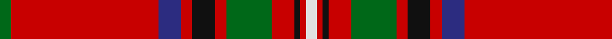

In pattern [GRBRKRGRKRW](/patterns/grbrkrgrkrw/).

This was sourced from house-of-tartan.  It is a [11 stripes tartan](/stripes/stripes11/).

Original link http://www.house-of-tartan.scotland.net/house/TartanViewjs.asp?colr=Def&tnam=847

## Thread count
G/4 R52 DB8 R4 K8 R4 G16 R8 K2 R2 LN/4

## Palette
Each colour and its ΔE from the base-6 reference it is a variant of.

| Colour | Shade | Base | ΔE (OKLab) |
|---|---|---|---|
| DB | <code style="background-color:#2C2C80;">#2C2C80</code> `#2C2C80` | B <code style="background-color:#2A418A;">#2A418A</code> | 0.06 |
| G | <code style="background-color:#006818;">#006818</code> `#006818` | G <code style="background-color:#006100;">#006100</code> | 0.02 |
| K | <code style="background-color:#101010;">#101010</code> `#101010` | K <code style="background-color:#000000;">#000000</code> | 0.17 |
| LN | <code style="background-color:#E0E0E0;">#E0E0E0</code> `#E0E0E0` | W <code style="background-color:#F7F7F7;">#F7F7F7</code> | 0.07 |
| R | <code style="background-color:#C80000;">#C80000</code> `#C80000` | R <code style="background-color:#CC0000;">#CC0000</code> | 0.01 |

## Nearest tartans

The nearest existing variants by ΔTartan distance.

1. [Stewart/Stuart of Rothesay (Sobieski)](/setts/s11/g2r26b4r2k4r2g8r4k1r1w2x2~b202060-g003820-k101010-rc80000-wfcfcfc/) — ΔT 0.42
1. [Stewart of Rothesay](/setts/s11/g2r26b4r2k4r2g8r4k1r1w2x2~b304080-g008000-k000000-rc00000-we0e0e0/) — ΔT 0.56
1. [Seton Family Tartan Tartan Number: 932. Earliest known date: 1842 Ref: Innes No 102. The Setons had early links with the House of Gordon. See products available Copyright © Blair Urquhart, Comrie, 2015](/setts/s10/g6w1g12r4b4r2k4r32g1r2x2~b2c2c80-g006818-k101010-rc80000-we0e0e0/) — ΔT 0.69
1. [Seton](/setts/s10/g6w1g12r4b4r2k4r32g1r2x2~b00004c-g004c00-k000000-rc80000-wd0d0d0/) — ΔT 0.78
1. [Chisholm #2](/setts/s10/r6w1r24b6g2k1g2k1g12r1x2~b2c4084-g005020-k101010-rdc0000-we0e0e0/) — ΔT 0.78
1. [Mair (Personal)](/setts/s12/r23g3y1g3r2b18r2w1g3r2b2r23x2~b2c2c80-g006818-rc80000-wfcfcfc-yd8b000/) — ΔT 0.81
1. [Mair Family Tartan Tartan Number: 1406. Earliest known date: 1985 Based on an unnamed tartan from South Uist, the yellow represents the gold and red of the original sett form the colours of the 'Mair' coat of arms registered with Lord Lyon. Head of the family, Duine Usail, Robert George Alexander Mair esq. F.S.A. Scot, Sunshine, Melbourne, Victoria, Australia. He is the son of Alexander Smith Mair who arrived in Australia in 1924 from Govan, Glasgow. See products available Copyright © Blair Urquhart, Comrie, 2015](/setts/s12/r23g3y1g3r2b18r2w1g3r2b2r23x2~b2c2c80-g006818-rc80000-we0e0e0-ye8c000/) — ΔT 0.82
1. [Leach, Leech, Leitch, dress](/setts/s9/r33w1k3w1g13r7k3b3w1x2~b800080-g008000-k000000-rc00000-we0e0e0/) — ΔT 0.83
1. [Seton](/setts/s10/g6w1g12r4b4r2k4r32g1r2x2~b304080-g008000-k000000-rc00000-we0e0e0/) — ΔT 0.87
1. [Mair](/setts/s12/r23g3y1g3r2b18r2w1g3r2b2r23x2~b304080-g008000-rc00000-we0e0e0-yf0c000/) — ΔT 0.87

## Neighbour map

Every grey dot is one of 15726 variants placed by the first two principal components of the ΔTartan feature space (44% of its variance). Red is this tartan; blue dots are its nearest — click one to open its page.

<svg viewBox="0 0 640 380" role="img" style="max-width:100%;height:auto;border:1px solid #e0e0e0;border-radius:4px;display:block" xmlns="http://www.w3.org/2000/svg"><image href="/nn/cloud.v1.png" width="640" height="380"/><a href="/setts/s11/g2r26b4r2k4r2g8r4k1r1w2x2~b202060-g003820-k101010-rc80000-wfcfcfc/"><circle cx="379.8" cy="91.6" r="4" fill="#3465a4"><title>Stewart/Stuart of Rothesay (Sobieski)</title></circle></a><a href="/setts/s11/g2r26b4r2k4r2g8r4k1r1w2x2~b304080-g008000-k000000-rc00000-we0e0e0/"><circle cx="368.8" cy="88.8" r="4" fill="#3465a4"><title>Stewart of Rothesay</title></circle></a><a href="/setts/s10/g6w1g12r4b4r2k4r32g1r2x2~b2c2c80-g006818-k101010-rc80000-we0e0e0/"><circle cx="383.8" cy="96.5" r="4" fill="#3465a4"><title>Seton Family Tartan Tartan Number: 932. Earliest known date: 1842 Ref: Innes No 102. The Setons had early links with the House of Gordon. See products available Copyright © Blair Urquhart, Comrie, 2015</title></circle></a><a href="/setts/s10/g6w1g12r4b4r2k4r32g1r2x2~b00004c-g004c00-k000000-rc80000-wd0d0d0/"><circle cx="368.8" cy="92.1" r="4" fill="#3465a4"><title>Seton</title></circle></a><a href="/setts/s10/r6w1r24b6g2k1g2k1g12r1x2~b2c4084-g005020-k101010-rdc0000-we0e0e0/"><circle cx="340.6" cy="105.1" r="4" fill="#3465a4"><title>Chisholm #2</title></circle></a><a href="/setts/s12/r23g3y1g3r2b18r2w1g3r2b2r23x2~b2c2c80-g006818-rc80000-wfcfcfc-yd8b000/"><circle cx="390.5" cy="104.8" r="4" fill="#3465a4"><title>Mair (Personal)</title></circle></a><a href="/setts/s12/r23g3y1g3r2b18r2w1g3r2b2r23x2~b2c2c80-g006818-rc80000-we0e0e0-ye8c000/"><circle cx="391.5" cy="105.2" r="4" fill="#3465a4"><title>Mair Family Tartan Tartan Number: 1406. Earliest known date: 1985 Based on an unnamed tartan from South Uist, the yellow represents the gold and red of the original sett form the colours of the 'Mair' coat of arms registered with Lord Lyon. Head of the family, Duine Usail, Robert George Alexander Mair esq. F.S.A. Scot, Sunshine, Melbourne, Victoria, Australia. He is the son of Alexander Smith Mair who arrived in Australia in 1924 from Govan, Glasgow. See products available Copyright © Blair Urquhart, Comrie, 2015</title></circle></a><a href="/setts/s9/r33w1k3w1g13r7k3b3w1x2~b800080-g008000-k000000-rc00000-we0e0e0/"><circle cx="375.2" cy="86.8" r="4" fill="#3465a4"><title>Leach, Leech, Leitch, dress</title></circle></a><a href="/setts/s10/g6w1g12r4b4r2k4r32g1r2x2~b304080-g008000-k000000-rc00000-we0e0e0/"><circle cx="368.4" cy="91.8" r="4" fill="#3465a4"><title>Seton</title></circle></a><a href="/setts/s12/r23g3y1g3r2b18r2w1g3r2b2r23x2~b304080-g008000-rc00000-we0e0e0-yf0c000/"><circle cx="398.8" cy="109.0" r="4" fill="#3465a4"><title>Mair</title></circle></a><circle cx="384.4" cy="93.1" r="5" fill="#c00000"/></svg>

ID: /setts/s11/g2r26b4r2k4r2g8r4k1r1w2x2~b2c2c80-g006818-k101010-rc80000-we0e0e0/
