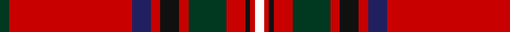

In pattern [GRBRKRGRKRW](/patterns/grbrkrgrkrw/).

This was sourced from register-of-tartans.  It is a [11 stripes tartan](/stripes/stripes11/).

Original link https://www.tartanregister.gov.uk/tartanDetails.aspx?ref=3954

## Attestations

This cloth appears in 2 source records; the oldest owns this page.

- 01/01/1829 — Stewart/Stuart of Rothesay (Sobieski) (register-of-tartans, [record](https://www.tartanregister.gov.uk/tartanDetails.aspx?ref=3954))
- 1829 — Stewart of Rothesay - 1829 (C Mss) (tartans-authority, [record](http://www.tartansauthority.com/tartan-ferret/display/847/))

## Register references

External register numbers recorded for this tartan.

- Scottish Register of Tartans: [3954](https://www.tartanregister.gov.uk/tartanDetails.aspx?ref=3954)
- Scottish Tartans Authority (ITI): 847
- Scottish Tartans World Register: 847

## Thread count
DG/4 R52 DB8 R4 K8 R4 DG16 R8 K2 R2 W/4

## Palette
Each colour and its ΔE from the base-6 reference it is a variant of.

| Colour | Shade | Base | ΔE (OKLab) |
|---|---|---|---|
| DB | <code style="background-color:#202060;">#202060</code> `#202060` | B <code style="background-color:#2A418A;">#2A418A</code> | 0.11 |
| DG | <code style="background-color:#003820;">#003820</code> `#003820` | G <code style="background-color:#006100;">#006100</code> | 0.15 |
| K | <code style="background-color:#101010;">#101010</code> `#101010` | K <code style="background-color:#000000;">#000000</code> | 0.17 |
| R | <code style="background-color:#C80000;">#C80000</code> `#C80000` | R <code style="background-color:#CC0000;">#CC0000</code> | 0.01 |
| W | <code style="background-color:#FCFCFC;">#FCFCFC</code> `#FCFCFC` | W <code style="background-color:#F7F7F7;">#F7F7F7</code> | 0.01 |

## Nearest tartans

The nearest existing variants by ΔTartan distance.

1. [Stewart of Rothesay Clan Tartan Tartan Number: 847. Earliest known date: 1829 See Vestiarium Scoticum entry. Named `Duke of Rothesay' in a drawing by Charles Sobieski (Allen) in the Dick Lauder transcript in the Royal Library in Windsor. See products available Copyright © Blair Urquhart, Comrie, 2015](/setts/s11/g2r26b4r2k4r2g8r4k1r1w2~b2c2c80-g006818-k101010-rc80000-we0e0e0~x2/) — ΔT 0.42
1. [Stewart of Rothesay](/setts/s11/g2r26b4r2k4r2g8r4k1r1w2~b304080-g008000-k000000-rc00000-we0e0e0~x2/) — ΔT 0.56
1. [Heritage Plaid](/setts/s11/r44b3k6y2k2y2k10r5k2r3w2~b2c2c80-k101010-rc80000-we0e0e0-ya08858~x2/) — ΔT 0.75
1. [Seton](/setts/s10/g6w1g12r4b4r2k4r32g1r2~b00004c-g004c00-k000000-rc80000-wd0d0d0~x2/) — ΔT 0.78
1. [Mair (Personal)](/setts/s12/r23g3y1g3r2b18r2w1g3r2b2r23~b2c2c80-g006818-rc80000-wfcfcfc-yd8b000~x2/) — ΔT 0.83
1. [Leach, Leech, Leitch, dress](/setts/s9/r33w1k3w1g13r7k3b3w1~b800080-g008000-k000000-rc00000-we0e0e0~x2/) — ΔT 0.83
1. [Hilton Champion Corporate Golf Tartan Tartan Number: 2336. Earliest known date: c.1970 Originally called Hilton Champion, this tartan was designed by Kinloch Anderson for the officials and winning jacket for the Hilton-sponsored Heritage Classic golf tournament. The name was changed to Heritage Plaid in September 2000 See products available Copyright © Blair Urquhart, Comrie, 2015](/setts/s11/r44b3k6ka2k2ka2k10r5k2r3w2~b588ca8-k101010-ka000000-rc80000-we0e0e0~x2/) — ΔT 0.84
1. [Mair Family Tartan Tartan Number: 1406. Earliest known date: 1985 Based on an unnamed tartan from South Uist, the yellow represents the gold and red of the original sett form the colours of the 'Mair' coat of arms registered with Lord Lyon. Head of the family, Duine Usail, Robert George Alexander Mair esq. F.S.A. Scot, Sunshine, Melbourne, Victoria, Australia. He is the son of Alexander Smith Mair who arrived in Australia in 1924 from Govan, Glasgow. See products available Copyright © Blair Urquhart, Comrie, 2015](/setts/s12/r23g3y1g3r2b18r2w1g3r2b2r23~b2c2c80-g006818-rc80000-we0e0e0-ye8c000~x2/) — ΔT 0.85
1. [1745 Trading (Corporate)](/setts/s12/r4w2r3g6r2g2r2b16r2wa2r32w2~b202060-g285800-rc80000-wfcfcfc-wa98c8e8~x2/) — ΔT 0.93
1. [Chisholm #2](/setts/s10/r6w1r24b6g2k1g2k1g12r1~b2c4084-g005020-k101010-rdc0000-we0e0e0~x2/) — ΔT 0.94

## Neighbour map

Every grey dot is one of 15726 variants placed by the first two principal components of the ΔTartan feature space (44% of its variance). Red is this tartan; blue dots are its nearest — click one to open its page.

<svg viewBox="0 0 640 380" role="img" style="max-width:100%;height:auto;border:1px solid #e0e0e0;border-radius:4px;display:block" xmlns="http://www.w3.org/2000/svg"><image href="/nn/cloud.v1.png" width="640" height="380"/><a href="/setts/s11/g2r26b4r2k4r2g8r4k1r1w2~b2c2c80-g006818-k101010-rc80000-we0e0e0~x2/"><circle cx="384.4" cy="93.1" r="4" fill="#3465a4"><title>Stewart of Rothesay Clan Tartan Tartan Number: 847. Earliest known date: 1829 See Vestiarium Scoticum entry. Named `Duke of Rothesay' in a drawing by Charles Sobieski (Allen) in the Dick Lauder transcript in the Royal Library in Windsor. See products available Copyright © Blair Urquhart, Comrie, 2015</title></circle></a><a href="/setts/s11/g2r26b4r2k4r2g8r4k1r1w2~b304080-g008000-k000000-rc00000-we0e0e0~x2/"><circle cx="368.8" cy="88.8" r="4" fill="#3465a4"><title>Stewart of Rothesay</title></circle></a><a href="/setts/s11/r44b3k6y2k2y2k10r5k2r3w2~b2c2c80-k101010-rc80000-we0e0e0-ya08858~x2/"><circle cx="408.2" cy="86.2" r="4" fill="#3465a4"><title>Heritage Plaid</title></circle></a><a href="/setts/s10/g6w1g12r4b4r2k4r32g1r2~b00004c-g004c00-k000000-rc80000-wd0d0d0~x2/"><circle cx="368.8" cy="92.1" r="4" fill="#3465a4"><title>Seton</title></circle></a><a href="/setts/s12/r23g3y1g3r2b18r2w1g3r2b2r23~b2c2c80-g006818-rc80000-wfcfcfc-yd8b000~x2/"><circle cx="390.5" cy="104.8" r="4" fill="#3465a4"><title>Mair (Personal)</title></circle></a><a href="/setts/s9/r33w1k3w1g13r7k3b3w1~b800080-g008000-k000000-rc00000-we0e0e0~x2/"><circle cx="375.2" cy="86.8" r="4" fill="#3465a4"><title>Leach, Leech, Leitch, dress</title></circle></a><a href="/setts/s11/r44b3k6ka2k2ka2k10r5k2r3w2~b588ca8-k101010-ka000000-rc80000-we0e0e0~x2/"><circle cx="399.3" cy="84.1" r="4" fill="#3465a4"><title>Hilton Champion Corporate Golf Tartan Tartan Number: 2336. Earliest known date: c.1970 Originally called Hilton Champion, this tartan was designed by Kinloch Anderson for the officials and winning jacket for the Hilton-sponsored Heritage Classic golf tournament. The name was changed to Heritage Plaid in September 2000 See products available Copyright © Blair Urquhart, Comrie, 2015</title></circle></a><a href="/setts/s12/r23g3y1g3r2b18r2w1g3r2b2r23~b2c2c80-g006818-rc80000-we0e0e0-ye8c000~x2/"><circle cx="391.5" cy="105.2" r="4" fill="#3465a4"><title>Mair Family Tartan Tartan Number: 1406. Earliest known date: 1985 Based on an unnamed tartan from South Uist, the yellow represents the gold and red of the original sett form the colours of the 'Mair' coat of arms registered with Lord Lyon. Head of the family, Duine Usail, Robert George Alexander Mair esq. F.S.A. Scot, Sunshine, Melbourne, Victoria, Australia. He is the son of Alexander Smith Mair who arrived in Australia in 1924 from Govan, Glasgow. See products available Copyright © Blair Urquhart, Comrie, 2015</title></circle></a><a href="/setts/s12/r4w2r3g6r2g2r2b16r2wa2r32w2~b202060-g285800-rc80000-wfcfcfc-wa98c8e8~x2/"><circle cx="341.2" cy="98.7" r="4" fill="#3465a4"><title>1745 Trading (Corporate)</title></circle></a><a href="/setts/s10/r6w1r24b6g2k1g2k1g12r1~b2c4084-g005020-k101010-rdc0000-we0e0e0~x2/"><circle cx="340.6" cy="105.1" r="4" fill="#3465a4"><title>Chisholm #2</title></circle></a><circle cx="379.8" cy="91.6" r="5" fill="#c00000"/></svg>

ID: /setts/s11/g2r26b4r2k4r2g8r4k1r1w2~b202060-g003820-k101010-rc80000-wfcfcfc~x2/
