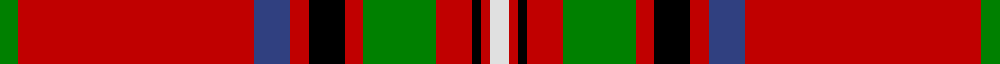

In pattern [GRBRKRGRKRW](/stripes/grbrkrgrkrw/).

This was sourced from weddslist.  It is a [11 stripe tartan](/stripes/stripes11/).

Original link http://www.weddslist.com/cgi-bin/tartans/pg.pl?source=sts

## Attestations

This cloth appears in 2 source records; the oldest owns this page.

- undated — Stewart of Rothesay (weddslist, [record](http://www.weddslist.com/cgi-bin/tartans/pg.pl?source=sts))
- undated — Stewart of Rothesay Clan Tartan Tartan Number: 847. Earliest known date: 1829 See Vestiarium Scoticum entry. Named `Duke of Rothesay' in a drawing by Charles Sobieski (Allen) in the Dick Lauder transcript in the Royal Library in Windsor. See products available Copyright © Blair Urquhart, Comrie, 2015 (house-of-tartan, [record](http://www.house-of-tartan.scotland.net/house/TartanViewjs.asp?colr=Def&tnam=847))

## Thread count
G/4 R52 B8 R4 K8 R4 G16 R8 K2 R2 LN/4

## Palette
Each colour and the base-6 reference it is a variant of.

| Colour | Shade | Base |
|---|---|---|
| B | <code style="background-color:#304080;">#304080</code> `oklch(39.4% 0.109 270.2)` <small>#304080</small> | B <code style="background-color:#2A418A;">#2A418A</code> |
| G | <code style="background-color:#008000;">#008000</code> `oklch(52.0% 0.177 142.5)` <small>#008000</small> | G <code style="background-color:#006100;">#006100</code> |
| K | <code style="background-color:#000000;">#000000</code> `oklch(0.0% 0.000 0.0)` <small>#000000</small> | K <code style="background-color:#000000;">#000000</code> |
| LN | <code style="background-color:#E0E0E0;">#E0E0E0</code> `oklch(90.7% 0.000 89.9)` <small>#E0E0E0</small> | W <code style="background-color:#F7F7F7;">#F7F7F7</code> |
| R | <code style="background-color:#C00000;">#C00000</code> `oklch(50.7% 0.208 29.2)` <small>#C00000</small> | R <code style="background-color:#CC0000;">#CC0000</code> |

## Nearest tartans

The nearest existing variants by ΔTartan distance.

1. [Stewart/Stuart of Rothesay (Sobieski)](/setts/s11/dg2r26db4r2k4r2dg8r4k1r1w2~x2/) — ΔT 0.56
1. [Leach, Leech, Leitch, dress](/setts/s9/r33w1k3w1g13r7k3p3w1~x2/) — ΔT 0.57
1. [Seton](/setts/s10/dg6lb1dg12r4db4r2k4r32dg1r2~x2/) — ΔT 0.62
1. [Seton](/setts/s10/g6w1g12r4db4r2k4r32g1r2~x2/) — ΔT 0.75
1. [Chisholm VS](/setts/s10/r6lb1r24db6dg2k1dg2k1dg12r1/) — ΔT 0.91
1. [Drummond of Perth](/setts/s8/r36lb1db3ly1dg16r8db3lb5/) — ΔT 0.93
1. [Chisholm #2](/setts/s10/r6w1r24db6dg2k1dg2k1dg12r1~x2/) — ΔT 0.94
1. [Drummond of Perth](/setts/s9/r51ly2k4w2g21r10k4t4w2~x2/) — ΔT 1.01
1. [Hilton Champion Corporate Golf Tartan Tartan Number: 2336. Earliest known date: c.1970 Originally called Hilton Champion, this tartan was designed by Kinloch Anderson for the officials and winning jacket for the Hilton-sponsored Heritage Classic golf tournament. The name was changed to Heritage Plaid in September 2000 See products available Copyright © Blair Urquhart, Comrie, 2015](/setts/s11/r44t3k6k2k2k2k10r5k2r3w2~x2/) — ΔT 1.04
1. [Heritage Plaid](/setts/s11/r44db3k6lo2k2lo2k10r5k2r3w2~x2/) — ΔT 1.05

## Neighbour map

Every grey dot is one of 14299 variants placed by the first two principal components of the ΔTartan feature space (44% of its variance). Red is this tartan; blue dots are its nearest — click one to open its page.

<svg viewBox="0 0 640 380" role="img" style="max-width:100%;height:auto;border:1px solid #e0e0e0;border-radius:4px;display:block" xmlns="http://www.w3.org/2000/svg"><image href="/nn/cloud.v1.png" width="640" height="380"/><a href="/setts/s11/dg2r26db4r2k4r2dg8r4k1r1w2~x2/"><circle cx="379.6" cy="87.7" r="4" fill="#3465a4"><title>Stewart/Stuart of Rothesay (Sobieski)</title></circle></a><a href="/setts/s9/r33w1k3w1g13r7k3p3w1~x2/"><circle cx="375.1" cy="81.7" r="4" fill="#3465a4"><title>Leach, Leech, Leitch, dress</title></circle></a><a href="/setts/s10/dg6lb1dg12r4db4r2k4r32dg1r2~x2/"><circle cx="369.1" cy="88.6" r="4" fill="#3465a4"><title>Seton</title></circle></a><a href="/setts/s10/g6w1g12r4db4r2k4r32g1r2~x2/"><circle cx="368.6" cy="88.7" r="4" fill="#3465a4"><title>Seton</title></circle></a><a href="/setts/s10/r6lb1r24db6dg2k1dg2k1dg12r1/"><circle cx="331.5" cy="102.7" r="4" fill="#3465a4"><title>Chisholm VS</title></circle></a><a href="/setts/s8/r36lb1db3ly1dg16r8db3lb5/"><circle cx="373.1" cy="93.6" r="4" fill="#3465a4"><title>Drummond of Perth</title></circle></a><a href="/setts/s10/r6w1r24db6dg2k1dg2k1dg12r1~x2/"><circle cx="340.8" cy="103.0" r="4" fill="#3465a4"><title>Chisholm #2</title></circle></a><a href="/setts/s9/r51ly2k4w2g21r10k4t4w2~x2/"><circle cx="344.7" cy="75.3" r="4" fill="#3465a4"><title>Drummond of Perth</title></circle></a><a href="/setts/s11/r44t3k6k2k2k2k10r5k2r3w2~x2/"><circle cx="399.1" cy="78.5" r="4" fill="#3465a4"><title>Hilton Champion Corporate Golf Tartan Tartan Number: 2336. Earliest known date: c.1970 Originally called Hilton Champion, this tartan was designed by Kinloch Anderson for the officials and winning jacket for the Hilton-sponsored Heritage Classic golf tournament. The name was changed to Heritage Plaid in September 2000 See products available Copyright © Blair Urquhart, Comrie, 2015</title></circle></a><a href="/setts/s11/r44db3k6lo2k2lo2k10r5k2r3w2~x2/"><circle cx="407.7" cy="81.3" r="4" fill="#3465a4"><title>Heritage Plaid</title></circle></a><circle cx="368.8" cy="84.2" r="5" fill="#c00000"/></svg>

ID: /setts/s11/g2r26db4r2k4r2g8r4k1r1w2~x2/
