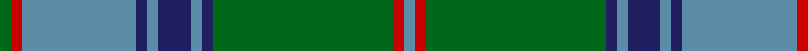

In pattern [BRGBBBBBBRG](/stripes/brgbbbbbbrg/).

This was sourced from house-of-tartan.  It is a [11 stripe tartan](/stripes/stripes11/).

Original link http://www.house-of-tartan.scotland.net/house/TartanViewjs.asp?colr=Def&tnam=502

## Thread count
G/4 R4 B42 DB4 B4 DB12 B4 DB4 G66 R4 B/4

## Palette
Each colour and its ΔE from the base-6 reference it is a variant of.

| Colour | Shade | Base | ΔE (OKLab) |
|---|---|---|---|
| B | <code style="background-color:#5C8CA8;">#5C8CA8</code> `#5C8CA8` | B <code style="background-color:#2A418A;">#2A418A</code> | 0.23 |
| DB | <code style="background-color:#202060;">#202060</code> `#202060` | B <code style="background-color:#2A418A;">#2A418A</code> | 0.11 |
| G | <code style="background-color:#006818;">#006818</code> `#006818` | G <code style="background-color:#006100;">#006100</code> | 0.02 |
| R | <code style="background-color:#C80000;">#C80000</code> `#C80000` | R <code style="background-color:#CC0000;">#CC0000</code> | 0.01 |

## Nearest tartans

The nearest existing variants by ΔTartan distance.

1. [Maine, Original State of (Fashion)](/setts/s11/dg2db2t23db2t2db6t2db2dg33r2t2~x2/) — ΔT 0.35
1. [Maine State](/setts/s11/g2r2t23db2t2db6t2db2g33r2t2~x2/) — ΔT 0.83
1. [McKirgan (Name)](/setts/s11/dg2n2w1r2w1n3dg1n12dg18w1r2~x2/) — ΔT 0.88
1. [Chartered Accountants of Scotland](/setts/s8/ly4g3r2g36b30k3b3k3~x2/) — ΔT 1.21
1. [Greenlaw, American](/setts/s14/b46r2b3r2b14g38k3g4~x2/) — ΔT 1.24
1. [Glen Orchy](/setts/s14/db2t1r2g16r2db6t1r2g6r2db16t1r2g2~x2/) — ΔT 1.25
1. [MacAuliffe/McAucliffe](/setts/s8/dg38w2dg6db24o6db2o3db2~x2/) — ΔT 1.27
1. [Unidentified (Pahls)](/setts/s10/lo4g4db2g29w1db12g2lo16g4db2~x2/) — ΔT 1.30
1. [Downie (Name)](/setts/s10/t24k2r2t2db12g28r4g5t3g3~x2/) — ΔT 1.32
1. [Stewart of Appin 2](/setts/s10/g11r4g4r7g41db11t4db41r4db8/) — ΔT 1.33

## Neighbour map

Every grey dot is one of 14299 variants placed by the first two principal components of the ΔTartan feature space (44% of its variance). Red is this tartan; blue dots are its nearest — click one to open its page.

<svg viewBox="0 0 640 380" role="img" style="max-width:100%;height:auto;border:1px solid #e0e0e0;border-radius:4px;display:block" xmlns="http://www.w3.org/2000/svg"><image href="/nn/cloud.v1.png" width="640" height="380"/><a href="/setts/s11/dg2db2t23db2t2db6t2db2dg33r2t2~x2/"><circle cx="321.4" cy="155.2" r="4" fill="#3465a4"><title>Maine, Original State of (Fashion)</title></circle></a><a href="/setts/s11/g2r2t23db2t2db6t2db2g33r2t2~x2/"><circle cx="289.2" cy="141.8" r="4" fill="#3465a4"><title>Maine State</title></circle></a><a href="/setts/s11/dg2n2w1r2w1n3dg1n12dg18w1r2~x2/"><circle cx="328.6" cy="155.7" r="4" fill="#3465a4"><title>McKirgan (Name)</title></circle></a><a href="/setts/s8/ly4g3r2g36b30k3b3k3~x2/"><circle cx="304.2" cy="159.4" r="4" fill="#3465a4"><title>Chartered Accountants of Scotland</title></circle></a><a href="/setts/s14/b46r2b3r2b14g38k3g4~x2/"><circle cx="351.3" cy="153.6" r="4" fill="#3465a4"><title>Greenlaw, American</title></circle></a><a href="/setts/s14/db2t1r2g16r2db6t1r2g6r2db16t1r2g2~x2/"><circle cx="259.6" cy="149.5" r="4" fill="#3465a4"><title>Glen Orchy</title></circle></a><a href="/setts/s8/dg38w2dg6db24o6db2o3db2~x2/"><circle cx="364.5" cy="179.2" r="4" fill="#3465a4"><title>MacAuliffe/McAucliffe</title></circle></a><a href="/setts/s10/lo4g4db2g29w1db12g2lo16g4db2~x2/"><circle cx="341.5" cy="150.8" r="4" fill="#3465a4"><title>Unidentified (Pahls)</title></circle></a><a href="/setts/s10/t24k2r2t2db12g28r4g5t3g3~x2/"><circle cx="243.8" cy="160.1" r="4" fill="#3465a4"><title>Downie (Name)</title></circle></a><a href="/setts/s10/g11r4g4r7g41db11t4db41r4db8/"><circle cx="278.1" cy="191.4" r="4" fill="#3465a4"><title>Stewart of Appin 2</title></circle></a><circle cx="316.9" cy="152.8" r="5" fill="#c00000"/></svg>

ID: /setts/s11/g2r2t21db2t2db6t2db2g33r2t2~x2/
