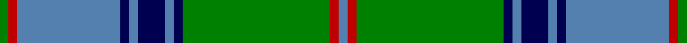

This page is one **sett** — a single exact thread-count. It belongs to the [tartan](/tartans/g2r2t23db2t2db6t2db2g33r2t2/)
(the same proportion at any scale), whose colour order is pattern [BRGBBBBBBRG](/stripes/brgbbbbbbrg/).

Sourced from weddslist.  It is a [11 stripe tartan](/stripes/stripes11/).

Original link http://www.weddslist.com/cgi-bin/tartans/pg.pl?source=sts

## Thread count
G/4 R4 B46 DB4 B4 DB12 B4 DB4 G66 R4 B/4

## Palette

Palette: <strong>custom</strong>
<table><thead><tr><th>Colour</th><th>Threads</th><th>Shade</th><th>Base</th><th>OKLCh</th></tr></thead><tbody><tr><td>G/</td><td style="text-align:right;font-variant-numeric:tabular-nums">4</td><td><code style="background-color:#008000;">#008000</code> <small style="color:#888">#008000</small></td><td>G <code style="background-color:#006100;">#006100</code></td><td><small style="color:#888">oklch(52.0% 0.177 142.5)</small></td></tr><tr><td>R</td><td style="text-align:right;font-variant-numeric:tabular-nums">4</td><td><code style="background-color:#C00000;">#C00000</code> <small style="color:#888">#C00000</small></td><td>R <code style="background-color:#CC0000;">#CC0000</code></td><td><small style="color:#888">oklch(50.7% 0.208 29.2)</small></td></tr><tr><td>B</td><td style="text-align:right;font-variant-numeric:tabular-nums">46</td><td><code style="background-color:#5480B0;">#5480B0</code> <small style="color:#888">#5480B0</small></td><td>B <code style="background-color:#2A418A;">#2A418A</code></td><td><small style="color:#888">oklch(58.8% 0.089 251.5)</small></td></tr><tr><td>DB</td><td style="text-align:right;font-variant-numeric:tabular-nums">4</td><td><code style="background-color:#000050;">#000050</code> <small style="color:#888">#000050</small></td><td>B <code style="background-color:#2A418A;">#2A418A</code></td><td><small style="color:#888">oklch(19.5% 0.135 264.1)</small></td></tr><tr><td>B</td><td style="text-align:right;font-variant-numeric:tabular-nums">4</td><td><code style="background-color:#5480B0;">#5480B0</code> <small style="color:#888">#5480B0</small></td><td>B <code style="background-color:#2A418A;">#2A418A</code></td><td><small style="color:#888">oklch(58.8% 0.089 251.5)</small></td></tr><tr><td>DB</td><td style="text-align:right;font-variant-numeric:tabular-nums">12</td><td><code style="background-color:#000050;">#000050</code> <small style="color:#888">#000050</small></td><td>B <code style="background-color:#2A418A;">#2A418A</code></td><td><small style="color:#888">oklch(19.5% 0.135 264.1)</small></td></tr><tr><td>B</td><td style="text-align:right;font-variant-numeric:tabular-nums">4</td><td><code style="background-color:#5480B0;">#5480B0</code> <small style="color:#888">#5480B0</small></td><td>B <code style="background-color:#2A418A;">#2A418A</code></td><td><small style="color:#888">oklch(58.8% 0.089 251.5)</small></td></tr><tr><td>DB</td><td style="text-align:right;font-variant-numeric:tabular-nums">4</td><td><code style="background-color:#000050;">#000050</code> <small style="color:#888">#000050</small></td><td>B <code style="background-color:#2A418A;">#2A418A</code></td><td><small style="color:#888">oklch(19.5% 0.135 264.1)</small></td></tr><tr><td>G</td><td style="text-align:right;font-variant-numeric:tabular-nums">66</td><td><code style="background-color:#008000;">#008000</code> <small style="color:#888">#008000</small></td><td>G <code style="background-color:#006100;">#006100</code></td><td><small style="color:#888">oklch(52.0% 0.177 142.5)</small></td></tr><tr><td>R</td><td style="text-align:right;font-variant-numeric:tabular-nums">4</td><td><code style="background-color:#C00000;">#C00000</code> <small style="color:#888">#C00000</small></td><td>R <code style="background-color:#CC0000;">#CC0000</code></td><td><small style="color:#888">oklch(50.7% 0.208 29.2)</small></td></tr><tr><td>B/</td><td style="text-align:right;font-variant-numeric:tabular-nums">4</td><td><code style="background-color:#5480B0;">#5480B0</code> <small style="color:#888">#5480B0</small></td><td>B <code style="background-color:#2A418A;">#2A418A</code></td><td><small style="color:#888">oklch(58.8% 0.089 251.5)</small></td></tr></tbody></table>

## Nearest tartans

The nearest existing variants by ΔTartan distance, with this tartan at the top so the swatches line up against it.

ΔTartan

Tartan

Sett

—

<a href="/ttd/edit/#slug=g2r2t23db2t2db6t2db2g33r2t2~x2">Maine State</a> <a class="nn-out" href="/setts/s11/g2r2t23db2t2db6t2db2g33r2t2~x2/" title="open its dictionary page">↗</a>

0.83

<a href="/ttd/edit/#slug=g2r2t21db2t2db6t2db2g33r2t2~x2">Maine State District Tartan Tartan Number: 502. Earliest known date: 1965 Maine tartan is the oldest of America's tartans. It was woven by the Maine Spinning Company which has now gone out of business. When the tartan was first introduced it was reported in the Glasgow Herald (30.12.65) that it had been 'duly accredited by the State of Maine'. The State archives, however, are unable to locate the authorization. It is now marketed by the Maine Tartan and Tweed company, who hold the copyright. See products available Copyright © Blair Urquhart, Comrie, 2015</a> <a class="nn-out" href="/setts/s11/g2r2t21db2t2db6t2db2g33r2t2~x2/" title="open its dictionary page">↗</a>

1.05

<a href="/ttd/edit/#slug=dg2db2t23db2t2db6t2db2dg33r2t2~x2">Maine, Original State of (Fashion)</a> <a class="nn-out" href="/setts/s11/dg2db2t23db2t2db6t2db2dg33r2t2~x2/" title="open its dictionary page">↗</a>

1.08

<a href="/ttd/edit/#slug=db5ly2db17g14w1g1w1g4ly2~x2">MacOrrell</a> <a class="nn-out" href="/setts/s9/db5ly2db17g14w1g1w1g4ly2~x2/" title="open its dictionary page">↗</a>

1.13

<a href="/ttd/edit/#slug=g2db1t6db6g4r1g18db1g1r1g1db1g4db10t6db1~x4">Pina (Corporate)</a> <a class="nn-out" href="/setts/s16/g2db1t6db6g4r1g18db1g1r1g1db1g4db10t6db1~x4/" title="open its dictionary page">↗</a>

1.13

<a href="/ttd/edit/#slug=g2db1b6db10g4db1g1r1g1db1g18r1g4db6b6db1~x4">Tiger</a> <a class="nn-out" href="/setts/s16/g2db1b6db10g4db1g1r1g1db1g18r1g4db6b6db1~x4/" title="open its dictionary page">↗</a>

1.22

<a href="/ttd/edit/#slug=db4lb1g4r2g14db2g1db1lb1db1lb13r1g1~x4">Maine Dirigo</a> <a class="nn-out" href="/setts/s13/db4lb1g4r2g14db2g1db1lb1db1lb13r1g1~x4/" title="open its dictionary page">↗</a>

1.27

<a href="/ttd/edit/#slug=k1b1k1b12dg12k1dg1ly1~x4">Banff Centennial</a> <a class="nn-out" href="/setts/s8/k1b1k1b12dg12k1dg1ly1~x4/" title="open its dictionary page">↗</a>

1.28

<a href="/setts/s14/g37w2g6db23ly6db2ly3db2~x2/">MacAuliffe Name Tartan Tartan Number: 2839. Earliest known date: 2005 The MacAuliffes are Irish in origin, being a branch of the powerful MacCarthys. The MacAuliffe's are descended from Auliffe Alainn (Humphrey the Dandy) MacCarthy, the son of Donough MacCarthy, the son of Murcharch MacCarthy, the son of Teige MacCarthy, who was King of Desmond (south Munster) from 1118 to 1124. The tartan is available from House of Tartan, Scotland. See products available Copyright © Blair Urquhart, Comrie, 2015</a>

1.28

<a href="/ttd/edit/#slug=k7t38g7k2g7k2g7lo21k3g4k3~x2">Chakraa (Fashion)</a> <a class="nn-out" href="/setts/s11/k7t38g7k2g7k2g7lo21k3g4k3~x2/" title="open its dictionary page">↗</a>

1.30

<a href="/ttd/edit/#slug=t39g3t3g20k3g20k3g3k20r3~x2">Dunedin Chapter (Corporate)</a> <a class="nn-out" href="/setts/s10/t39g3t3g20k3g20k3g3k20r3~x2/" title="open its dictionary page">↗</a>

## Neighbour map

Every grey dot is one of 14299 variants placed by the first two principal components of the ΔTartan feature space (44% of its variance). Red is this tartan; blue dots are its nearest — click one to open its page.

<svg viewBox="0 0 640 380" role="img" style="max-width:100%;height:auto;border:1px solid #e0e0e0;border-radius:4px;display:block" xmlns="http://www.w3.org/2000/svg"><image href="/nn/cloud.v1.png" width="640" height="380"/><a href="/setts/s11/g2r2t21db2t2db6t2db2g33r2t2~x2/"><circle cx="316.9" cy="152.8" r="4" fill="#3465a4"><title>Maine State District Tartan Tartan Number: 502. Earliest known date: 1965 Maine tartan is the oldest of America's tartans. It was woven by the Maine Spinning Company which has now gone out of business. When the tartan was first introduced it was reported in the Glasgow Herald (30.12.65) that it had been 'duly accredited by the State of Maine'. The State archives, however, are unable to locate the authorization. It is now marketed by the Maine Tartan and Tweed company, who hold the copyright. See products available Copyright © Blair Urquhart, Comrie, 2015</title></circle></a><a href="/setts/s11/dg2db2t23db2t2db6t2db2dg33r2t2~x2/"><circle cx="321.4" cy="155.2" r="4" fill="#3465a4"><title>Maine, Original State of (Fashion)</title></circle></a><a href="/setts/s9/db5ly2db17g14w1g1w1g4ly2~x2/"><circle cx="282.4" cy="160.8" r="4" fill="#3465a4"><title>MacOrrell</title></circle></a><a href="/setts/s16/g2db1t6db6g4r1g18db1g1r1g1db1g4db10t6db1~x4/"><circle cx="262.5" cy="135.4" r="4" fill="#3465a4"><title>Pina (Corporate)</title></circle></a><a href="/setts/s16/g2db1b6db10g4db1g1r1g1db1g18r1g4db6b6db1~x4/"><circle cx="265.5" cy="138.4" r="4" fill="#3465a4"><title>Tiger</title></circle></a><a href="/setts/s13/db4lb1g4r2g14db2g1db1lb1db1lb13r1g1~x4/"><circle cx="230.6" cy="131.5" r="4" fill="#3465a4"><title>Maine Dirigo</title></circle></a><a href="/setts/s8/k1b1k1b12dg12k1dg1ly1~x4/"><circle cx="276.0" cy="176.7" r="4" fill="#3465a4"><title>Banff Centennial</title></circle></a><a href="/setts/s14/g37w2g6db23ly6db2ly3db2~x2/"><circle cx="246.5" cy="126.9" r="4" fill="#3465a4"><title>MacAuliffe Name Tartan Tartan Number: 2839. Earliest known date: 2005 The MacAuliffes are Irish in origin, being a branch of the powerful MacCarthys. The MacAuliffe's are descended from Auliffe Alainn (Humphrey the Dandy) MacCarthy, the son of Donough MacCarthy, the son of Murcharch MacCarthy, the son of Teige MacCarthy, who was King of Desmond (south Munster) from 1118 to 1124. The tartan is available from House of Tartan, Scotland. See products available Copyright © Blair Urquhart, Comrie, 2015</title></circle></a><a href="/setts/s11/k7t38g7k2g7k2g7lo21k3g4k3~x2/"><circle cx="221.6" cy="147.0" r="4" fill="#3465a4"><title>Chakraa (Fashion)</title></circle></a><a href="/setts/s10/t39g3t3g20k3g20k3g3k20r3~x2/"><circle cx="231.5" cy="176.8" r="4" fill="#3465a4"><title>Dunedin Chapter (Corporate)</title></circle></a><circle cx="289.2" cy="141.8" r="5" fill="#c00000"/></svg>

ID: /setts/s11/g2r2t23db2t2db6t2db2g33r2t2~x2/
