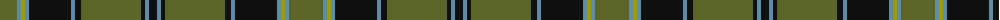

In pattern [GBYBKBKGKBK](/patterns/gbybkbkgkbk/).

This was sourced from register-of-tartans.  It is a [11 stripes tartan](/stripes/stripes11/).

Original link https://www.tartanregister.gov.uk/tartanDetails.aspx?ref=1237

## Thread count
G/34 B4 LG4 B4 K42 B4 K6 G60 K4 B4 K/8

## Palette
Each colour and its ΔE from the base-6 reference it is a variant of.

| Colour | Shade | Base | ΔE (OKLab) |
|---|---|---|---|
| B | <code style="background-color:#5C8CA8;">#5C8CA8</code> `#5C8CA8` | B <code style="background-color:#2C4084;">#2C4084</code> | 0.23 |
| G | <code style="background-color:#5C6428;">#5C6428</code> `#5C6428` | G <code style="background-color:#006400;">#006400</code> | 0.09 |
| K | <code style="background-color:#101010;">#101010</code> `#101010` | K <code style="background-color:#000000;">#000000</code> | 0.17 |
| LG | <code style="background-color:#9C9C00;">#9C9C00</code> `#9C9C00` | Y <code style="background-color:#E8C000;">#E8C000</code> | 0.16 |

ID: /setts/s11/g34b4y4b4k42b4k6g60k4b4k8-b5c8ca8-g5c6428-k101010-y9c9c00/
