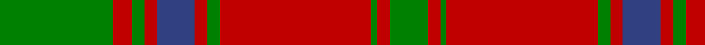

In pattern [GRGRBRGRGRG](/patterns/grgrbrgrgrg/).

This was sourced from weddslist.  It is a [11 stripes tartan](/stripes/stripes11/).

Original link http://www.weddslist.com/cgi-bin/tartans/pg.pl?source=sts

## Thread count
G/36 R6 G4 R4 B12 R4 G4 R48 G2 R4 G/12

## Palette
Each colour and its ΔE from the base-6 reference it is a variant of.

| Colour | Shade | Base | ΔE (OKLab) |
|---|---|---|---|
| B | <code style="background-color:#304080;">#304080</code> `#304080` | B <code style="background-color:#2A418A;">#2A418A</code> | 0.02 |
| G | <code style="background-color:#008000;">#008000</code> `#008000` | G <code style="background-color:#006100;">#006100</code> | 0.10 |
| R | <code style="background-color:#C00000;">#C00000</code> `#C00000` | R <code style="background-color:#CC0000;">#CC0000</code> | 0.03 |

## Nearest tartans

The nearest existing variants by ΔTartan distance.

1. [Unidentified Cant #09](/setts/s8/r44b2g26r3b2r3g26b2-b2c2c80-g006818-rc80000/) — ΔT 0.76
1. [MacDonell of Glengarry #4](/setts/s11/g36r6g4r4b12r4g4r48g2r4g12-b2c4084-g005020-rdc0000/) — ΔT 0.85
1. [Drummond](/setts/s12/g8r2g2r56g16k2g2k2g36r2g2r8-g008000-k000000-rc00000/) — ΔT 0.92
1. [Thomas of Wales](/setts/s8/g4r54b4g38b2g4b2r4-b202060-g006818-rc80000/) — ΔT 0.99
1. [Unidentified #62](/setts/s10/r64y2g16y2g16y2g16y2g16y2-g006818-r880000-yd09800/) — ΔT 1.06
1. [Drummond](/setts/s12/b48r14g14r78b8r4b4r10g84r14b12r14-b304080-g008000-rc00000/) — ΔT 1.10
1. [Drummond #3](/setts/s12/g8r2g2r56g16k2g2k2g36r2g2r8-g005020-k101010-rdc0000/) — ΔT 1.10
1. [Drummond VS](/setts/s12/g4r1g1r28g8k1g1k1g18r1g1r4-g004c00-k000000-rc80000/) — ΔT 1.10
1. [MacLintock](/setts/s12/g72r6g6r6b18r6ba4r80b6r6b4r12-b304080-ba5480b0-g008000-rc00000/) — ΔT 1.14
1. [Stewart of Athol Clan Tartan Tartan Number: 802. Earliest known date: pre 1842 (1745) Prepared for the Vestiarium Scoticum but not included in the published version. It was claimed to be the sett of a 'relic from the '45' and published as such by D.W.Stewart in his book 'Old and Rare Scottish Tartans' in 1893. It has become more widely known in recent times. There is also an Atholl district tartan. See products available Copyright © Blair Urquhart, Comrie, 2015](/setts/s9/g44k2g4k2g6k16r40k2r12-g006818-k101010-rc80000/) — ΔT 1.14

## Neighbour map

Every grey dot is one of 15726 variants placed by the first two principal components of the ΔTartan feature space (44% of its variance). Red is this tartan; blue dots are its nearest — click one to open its page.

<svg viewBox="0 0 640 380" role="img" style="max-width:100%;height:auto;border:1px solid #e0e0e0;border-radius:4px;display:block" xmlns="http://www.w3.org/2000/svg"><image href="/nn/cloud.v1.png" width="640" height="380"/><a href="/setts/s8/r44b2g26r3b2r3g26b2-b2c2c80-g006818-rc80000/"><circle cx="375.5" cy="168.8" r="4" fill="#3465a4"><title>Unidentified Cant #09</title></circle></a><a href="/setts/s11/g36r6g4r4b12r4g4r48g2r4g12-b2c4084-g005020-rdc0000/"><circle cx="359.5" cy="141.9" r="4" fill="#3465a4"><title>MacDonell of Glengarry #4</title></circle></a><a href="/setts/s12/g8r2g2r56g16k2g2k2g36r2g2r8-g008000-k000000-rc00000/"><circle cx="388.5" cy="120.7" r="4" fill="#3465a4"><title>Drummond</title></circle></a><a href="/setts/s8/g4r54b4g38b2g4b2r4-b202060-g006818-rc80000/"><circle cx="403.8" cy="145.7" r="4" fill="#3465a4"><title>Thomas of Wales</title></circle></a><a href="/setts/s10/r64y2g16y2g16y2g16y2g16y2-g006818-r880000-yd09800/"><circle cx="396.9" cy="146.6" r="4" fill="#3465a4"><title>Unidentified #62</title></circle></a><a href="/setts/s12/b48r14g14r78b8r4b4r10g84r14b12r14-b304080-g008000-rc00000/"><circle cx="305.1" cy="150.9" r="4" fill="#3465a4"><title>Drummond</title></circle></a><a href="/setts/s12/g8r2g2r56g16k2g2k2g36r2g2r8-g005020-k101010-rdc0000/"><circle cx="394.5" cy="119.9" r="4" fill="#3465a4"><title>Drummond #3</title></circle></a><a href="/setts/s12/g4r1g1r28g8k1g1k1g18r1g1r4-g004c00-k000000-rc80000/"><circle cx="395.6" cy="123.2" r="4" fill="#3465a4"><title>Drummond VS</title></circle></a><a href="/setts/s12/g72r6g6r6b18r6ba4r80b6r6b4r12-b304080-ba5480b0-g008000-rc00000/"><circle cx="346.9" cy="120.2" r="4" fill="#3465a4"><title>MacLintock</title></circle></a><a href="/setts/s9/g44k2g4k2g6k16r40k2r12-g006818-k101010-rc80000/"><circle cx="306.7" cy="159.4" r="4" fill="#3465a4"><title>Stewart of Athol Clan Tartan Tartan Number: 802. Earliest known date: pre 1842 (1745) Prepared for the Vestiarium Scoticum but not included in the published version. It was claimed to be the sett of a 'relic from the '45' and published as such by D.W.Stewart in his book 'Old and Rare Scottish Tartans' in 1893. It has become more widely known in recent times. There is also an Atholl district tartan. See products available Copyright © Blair Urquhart, Comrie, 2015</title></circle></a><circle cx="361.7" cy="145.9" r="5" fill="#c00000"/></svg>

ID: /setts/s11/g36r6g4r4b12r4g4r48g2r4g12-b304080-g008000-rc00000/
