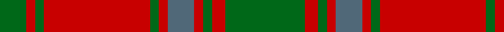

In pattern [GRGRBRGRGRG](/patterns/grgrbrgrgrg/).

This was sourced from tartans-authority.  It is a [11 stripes tartan](/stripes/stripes11/).

Original link http://www.tartansauthority.com/tartan-ferret/display/856/

## Thread count
G/12 R4 G4 R48 G4 R4 N12 R4 G4 R6 G/36

## Palette
Each colour and its ΔE from the base-6 reference it is a variant of.

| Colour | Shade | Base | ΔE (OKLab) |
|---|---|---|---|
| G | <code style="background-color:#006818;">#006818</code> `#006818` | G <code style="background-color:#006400;">#006400</code> | 0.02 |
| N | <code style="background-color:#506878;">#506878</code> `#506878` | B <code style="background-color:#2C4084;">#2C4084</code> | 0.14 |
| R | <code style="background-color:#C80000;">#C80000</code> `#C80000` | R <code style="background-color:#C80000;">#C80000</code> | 0.00 |

## Nearest tartans

The nearest existing variants by ΔTartan distance.

1. [Bruce, Old](/setts/s14/r45b4r4g48r4b4r4b15r4b4r40g4r4g30-b304080-g008000-rc00000/) — ΔT 0.76
1. [Bruce Old Clan Tartan Tartan Number: 876. Earliest known date: 1797 An order dated 1797 in the Wilson's of Bannockburn papers requests '50 Ells Bruce sett tartan'. As no distinction is made between 'old' and 'new' we assume that the 'new' sett, which has much in common with this one, had not been introduced. (Reduced in proportion for illustration.) See products available Copyright © Blair Urquhart, Comrie, 2015](/setts/s14/r45b4r4g48r4b4r4b15r4b4r40g4r4g30-b780078-g006818-rc80000/) — ΔT 0.95
1. [Robertson 3](/setts/s13/r4g4r36b4r4g36r4b36r4g4r36g4r4-b304080-g008000-rc00000/) — ΔT 1.12
1. [Wilson's No.119](/setts/s12/r12g56r12b4r12b38r12b4r12g56r12b4-b780078-g006818-rc80000/) — ΔT 1.17
1. [MacDonell of Glengarry](/setts/s11/g36r6g4r4b12r4g4r48g2r4g12-b304080-g008000-rc00000/) — ΔT 1.18
1. [Bruce Old](/setts/s14/r45b4r4g48r4b4r4b15r4b4r40g4r4g30-b2c4084-g005020-rdc0000/) — ΔT 1.18
1. [Robertson, Curtain](/setts/s13/r12g8r76b8r12b80r12g80r12b8r76g8r12-b304080-g008000-rc00000/) — ΔT 1.20
1. [Unidentified Cant #09](/setts/s8/r44b2g26r3b2r3g26b2-b2c2c80-g006818-rc80000/) — ΔT 1.22
1. [Skene #2](/setts/s12/b24r12g4r12g48r12g4r12g48r12g4r12-b202060-g006818-rc80000/) — ΔT 1.30
1. [Valdres, Kvam & Vang (Artefact)](/setts/s9/r20ra8r4g64ra8r44ra4r4ra8-g006c3c-rc80000-radc0058/) — ΔT 1.31

## Neighbour map

Every grey dot is one of 15726 variants placed by the first two principal components of the ΔTartan feature space (44% of its variance). Red is this tartan; blue dots are its nearest — click one to open its page.

<svg viewBox="0 0 640 380" role="img" style="max-width:100%;height:auto;border:1px solid #e0e0e0;border-radius:4px;display:block" xmlns="http://www.w3.org/2000/svg"><image href="/nn/cloud.v1.png" width="640" height="380"/><a href="/setts/s14/r45b4r4g48r4b4r4b15r4b4r40g4r4g30-b304080-g008000-rc00000/"><circle cx="320.2" cy="163.7" r="4" fill="#3465a4"><title>Bruce, Old</title></circle></a><a href="/setts/s14/r45b4r4g48r4b4r4b15r4b4r40g4r4g30-b780078-g006818-rc80000/"><circle cx="330.7" cy="164.0" r="4" fill="#3465a4"><title>Bruce Old Clan Tartan Tartan Number: 876. Earliest known date: 1797 An order dated 1797 in the Wilson's of Bannockburn papers requests '50 Ells Bruce sett tartan'. As no distinction is made between 'old' and 'new' we assume that the 'new' sett, which has much in common with this one, had not been introduced. (Reduced in proportion for illustration.) See products available Copyright © Blair Urquhart, Comrie, 2015</title></circle></a><a href="/setts/s13/r4g4r36b4r4g36r4b36r4g4r36g4r4-b304080-g008000-rc00000/"><circle cx="310.6" cy="177.3" r="4" fill="#3465a4"><title>Robertson 3</title></circle></a><a href="/setts/s12/r12g56r12b4r12b38r12b4r12g56r12b4-b780078-g006818-rc80000/"><circle cx="303.5" cy="177.4" r="4" fill="#3465a4"><title>Wilson's No.119</title></circle></a><a href="/setts/s11/g36r6g4r4b12r4g4r48g2r4g12-b304080-g008000-rc00000/"><circle cx="361.7" cy="145.9" r="4" fill="#3465a4"><title>MacDonell of Glengarry</title></circle></a><a href="/setts/s14/r45b4r4g48r4b4r4b15r4b4r40g4r4g30-b2c4084-g005020-rdc0000/"><circle cx="318.2" cy="160.0" r="4" fill="#3465a4"><title>Bruce Old</title></circle></a><a href="/setts/s13/r12g8r76b8r12b80r12g80r12b8r76g8r12-b304080-g008000-rc00000/"><circle cx="319.4" cy="177.7" r="4" fill="#3465a4"><title>Robertson, Curtain</title></circle></a><a href="/setts/s8/r44b2g26r3b2r3g26b2-b2c2c80-g006818-rc80000/"><circle cx="375.5" cy="168.8" r="4" fill="#3465a4"><title>Unidentified Cant #09</title></circle></a><a href="/setts/s12/b24r12g4r12g48r12g4r12g48r12g4r12-b202060-g006818-rc80000/"><circle cx="323.9" cy="193.1" r="4" fill="#3465a4"><title>Skene #2</title></circle></a><a href="/setts/s9/r20ra8r4g64ra8r44ra4r4ra8-g006c3c-rc80000-radc0058/"><circle cx="337.2" cy="174.0" r="4" fill="#3465a4"><title>Valdres, Kvam &amp; Vang (Artefact)</title></circle></a><circle cx="348.4" cy="178.1" r="5" fill="#c00000"/></svg>

ID: /setts/s11/g36r6g4r4b12r4g4r48g4r4g12-b506878-g006818-rc80000/
