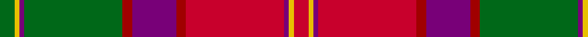

In pattern [GYBGRBRRBYR](/patterns/gybgrbrrbyr/).

This was sourced from register-of-tartans.  It is a [11 stripes tartan](/stripes/stripes11/).

Original link https://www.tartanregister.gov.uk/tartanDetails.aspx?ref=5067

## Attestations

This cloth appears in 2 source records; the oldest owns this page.

- 01/09/2002 — Scotland (Personal) (register-of-tartans, [record](https://www.tartanregister.gov.uk/tartanDetails.aspx?ref=5067))
- 2002 — Scotland (Personal) (tartans-authority, [record](http://www.tartansauthority.com/tartan-ferret/display/3115/))

## Thread count
G/6 Y2 P2 G40 DR4 P18 DR4 R40 P2 Y2 R/6

## Palette
Each colour and its ΔE from the base-6 reference it is a variant of.

| Colour | Shade | Base | ΔE (OKLab) |
|---|---|---|---|
| DR | <code style="background-color:#A00000;">#A00000</code> `#A00000` | R <code style="background-color:#CC0000;">#CC0000</code> | 0.09 |
| G | <code style="background-color:#006818;">#006818</code> `#006818` | G <code style="background-color:#006100;">#006100</code> | 0.02 |
| P | <code style="background-color:#780078;">#780078</code> `#780078` | B <code style="background-color:#2A418A;">#2A418A</code> | 0.17 |
| R | <code style="background-color:#C8002C;">#C8002C</code> `#C8002C` | R <code style="background-color:#CC0000;">#CC0000</code> | 0.03 |
| Y | <code style="background-color:#E8C000;">#E8C000</code> `#E8C000` | Y <code style="background-color:#F2BF00;">#F2BF00</code> | 0.02 |

## Nearest tartans

The nearest existing variants by ΔTartan distance.

1. [Scobie (Name)](/setts/s12/b1r1b1r6g26b14r20ba1r1ba1r2y1~b780078-ba5c8ca8-g006818-rc80000-yf0b4b4~x2/) — ΔT 0.63
1. [Orr, Gerald William (Personal)](/setts/s12/b4y2b2k5b4k4b8k6b2r32b2w4~b5c5c5c-k101010-rc80000-we0e0e0-ybc8c00~x2/) — ΔT 0.95
1. [MacColl, Ancient](/setts/s17/r7ra3r6b26r8g2r2b2r2ga1ra2r8ga26r8ga2r2ra2~b304080-g005020-ga008000-rc00000-ra900030~x2/) — ΔT 1.15
1. [Rikaco Red (Fashion)](/setts/s10/b5w5b2r47b18wa2b5ra9w7wa3~b5c5c5c-rc80000-raa48444-w98c8e8-waf0d0b4~x2/) — ΔT 1.18
1. [Brousseau (Personal)](/setts/s9/y25r2w2b2w2r13g28b2r3~b141e46-g703200-ra52b05-we0e0e0-y96963c~x2/) — ΔT 1.19
1. [Moray of Abercairny](/setts/s11/w1b3ba2r18ra2g16ra2r2ra2b3w1~b5c8ca8-ba1c1c50-g006818-r880000-rad05054-wf8f8f8~x2/) — ΔT 1.19
1. [MacColl Hunting](/setts/s18/r6ra3r6b22r7ra2w1r2b2r2w1ra2r7g22r7g2r2ra2~b2c2c80-g006818-rc80000-raa00048-we0e0e0~x2/) — ΔT 1.20
1. [Grant or New Bruce](/setts/s15/r12b2r4b4r39ba2r4b11r6g4r6g45r4b4bb10~b800080-ba5480b0-bb304080-g008000-rc00000/) — ΔT 1.20
1. [Grant or New Bruce Clan Tartan Tartan Number: 1385. Earliest known date: 1819 As ordered by Patrick Grant of Redcastle, the chief of the Clan Grant. The large red and the large green squares have been reduced by a factor of 4 to allow display. The original sett was S15 P2 S4 P4 S156 LB2 S4 P42 S6 G4 S6 G178 S4 P4 S10 (HSHP half sett half pivot). This tartan was also adopted by the Drummonds. See products available Copyright © Blair Urquhart, Comrie, 2015](/setts/s15/r12b2r4b4r39ba2r4b11r6g4r6g45r4b4bb10~b780078-ba5c8ca8-bb2c2c80-g006818-rc80000/) — ΔT 1.20
1. [Scobie (Blackford)](/setts/s12/b1r1b1r6g26ra14r20w1r1w1r2rb1~baa00ff-g006400-re3170d-rab966ae-rba01d69-w82cffd~x2/) — ΔT 1.22

## Neighbour map

Every grey dot is one of 15726 variants placed by the first two principal components of the ΔTartan feature space (44% of its variance). Red is this tartan; blue dots are its nearest — click one to open its page.

<svg viewBox="0 0 640 380" role="img" style="max-width:100%;height:auto;border:1px solid #e0e0e0;border-radius:4px;display:block" xmlns="http://www.w3.org/2000/svg"><image href="/nn/cloud.v1.png" width="640" height="380"/><a href="/setts/s12/b1r1b1r6g26b14r20ba1r1ba1r2y1~b780078-ba5c8ca8-g006818-rc80000-yf0b4b4~x2/"><circle cx="279.0" cy="93.6" r="4" fill="#3465a4"><title>Scobie (Name)</title></circle></a><a href="/setts/s12/b4y2b2k5b4k4b8k6b2r32b2w4~b5c5c5c-k101010-rc80000-we0e0e0-ybc8c00~x2/"><circle cx="244.0" cy="106.4" r="4" fill="#3465a4"><title>Orr, Gerald William (Personal)</title></circle></a><a href="/setts/s17/r7ra3r6b26r8g2r2b2r2ga1ra2r8ga26r8ga2r2ra2~b304080-g005020-ga008000-rc00000-ra900030~x2/"><circle cx="249.0" cy="90.8" r="4" fill="#3465a4"><title>MacColl, Ancient</title></circle></a><a href="/setts/s10/b5w5b2r47b18wa2b5ra9w7wa3~b5c5c5c-rc80000-raa48444-w98c8e8-waf0d0b4~x2/"><circle cx="295.3" cy="105.7" r="4" fill="#3465a4"><title>Rikaco Red (Fashion)</title></circle></a><a href="/setts/s9/y25r2w2b2w2r13g28b2r3~b141e46-g703200-ra52b05-we0e0e0-y96963c~x2/"><circle cx="224.5" cy="140.6" r="4" fill="#3465a4"><title>Brousseau (Personal)</title></circle></a><a href="/setts/s11/w1b3ba2r18ra2g16ra2r2ra2b3w1~b5c8ca8-ba1c1c50-g006818-r880000-rad05054-wf8f8f8~x2/"><circle cx="207.1" cy="99.3" r="4" fill="#3465a4"><title>Moray of Abercairny</title></circle></a><a href="/setts/s18/r6ra3r6b22r7ra2w1r2b2r2w1ra2r7g22r7g2r2ra2~b2c2c80-g006818-rc80000-raa00048-we0e0e0~x2/"><circle cx="231.1" cy="90.8" r="4" fill="#3465a4"><title>MacColl Hunting</title></circle></a><a href="/setts/s15/r12b2r4b4r39ba2r4b11r6g4r6g45r4b4bb10~b800080-ba5480b0-bb304080-g008000-rc00000/"><circle cx="294.3" cy="96.3" r="4" fill="#3465a4"><title>Grant or New Bruce</title></circle></a><a href="/setts/s15/r12b2r4b4r39ba2r4b11r6g4r6g45r4b4bb10~b780078-ba5c8ca8-bb2c2c80-g006818-rc80000/"><circle cx="299.3" cy="97.8" r="4" fill="#3465a4"><title>Grant or New Bruce Clan Tartan Tartan Number: 1385. Earliest known date: 1819 As ordered by Patrick Grant of Redcastle, the chief of the Clan Grant. The large red and the large green squares have been reduced by a factor of 4 to allow display. The original sett was S15 P2 S4 P4 S156 LB2 S4 P42 S6 G4 S6 G178 S4 P4 S10 (HSHP half sett half pivot). This tartan was also adopted by the Drummonds. See products available Copyright © Blair Urquhart, Comrie, 2015</title></circle></a><a href="/setts/s12/b1r1b1r6g26ra14r20w1r1w1r2rb1~baa00ff-g006400-re3170d-rab966ae-rba01d69-w82cffd~x2/"><circle cx="245.1" cy="68.9" r="4" fill="#3465a4"><title>Scobie (Blackford)</title></circle></a><circle cx="244.1" cy="111.2" r="5" fill="#c00000"/></svg>

ID: /setts/s11/g3y1b1g20r2b9r2ra20b1y1ra3~b780078-g006818-ra00000-rac8002c-ye8c000~x2/
