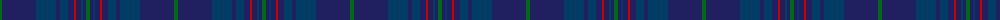

In pattern [GBBBBBRBBBG](/patterns/gbbbbbrbbbg/).

This was sourced from house-of-tartan.  It is a [11 stripes tartan](/stripes/stripes11/).

Original link http://www.house-of-tartan.scotland.net/house/TartanViewjs.asp?colr=Def&tnam=5756

## Thread count
G/4 DB34 DBa20 DB4 DBa8 DB6 R2 DB5 DBa2 DB3 G/4

## Palette
Each colour and its ΔE from the base-6 reference it is a variant of.

| Colour | Shade | Base | ΔE (OKLab) |
|---|---|---|---|
| DB | <code style="background-color:#202060;">#202060</code> `#202060` | B <code style="background-color:#2A418A;">#2A418A</code> | 0.11 |
| DBa | <code style="background-color:#003C64;">#003C64</code> `#003C64` | B <code style="background-color:#2A418A;">#2A418A</code> | 0.08 |
| G | <code style="background-color:#006818;">#006818</code> `#006818` | G <code style="background-color:#006100;">#006100</code> | 0.02 |
| K | <code style="background-color:#101010;">#101010</code> `#101010` | K <code style="background-color:#000000;">#000000</code> | 0.17 |
| R | <code style="background-color:#C80000;">#C80000</code> `#C80000` | R <code style="background-color:#CC0000;">#CC0000</code> | 0.01 |

## Nearest tartans

The nearest existing variants by ΔTartan distance.

1. [Gravesend Grammar School (Corp)](/setts/s11/b8g5b72ba72r5ba16r5ba72b72g5b8-b2c2c80-ba1c1c50-g006818-r9c68a4/) — ΔT 1.39
1. [Dauphinee, Andrew Hunter (Personal)](/setts/s9/r6b64ba4b6ba8b4ba32w2ba2-b3c4359-ba172d60-ra00000-wf8f4d0/) — ΔT 1.46
1. [Little Hunting](/setts/s8/b10ba6b8ba6b8k56b16r2-b1c1c50-ba2c2c80-k101010-rc80000/) — ΔT 1.66
1. [Tern House](/setts/s7/g23b3k8b4g4b56ga8-b141e46-g003820-ga604000-k101010/) — ΔT 1.66
1. [Hughes of Wales](/setts/s20/b34ba20b4ba8b6r2b5ba2b3g4b3ba2b5r2b6ba8b4ba20b34g4-b202060-ba003c64-g006818-rc80000/) — ΔT 1.71
1. [Scottish Thistle](/setts/s10/b4k6b66ka22k6b6ba30b8r2b4-b003c64-ba181034-k080020-ka101010-r8c90b0/) — ΔT 1.81
1. [Payne (Name)](/setts/s14/b4k2b8ba10bb6ba40k16b8k2b4k2b66y2b2-b2c2c80-ba202060-bb780078-k101010-yfccc00/) — ΔT 1.88
1. [Argentina Argentinian District Tartan Tartan Number: 2487. Earliest known date: 1998 Original notes said: Designed by the St Andrew's Society of the River Plate for Scots living in Argentina. But in May 2005 notes were submitted by the designer Edward Macrae, a Scottish-Argentinian who designed the Argentina District Tartan in 1998. It is based in the sett of the Robertson tartan honouring John and William Robertson two Scotsmen from Kelso who started the first settlement of Scottish immigrants in Argentina. 220 emigrants left the port of Leith on board of the Symmetry and arrived in Buenos Aires on August 8, 1825 settling in a ranch 20 miles south-west of the city in the area of Monte Grande and called Santa Catalina. The tartan combines the colours of the Argentine and Scottish flags. Blue, navy blue and white are part of the iconography used in sports and national symbols representing Argentina. See products available Copyright © Blair Urquhart, Comrie, 2015](/setts/s12/b72ba6b6ba66w6ba10w6ba66b6ba6b72ba6-b202060-ba2c2c80-we0e0e0/) — ΔT 1.92
1. [Hopkins (Welsh Name)](/setts/s12/k20b8k8b8k8ba20b8ba4k4ba4b40k12-b202060-ba003c64-k101010/) — ΔT 1.94
1. [Land's End, Blue (Fashion)](/setts/s8/b4g18r4g18b4g4b52g4-b003054-g004c2c-r901c38/) — ΔT 1.95

## Neighbour map

Every grey dot is one of 15726 variants placed by the first two principal components of the ΔTartan feature space (44% of its variance). Red is this tartan; blue dots are its nearest — click one to open its page.

<svg viewBox="0 0 640 380" role="img" style="max-width:100%;height:auto;border:1px solid #e0e0e0;border-radius:4px;display:block" xmlns="http://www.w3.org/2000/svg"><image href="/nn/cloud.v1.png" width="640" height="380"/><a href="/setts/s11/b8g5b72ba72r5ba16r5ba72b72g5b8-b2c2c80-ba1c1c50-g006818-r9c68a4/"><circle cx="457.5" cy="247.0" r="4" fill="#3465a4"><title>Gravesend Grammar School (Corp)</title></circle></a><a href="/setts/s9/r6b64ba4b6ba8b4ba32w2ba2-b3c4359-ba172d60-ra00000-wf8f4d0/"><circle cx="524.3" cy="190.1" r="4" fill="#3465a4"><title>Dauphinee, Andrew Hunter (Personal)</title></circle></a><a href="/setts/s8/b10ba6b8ba6b8k56b16r2-b1c1c50-ba2c2c80-k101010-rc80000/"><circle cx="469.1" cy="215.0" r="4" fill="#3465a4"><title>Little Hunting</title></circle></a><a href="/setts/s7/g23b3k8b4g4b56ga8-b141e46-g003820-ga604000-k101010/"><circle cx="522.5" cy="248.1" r="4" fill="#3465a4"><title>Tern House</title></circle></a><a href="/setts/s20/b34ba20b4ba8b6r2b5ba2b3g4b3ba2b5r2b6ba8b4ba20b34g4-b202060-ba003c64-g006818-rc80000/"><circle cx="508.7" cy="215.1" r="4" fill="#3465a4"><title>Hughes of Wales</title></circle></a><a href="/setts/s10/b4k6b66ka22k6b6ba30b8r2b4-b003c64-ba181034-k080020-ka101010-r8c90b0/"><circle cx="451.9" cy="172.0" r="4" fill="#3465a4"><title>Scottish Thistle</title></circle></a><a href="/setts/s14/b4k2b8ba10bb6ba40k16b8k2b4k2b66y2b2-b2c2c80-ba202060-bb780078-k101010-yfccc00/"><circle cx="455.7" cy="150.3" r="4" fill="#3465a4"><title>Payne (Name)</title></circle></a><a href="/setts/s12/b72ba6b6ba66w6ba10w6ba66b6ba6b72ba6-b202060-ba2c2c80-we0e0e0/"><circle cx="443.5" cy="245.6" r="4" fill="#3465a4"><title>Argentina Argentinian District Tartan Tartan Number: 2487. Earliest known date: 1998 Original notes said: Designed by the St Andrew's Society of the River Plate for Scots living in Argentina. But in May 2005 notes were submitted by the designer Edward Macrae, a Scottish-Argentinian who designed the Argentina District Tartan in 1998. It is based in the sett of the Robertson tartan honouring John and William Robertson two Scotsmen from Kelso who started the first settlement of Scottish immigrants in Argentina. 220 emigrants left the port of Leith on board of the Symmetry and arrived in Buenos Aires on August 8, 1825 settling in a ranch 20 miles south-west of the city in the area of Monte Grande and called Santa Catalina. The tartan combines the colours of the Argentine and Scottish flags. Blue, navy blue and white are part of the iconography used in sports and national symbols representing Argentina. See products available Copyright © Blair Urquhart, Comrie, 2015</title></circle></a><a href="/setts/s12/k20b8k8b8k8ba20b8ba4k4ba4b40k12-b202060-ba003c64-k101010/"><circle cx="379.3" cy="266.9" r="4" fill="#3465a4"><title>Hopkins (Welsh Name)</title></circle></a><a href="/setts/s8/b4g18r4g18b4g4b52g4-b003054-g004c2c-r901c38/"><circle cx="518.9" cy="270.4" r="4" fill="#3465a4"><title>Land's End, Blue (Fashion)</title></circle></a><circle cx="472.0" cy="223.7" r="5" fill="#c00000"/></svg>

ID: /setts/s11/g4b34ba20b4ba8b6r2b5ba2b3g4-b202060-ba003c64-g006818-rc80000/
