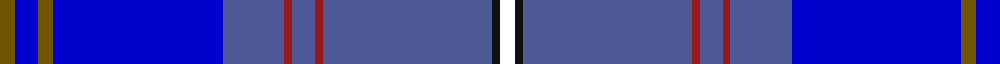

In pattern [GBGBBRBRBKW](/patterns/gbgbbrbrbkw/).

This was sourced from register-of-tartans.  It is a [11 stripes tartan](/stripes/stripes11/).

Original link https://www.tartanregister.gov.uk/tartanDetails.aspx?ref=10056

## Thread count
T/4 Ba6 T4 Ba44 B16 DR2 B6 DR2 B44 K2 W/4

## Palette
Each colour and its ΔE from the base-6 reference it is a variant of.

| Colour | Shade | Base | ΔE (OKLab) |
|---|---|---|---|
| B | <code style="background-color:#4E5A96;">#4E5A96</code> `#4E5A96` | B <code style="background-color:#2C4084;">#2C4084</code> | 0.09 |
| Ba | <code style="background-color:#0000CD;">#0000CD</code> `#0000CD` | B <code style="background-color:#2C4084;">#2C4084</code> | 0.15 |
| DR | <code style="background-color:#9B1617;">#9B1617</code> `#9B1617` | R <code style="background-color:#C80000;">#C80000</code> | 0.09 |
| K | <code style="background-color:#101010;">#101010</code> `#101010` | K <code style="background-color:#000000;">#000000</code> | 0.17 |
| T | <code style="background-color:#715406;">#715406</code> `#715406` | G <code style="background-color:#006400;">#006400</code> | 0.13 |
| W | <code style="background-color:#FFFFFF;">#FFFFFF</code> `#FFFFFF` | W <code style="background-color:#F4F4F0;">#F4F4F0</code> | 0.03 |

## Nearest tartans

The nearest existing variants by ΔTartan distance.

1. [Plymouth Armada (Commemorative)](/setts/s12/b80r4b14ba10bb4ba6w4ba20ra12b4ra8w4-b2c2c80-ba202060-bb480800-rc80000-ra888888-we0e0e0/) — ΔT 1.35
1. [Plymouth/Armada 400, Armada](/setts/s12/b80r4b14ba10ra4ba6w4ba20g12b4g8w4-b304080-ba000050-g808080-rc00000-ra703000-we0e0e0/) — ΔT 1.49
1. [Schiehallion (Corporate)](/setts/s11/b28ba8g4ba4ga6ba4b34ba62b2ba2w4-b1870a4-ba202060-g408060-ga006818-wfcfcfc/) — ΔT 1.54
1. [Blue Ridge Highlands Heritage](/setts/s8/b54ba18w6g12ba66w6bb6y4-b5c8ca8-ba2c2c80-bb680028-g00643c-wa8ace8-ye8c000/) — ΔT 1.61
1. [Bavidge (Personal)](/setts/s12/b92k14b18ba5b5ba5b5g32bb16k5bb7y8-b2c2c80-ba1860a8-bb780078-g005028-k101010-ye8c000/) — ΔT 1.63
1. [Blue Pride](/setts/s11/b76k8b4g12ba22bb6ba4r4b22k2w4-b3850c3-ba9058d8-bb141e46-g00643c-k101010-rec34c4-wfcfcfc/) — ΔT 1.66
1. [Blue Pride](/setts/s11/b76k8b4g12ba22bb6ba4r4b22k2w4-b3850c8-ba9058d8-bb202060-g006818-k101010-rc80000-wfcfcfc/) — ΔT 1.67
1. [Plymouth Armada](/setts/s12/b80r4b14ba10bb4bc6w4bc20ra12b4ra8w4-b2c2c80-ba441800-bb480800-bc202060-rc80000-ra888888-we0e0e0/) — ΔT 1.72
1. [Incorporation of Weavers (Glasgow)](/setts/s9/b6r6b72ba14k6ba12g10k2y6-b1c0070-ba2c2c80-g006818-k101010-r888888-ye8c000/) — ΔT 1.72
1. [Musselburgh](/setts/s9/b28w2b6y4b6w2b8ba48r6-b5480b0-ba304080-rc00000-we0e0e0-yf0c000/) — ΔT 1.80

## Neighbour map

Every grey dot is one of 15726 variants placed by the first two principal components of the ΔTartan feature space (44% of its variance). Red is this tartan; blue dots are its nearest — click one to open its page.

<svg viewBox="0 0 640 380" role="img" style="max-width:100%;height:auto;border:1px solid #e0e0e0;border-radius:4px;display:block" xmlns="http://www.w3.org/2000/svg"><image href="/nn/cloud.v1.png" width="640" height="380"/><a href="/setts/s12/b80r4b14ba10bb4ba6w4ba20ra12b4ra8w4-b2c2c80-ba202060-bb480800-rc80000-ra888888-we0e0e0/"><circle cx="340.8" cy="107.5" r="4" fill="#3465a4"><title>Plymouth Armada (Commemorative)</title></circle></a><a href="/setts/s12/b80r4b14ba10ra4ba6w4ba20g12b4g8w4-b304080-ba000050-g808080-rc00000-ra703000-we0e0e0/"><circle cx="326.0" cy="101.4" r="4" fill="#3465a4"><title>Plymouth/Armada 400, Armada</title></circle></a><a href="/setts/s11/b28ba8g4ba4ga6ba4b34ba62b2ba2w4-b1870a4-ba202060-g408060-ga006818-wfcfcfc/"><circle cx="349.8" cy="122.3" r="4" fill="#3465a4"><title>Schiehallion (Corporate)</title></circle></a><a href="/setts/s8/b54ba18w6g12ba66w6bb6y4-b5c8ca8-ba2c2c80-bb680028-g00643c-wa8ace8-ye8c000/"><circle cx="258.4" cy="141.5" r="4" fill="#3465a4"><title>Blue Ridge Highlands Heritage</title></circle></a><a href="/setts/s12/b92k14b18ba5b5ba5b5g32bb16k5bb7y8-b2c2c80-ba1860a8-bb780078-g005028-k101010-ye8c000/"><circle cx="330.2" cy="120.2" r="4" fill="#3465a4"><title>Bavidge (Personal)</title></circle></a><a href="/setts/s11/b76k8b4g12ba22bb6ba4r4b22k2w4-b3850c3-ba9058d8-bb141e46-g00643c-k101010-rec34c4-wfcfcfc/"><circle cx="365.4" cy="73.0" r="4" fill="#3465a4"><title>Blue Pride</title></circle></a><a href="/setts/s11/b76k8b4g12ba22bb6ba4r4b22k2w4-b3850c8-ba9058d8-bb202060-g006818-k101010-rc80000-wfcfcfc/"><circle cx="360.6" cy="71.0" r="4" fill="#3465a4"><title>Blue Pride</title></circle></a><a href="/setts/s12/b80r4b14ba10bb4bc6w4bc20ra12b4ra8w4-b2c2c80-ba441800-bb480800-bc202060-rc80000-ra888888-we0e0e0/"><circle cx="311.5" cy="88.0" r="4" fill="#3465a4"><title>Plymouth Armada</title></circle></a><a href="/setts/s9/b6r6b72ba14k6ba12g10k2y6-b1c0070-ba2c2c80-g006818-k101010-r888888-ye8c000/"><circle cx="358.2" cy="103.8" r="4" fill="#3465a4"><title>Incorporation of Weavers (Glasgow)</title></circle></a><a href="/setts/s9/b28w2b6y4b6w2b8ba48r6-b5480b0-ba304080-rc00000-we0e0e0-yf0c000/"><circle cx="306.4" cy="135.1" r="4" fill="#3465a4"><title>Musselburgh</title></circle></a><circle cx="302.2" cy="115.7" r="5" fill="#c00000"/></svg>

ID: /setts/s11/g4b6g4b44ba16r2ba6r2ba44k2w4-b0000cd-ba4e5a96-g715406-k101010-r9b1617-wffffff/
