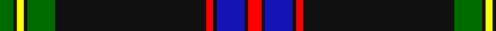

**Bands:** [GKYKGKRKBKR](/stripes/gkykgkrkbkr/) · **Stripes:** [G K LY K G K R K DB K R](/stripes/stripes11/) G K LY K G K R K DB K R

This was sourced from register-of-tartans.  It is a [11 band tartan](/bands/bands11/).

Original link https://www.tartanregister.gov.uk/tartanDetails.aspx?ref=10585

## Register references

External register numbers recorded for this tartan.

- Scottish Register of Tartans: [10585](https://www.tartanregister.gov.uk/tartanDetails.aspx?ref=10585)

## Thread count
G/8 K2 Y4 K2 G16 K88 R4 K2 B16 K2 R/8

## Palette
Each colour and its ΔE from the base-6 reference it is a variant of.

| Colour | Shade | Base | ΔE (OKLab) |
|---|---|---|---|
| B | <code style="background-color:#1414B4;">#1414B4</code> `#1414B4` | B <code style="background-color:#2A418A;">#2A418A</code> | 0.11 |
| G | <code style="background-color:#006C00;">#006C00</code> `#006C00` | G <code style="background-color:#006100;">#006100</code> | 0.04 |
| K | <code style="background-color:#101010;">#101010</code> `#101010` | K <code style="background-color:#000000;">#000000</code> | 0.17 |
| R | <code style="background-color:#FF0000;">#FF0000</code> `#FF0000` | R <code style="background-color:#CC0000;">#CC0000</code> | 0.11 |
| Y | <code style="background-color:#FFFF0A;">#FFFF0A</code> `#FFFF0A` | Y <code style="background-color:#F2BF00;">#F2BF00</code> | 0.16 |

## Nearest tartans

The nearest existing variants by ΔTartan distance.

1. [Marsa Scout Group](/setts/s11/g4k1ly2k1g8k44r2db8k1k1r4~x2/) — ΔT 0.72
1. [Langtree](/setts/s12/k86n6k4lb3k3r3k3n22o14k3o6lb4/) — ΔT 0.84
1. [Langtree Trade Tartan Tartan Number: 1131. Earliest known date: pre 2003 A Stewart colour variation marketed by Selfridge's, London and apparently designed and woven by Pendleton Woolen Mills of Oregon. See products available Copyright © Blair Urquhart, Comrie, 2015](/setts/s12/k86o6k4w3k3r3k3o22lo14k3lo6w4/) — ΔT 0.90
1. [Calgary HOG (Corporate)](/setts/s9/lb4n6k4r2r10k44n1k1lb2~x2/) — ΔT 0.97
1. [Goldwire (2015)](/setts/s14/k3lo3k3lo3k3lo3k3lo3k36w1k2dt9r2dt1~x2/) — ΔT 1.05
1. [Estonian National Tartan (District)](/setts/s10/k53b3k2w1k2b3k5b32ly1r3~x2/) — ΔT 1.09
1. [Williams Dress (Personal)](/setts/s11/r5k1w3k6n5k2ly3k45n4k2ly3~x2/) — ΔT 1.18
1. [Italian American](/setts/s9/r4k2w6k2db40k80dg10w6r3/) — ΔT 1.21
1. [Langtree](/setts/s12/k86y6k4w3k3r3k3y22o14k3o6w4/) — ΔT 1.23
1. [Montgomerie, Colin](/setts/s9/lr2k1r5n3o12n4lr1k40b1~x2/) — ΔT 1.26

## Neighbour map

Every grey dot is one of 14313 variants placed by the first two principal components of the ΔTartan feature space (44% of its variance). Red is this tartan; blue dots are its nearest — click one to open its page.

<svg viewBox="0 0 640 380" role="img" style="max-width:100%;height:auto;border:1px solid #e0e0e0;border-radius:4px;display:block" xmlns="http://www.w3.org/2000/svg"><image href="/nn/cloud.v1.png" width="640" height="380"/><a href="/setts/s11/g4k1ly2k1g8k44r2db8k1k1r4~x2/"><circle cx="421.2" cy="84.3" r="4" fill="#3465a4"><title>Marsa Scout Group</title></circle></a><a href="/setts/s12/k86n6k4lb3k3r3k3n22o14k3o6lb4/"><circle cx="396.9" cy="88.6" r="4" fill="#3465a4"><title>Langtree</title></circle></a><a href="/setts/s12/k86o6k4w3k3r3k3o22lo14k3lo6w4/"><circle cx="375.7" cy="76.6" r="4" fill="#3465a4"><title>Langtree Trade Tartan Tartan Number: 1131. Earliest known date: pre 2003 A Stewart colour variation marketed by Selfridge's, London and apparently designed and woven by Pendleton Woolen Mills of Oregon. See products available Copyright © Blair Urquhart, Comrie, 2015</title></circle></a><a href="/setts/s9/lb4n6k4r2r10k44n1k1lb2~x2/"><circle cx="431.0" cy="89.0" r="4" fill="#3465a4"><title>Calgary HOG (Corporate)</title></circle></a><a href="/setts/s14/k3lo3k3lo3k3lo3k3lo3k36w1k2dt9r2dt1~x2/"><circle cx="425.9" cy="78.2" r="4" fill="#3465a4"><title>Goldwire (2015)</title></circle></a><a href="/setts/s10/k53b3k2w1k2b3k5b32ly1r3~x2/"><circle cx="409.8" cy="86.2" r="4" fill="#3465a4"><title>Estonian National Tartan (District)</title></circle></a><a href="/setts/s11/r5k1w3k6n5k2ly3k45n4k2ly3~x2/"><circle cx="445.9" cy="69.2" r="4" fill="#3465a4"><title>Williams Dress (Personal)</title></circle></a><a href="/setts/s9/r4k2w6k2db40k80dg10w6r3/"><circle cx="341.6" cy="97.1" r="4" fill="#3465a4"><title>Italian American</title></circle></a><a href="/setts/s12/k86y6k4w3k3r3k3y22o14k3o6w4/"><circle cx="366.7" cy="77.2" r="4" fill="#3465a4"><title>Langtree</title></circle></a><a href="/setts/s9/lr2k1r5n3o12n4lr1k40b1~x2/"><circle cx="356.9" cy="74.9" r="4" fill="#3465a4"><title>Montgomerie, Colin</title></circle></a><circle cx="399.9" cy="73.7" r="5" fill="#c00000"/></svg>

ID: /setts/s11/g4k1ly2k1g8k44r2k1db8k1r4~x2/
