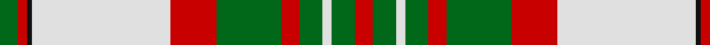

In pattern [GRKWRGRGWGR](/patterns/grkwrgrgwgr/).

This was sourced from house-of-tartan.  It is a [11 stripes tartan](/stripes/stripes11/).

Original link http://www.house-of-tartan.scotland.net/house/TartanViewjs.asp?colr=Def&tnam=1006

## Thread count
G/8 R4 K2 LN60 R20 G28 R8 G10 LN4 G10 R/8

## Palette
Each colour and its ΔE from the base-6 reference it is a variant of.

| Colour | Shade | Base | ΔE (OKLab) |
|---|---|---|---|
| G | <code style="background-color:#006818;">#006818</code> `#006818` | G <code style="background-color:#006100;">#006100</code> | 0.02 |
| K | <code style="background-color:#101010;">#101010</code> `#101010` | K <code style="background-color:#000000;">#000000</code> | 0.17 |
| LN | <code style="background-color:#E0E0E0;">#E0E0E0</code> `#E0E0E0` | W <code style="background-color:#F7F7F7;">#F7F7F7</code> | 0.07 |
| R | <code style="background-color:#C80000;">#C80000</code> `#C80000` | R <code style="background-color:#CC0000;">#CC0000</code> | 0.01 |

## Nearest tartans

The nearest existing variants by ΔTartan distance.

1. [Scott, dress](/setts/s11/g4r2k1w30r10g14r4g5w2g5r4x2~g008000-k000000-rc00000-we0e0e0/) — ΔT 0.32
1. [Dogwood Trade Tartan Tartan Number: 913. Earliest known date: 1968 The registered tartan of the Dinwiddie Clan. Dinwiddies are normally associated with the Maxwells, but Lord Lyon stated, in 1988, that Dinwiddies were a sept of no other clan. See products available Copyright © Blair Urquhart, Comrie, 2015](/setts/s8/g3r12g12y5r1w25g2r1x2~g006818-r880000-we0e0e0-ya08858/) — ΔT 0.82
1. [Dogwood](/setts/s8/g3r12g12ra5r1w25g2r1x2~g008000-r800000-ra906030-we0e0e0/) — ΔT 0.83
1. [Prince Edward Island, Dress](/setts/s9/g22r2g4r2g4r18w24r1y3x2~g006818-r880000-we0e0e0-yd09800/) — ΔT 0.86
1. [British Columbia #2](/setts/s8/g4b14g14r6b1w30g2b1x2~b541c0c-g004c00-r9c8000-wffffff/) — ΔT 1.04
1. [Grant - 1714 (Piper) (Portrait)](/setts/s12/r24k2g8k2r8k1g24w6k2r14w18k4~g289c18-k101010-re87878-w98c8e8/) — ΔT 1.04
1. [Dogwood](/setts/s8/g4b10g10r6b1w26g2b1x4~b381c0c-g004800-rb07430-wf8f4d0/) — ΔT 1.10
1. [Crawford Arisaid (Dance)](/setts/s9/r6w1r2w25r3g12r3g12r3x2~g006818-r880000-wfcfcfc/) — ΔT 1.13
1. [Ben Cleuch](/setts/s10/w68r3w3r8w3r27g16ra3g20r3x2~g64340c-ra07c58-ra90000c-wf8f4d0/) — ΔT 1.16
1. [Fiona](/setts/s13/w16b2w2r2w2b24wa2r1wa1r1wa12b1r2x4~b3c3c3c-ra0783c-wfcc8d8-waf8f4d0/) — ΔT 1.19

## Neighbour map

Every grey dot is one of 15726 variants placed by the first two principal components of the ΔTartan feature space (44% of its variance). Red is this tartan; blue dots are its nearest — click one to open its page.

<svg viewBox="0 0 640 380" role="img" style="max-width:100%;height:auto;border:1px solid #e0e0e0;border-radius:4px;display:block" xmlns="http://www.w3.org/2000/svg"><image href="/nn/cloud.v1.png" width="640" height="380"/><a href="/setts/s11/g4r2k1w30r10g14r4g5w2g5r4x2~g008000-k000000-rc00000-we0e0e0/"><circle cx="233.6" cy="103.6" r="4" fill="#3465a4"><title>Scott, dress</title></circle></a><a href="/setts/s8/g3r12g12y5r1w25g2r1x2~g006818-r880000-we0e0e0-ya08858/"><circle cx="221.2" cy="127.4" r="4" fill="#3465a4"><title>Dogwood Trade Tartan Tartan Number: 913. Earliest known date: 1968 The registered tartan of the Dinwiddie Clan. Dinwiddies are normally associated with the Maxwells, but Lord Lyon stated, in 1988, that Dinwiddies were a sept of no other clan. See products available Copyright © Blair Urquhart, Comrie, 2015</title></circle></a><a href="/setts/s8/g3r12g12ra5r1w25g2r1x2~g008000-r800000-ra906030-we0e0e0/"><circle cx="221.0" cy="127.6" r="4" fill="#3465a4"><title>Dogwood</title></circle></a><a href="/setts/s9/g22r2g4r2g4r18w24r1y3x2~g006818-r880000-we0e0e0-yd09800/"><circle cx="212.2" cy="129.0" r="4" fill="#3465a4"><title>Prince Edward Island, Dress</title></circle></a><a href="/setts/s8/g4b14g14r6b1w30g2b1x2~b541c0c-g004c00-r9c8000-wffffff/"><circle cx="213.2" cy="115.1" r="4" fill="#3465a4"><title>British Columbia #2</title></circle></a><a href="/setts/s12/r24k2g8k2r8k1g24w6k2r14w18k4~g289c18-k101010-re87878-w98c8e8/"><circle cx="213.2" cy="128.8" r="4" fill="#3465a4"><title>Grant - 1714 (Piper) (Portrait)</title></circle></a><a href="/setts/s8/g4b10g10r6b1w26g2b1x4~b381c0c-g004800-rb07430-wf8f4d0/"><circle cx="215.4" cy="122.2" r="4" fill="#3465a4"><title>Dogwood</title></circle></a><a href="/setts/s9/r6w1r2w25r3g12r3g12r3x2~g006818-r880000-wfcfcfc/"><circle cx="227.2" cy="138.2" r="4" fill="#3465a4"><title>Crawford Arisaid (Dance)</title></circle></a><a href="/setts/s10/w68r3w3r8w3r27g16ra3g20r3x2~g64340c-ra07c58-ra90000c-wf8f4d0/"><circle cx="269.9" cy="103.3" r="4" fill="#3465a4"><title>Ben Cleuch</title></circle></a><a href="/setts/s13/w16b2w2r2w2b24wa2r1wa1r1wa12b1r2x4~b3c3c3c-ra0783c-wfcc8d8-waf8f4d0/"><circle cx="218.1" cy="83.9" r="4" fill="#3465a4"><title>Fiona</title></circle></a><circle cx="233.7" cy="103.2" r="5" fill="#c00000"/></svg>

ID: /setts/s11/g4r2k1w30r10g14r4g5w2g5r4x2~g006818-k101010-rc80000-we0e0e0/
