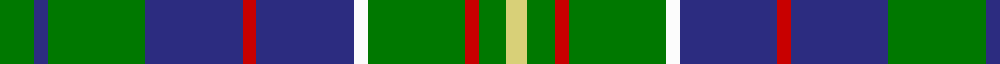

In pattern [GBGBRBWGRGY](/patterns/gbgbrbwgrgy/).

This was sourced from tartans-authority.  It is a [11 stripes tartan](/stripes/stripes11/).

Original link http://www.tartansauthority.com/tartan-ferret/display/719/

## Thread count
G/10 DB4 G28 DB28 R4 DB28 W4 G28 R4 G8 LG/6

## Palette
Each colour and its ΔE from the base-6 reference it is a variant of.

| Colour | Shade | Base | ΔE (OKLab) |
|---|---|---|---|
| DB | <code style="background-color:#2C2C80;">#2C2C80</code> `#2C2C80` | B <code style="background-color:#2A418A;">#2A418A</code> | 0.06 |
| G | <code style="background-color:#007800;">#007800</code> `#007800` | G <code style="background-color:#006100;">#006100</code> | 0.07 |
| LG | <code style="background-color:#D8D078;">#D8D078</code> `#D8D078` | Y <code style="background-color:#F2BF00;">#F2BF00</code> | 0.07 |
| R | <code style="background-color:#C80000;">#C80000</code> `#C80000` | R <code style="background-color:#CC0000;">#CC0000</code> | 0.01 |
| W | <code style="background-color:#FCFCFC;">#FCFCFC</code> `#FCFCFC` | W <code style="background-color:#F7F7F7;">#F7F7F7</code> | 0.01 |

## Nearest tartans

The nearest existing variants by ΔTartan distance.

1. [Hunter of Hunterston Clan Tartan Tartan Number: 719. Earliest known date: 1985 Authorized by Clan Society 1985. Chiefship of the Clan Hunter passed to the Cochrane-Patrick family who have changed their name to Hunter of Hunterston. Hunterston House belongs to British Nuclear Fuels. See products available Copyright © Blair Urquhart, Comrie, 2015](/setts/s11/g5b2g12b12r2b12w2g12r2g4y3~b2c2c80-g006818-rc80000-we0e0e0-ye8c000~x2/) — ΔT 0.55
1. [Harkness](/setts/s10/g21b4w4b32g12y4g8r4g6b12~b304080-g008000-rc00000-we0e0e0-yf0c000/) — ΔT 0.61
1. [Hunter of Hunterston](/setts/s11/g5b2g12b12r2b12w2g12r2g4y3~b304080-g008000-rc00000-we0e0e0-yf0c000~x2/) — ΔT 0.70
1. [Manx Ellan Vannin](/setts/s10/g14w2b3y7g2y7b3w2g14ba2~b202060-ba5c8ca8-g003820-we0e0e0-y98b480~x4/) — ΔT 0.73
1. [Seaford House](/setts/s9/w3b3w12b26g26r3g26b28wa3~b202060-g006818-rc80000-w98c8e8-wafcfcfc/) — ΔT 1.01
1. [MacConnell Clan Tartan Tartan Number: 141. Earliest known date: 1989 Based on MacDonald Hunting without the black. For use by the McConnells in addition to the MacDonald. Sample in STA Johnston Collection states 'from Margaret McConnel of Highland Heritage (USA). See products available Copyright © Blair Urquhart, Comrie, 2015](/setts/s10/b22g6b5ba2g22r6g5r4g9w3~b2c2c80-ba5c8ca8-g006818-rc80000-we0e0e0~x2/) — ΔT 1.04
1. [Greylock Corporate Tartan Tartan Number: 944. Earliest known date: 1987 . See products available Copyright © Blair Urquhart, Comrie, 2015](/setts/s13/g10w2g10k3b12r3b12g15w2b3k2g3y3~b2c2c80-g006818-k101010-rc80000-we0e0e0-ye8c000~x2/) — ΔT 1.08
1. [MacConnell](/setts/s10/b22g6b5ba2g22r6g5r4g9w3~b304080-ba5480b0-g008000-rc00000-we0e0e0~x2/) — ΔT 1.11
1. [MacCainsh](/setts/s11/r2b8k1g2k1g4k1g2k1b8y2~b304080-g008000-k000000-rc00000-yf0c000~x2/) — ΔT 1.16
1. [Greylock](/setts/s13/g10w2g10k3b12r3b12g15w2b3k2g3y3~b304080-g008000-k000000-rc00000-we0e0e0-yf0c000~x2/) — ΔT 1.16

## Neighbour map

Every grey dot is one of 15726 variants placed by the first two principal components of the ΔTartan feature space (44% of its variance). Red is this tartan; blue dots are its nearest — click one to open its page.

<svg viewBox="0 0 640 380" role="img" style="max-width:100%;height:auto;border:1px solid #e0e0e0;border-radius:4px;display:block" xmlns="http://www.w3.org/2000/svg"><image href="/nn/cloud.v1.png" width="640" height="380"/><a href="/setts/s11/g5b2g12b12r2b12w2g12r2g4y3~b2c2c80-g006818-rc80000-we0e0e0-ye8c000~x2/"><circle cx="206.9" cy="204.3" r="4" fill="#3465a4"><title>Hunter of Hunterston Clan Tartan Tartan Number: 719. Earliest known date: 1985 Authorized by Clan Society 1985. Chiefship of the Clan Hunter passed to the Cochrane-Patrick family who have changed their name to Hunter of Hunterston. Hunterston House belongs to British Nuclear Fuels. See products available Copyright © Blair Urquhart, Comrie, 2015</title></circle></a><a href="/setts/s10/g21b4w4b32g12y4g8r4g6b12~b304080-g008000-rc00000-we0e0e0-yf0c000/"><circle cx="218.6" cy="189.7" r="4" fill="#3465a4"><title>Harkness</title></circle></a><a href="/setts/s11/g5b2g12b12r2b12w2g12r2g4y3~b304080-g008000-rc00000-we0e0e0-yf0c000~x2/"><circle cx="205.9" cy="203.6" r="4" fill="#3465a4"><title>Hunter of Hunterston</title></circle></a><a href="/setts/s10/g14w2b3y7g2y7b3w2g14ba2~b202060-ba5c8ca8-g003820-we0e0e0-y98b480~x4/"><circle cx="207.0" cy="184.7" r="4" fill="#3465a4"><title>Manx Ellan Vannin</title></circle></a><a href="/setts/s9/w3b3w12b26g26r3g26b28wa3~b202060-g006818-rc80000-w98c8e8-wafcfcfc/"><circle cx="193.2" cy="187.8" r="4" fill="#3465a4"><title>Seaford House</title></circle></a><a href="/setts/s10/b22g6b5ba2g22r6g5r4g9w3~b2c2c80-ba5c8ca8-g006818-rc80000-we0e0e0~x2/"><circle cx="245.8" cy="177.9" r="4" fill="#3465a4"><title>MacConnell Clan Tartan Tartan Number: 141. Earliest known date: 1989 Based on MacDonald Hunting without the black. For use by the McConnells in addition to the MacDonald. Sample in STA Johnston Collection states 'from Margaret McConnel of Highland Heritage (USA). See products available Copyright © Blair Urquhart, Comrie, 2015</title></circle></a><a href="/setts/s13/g10w2g10k3b12r3b12g15w2b3k2g3y3~b2c2c80-g006818-k101010-rc80000-we0e0e0-ye8c000~x2/"><circle cx="171.8" cy="167.5" r="4" fill="#3465a4"><title>Greylock Corporate Tartan Tartan Number: 944. Earliest known date: 1987 . See products available Copyright © Blair Urquhart, Comrie, 2015</title></circle></a><a href="/setts/s10/b22g6b5ba2g22r6g5r4g9w3~b304080-ba5480b0-g008000-rc00000-we0e0e0~x2/"><circle cx="244.0" cy="177.1" r="4" fill="#3465a4"><title>MacConnell</title></circle></a><a href="/setts/s11/r2b8k1g2k1g4k1g2k1b8y2~b304080-g008000-k000000-rc00000-yf0c000~x2/"><circle cx="196.4" cy="171.4" r="4" fill="#3465a4"><title>MacCainsh</title></circle></a><a href="/setts/s13/g10w2g10k3b12r3b12g15w2b3k2g3y3~b304080-g008000-k000000-rc00000-we0e0e0-yf0c000~x2/"><circle cx="158.1" cy="162.2" r="4" fill="#3465a4"><title>Greylock</title></circle></a><circle cx="211.3" cy="190.0" r="5" fill="#c00000"/></svg>

ID: /setts/s11/g5b2g14b14r2b14w2g14r2g4y3~b2c2c80-g007800-rc80000-wfcfcfc-yd8d078~x2/
