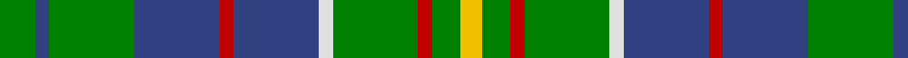

This page is one **sett** — a single exact thread-count. It belongs to the [tartan](/tartans/g5b2g12b12r2b12ln2g12r2g4y3/)
(the same proportion at any scale), whose colour order is pattern [GBGBRBWGRGY](/stripes/gbgbrbwgrgy/).

Sourced from weddslist.  It is a [11 stripe tartan](/stripes/stripes11/).

Original link http://www.weddslist.com/cgi-bin/tartans/pg.pl?source=sts

2 attestations — the source records this cloth was collapsed from (oldest owns this page)

<ul>
<li>undated — Hunter of Hunterston (weddslist, <a href="http://www.weddslist.com/cgi-bin/tartans/pg.pl?source=sts">record</a>)</li>
<li>undated — Hunter of Hunterston Clan Tartan Tartan Number: 719. Earliest known date: 1985 Authorized by Clan Society 1985. Chiefship of the Clan Hunter passed to the Cochrane-Patrick family who have changed their name to Hunter of Hunterston. Hunterston House belongs to British Nuclear Fuels. See products available Copyright © Blair Urquhart, Comrie, 2015 (house-of-tartan, <a href="http://www.house-of-tartan.scotland.net/house/TartanViewjs.asp?colr=Def&tnam=719">record</a>)</li>
</ul>

## Thread count
G/10 B4 G24 B24 R4 B24 LN4 G24 R4 G8 Y/6

## Palette
Each colour and the base-6 reference it is a variant of.

| Colour | Shade | Base |
|---|---|---|
| B | <code style="background-color:#304080;">#304080</code> `oklch(39.4% 0.109 270.2)` <small>#304080</small> | B <code style="background-color:#2A418A;">#2A418A</code> |
| G | <code style="background-color:#008000;">#008000</code> `oklch(52.0% 0.177 142.5)` <small>#008000</small> | G <code style="background-color:#006100;">#006100</code> |
| LN | <code style="background-color:#E0E0E0;">#E0E0E0</code> `oklch(90.7% 0.000 89.9)` <small>#E0E0E0</small> | W <code style="background-color:#F7F7F7;">#F7F7F7</code> |
| R | <code style="background-color:#C00000;">#C00000</code> `oklch(50.7% 0.208 29.2)` <small>#C00000</small> | R <code style="background-color:#CC0000;">#CC0000</code> |
| Y | <code style="background-color:#F0C000;">#F0C000</code> `oklch(82.7% 0.169 90.5)` <small>#F0C000</small> | Y <code style="background-color:#F2BF00;">#F2BF00</code> |

## Nearest tartans

The nearest existing variants by ΔTartan distance, with this tartan at the top so the swatches line up against it.

ΔTartan

Tartan

Sett

—

<a href="/ttd/edit/#slug=g5db2g12db12r2db12w2g12r2g4ly3~x2">Hunter of Hunterston</a> <a class="nn-out" href="/setts/s11/g5db2g12db12r2db12w2g12r2g4ly3~x2/" title="open its dictionary page">↗</a>

0.70

<a href="/ttd/edit/#slug=g5db2g14db14r2db14w2g14r2g4ly3~x2">Hunter of Hunterston (Clan)</a> <a class="nn-out" href="/setts/s11/g5db2g14db14r2db14w2g14r2g4ly3~x2/" title="open its dictionary page">↗</a>

0.74

<a href="/ttd/edit/#slug=g21db4w4db32g12ly4g8r4g6db12">Harkness</a> <a class="nn-out" href="/setts/s10/g21db4w4db32g12ly4g8r4g6db12/" title="open its dictionary page">↗</a>

0.98

<a href="/ttd/edit/#slug=y3g12k5g2k5y2r2y2k5g12w2y3~x2">Wilcox, Yu, Cruikshank Reunion</a> <a class="nn-out" href="/setts/s12/y3g12k5g2k5y2r2y2k5g12w2y3~x2/" title="open its dictionary page">↗</a>

1.07

<a href="/ttd/edit/#slug=db22g6db5t2g22r6g5r4g9w3~x2">MacConnell</a> <a class="nn-out" href="/setts/s10/db22g6db5t2g22r6g5r4g9w3~x2/" title="open its dictionary page">↗</a>

1.14

<a href="/ttd/edit/#slug=dg14w2db3lg7dg2lg7db3w2dg14t2~x4">Manx Ellan Vannin</a> <a class="nn-out" href="/setts/s10/dg14w2db3lg7dg2lg7db3w2dg14t2~x4/" title="open its dictionary page">↗</a>

1.23

<a href="/setts/s12/g15r3t15r8g15ly2db4~x2/">Rotary Corporate Tartan Tartan Number: 2334. Earliest known date: 1996 March 1996. Check colours. Sample in STA Johnston Collection. Woven by Lochcarron of Scotland. STS entry says that it was launched at the Rotary World Convention, Glasgow, 1997 and indicates that it was designed by the Tartans Society (Keith Lumsden) for Rotary International. A counter claim suggests that Geoffrey (Tailor) was the designer. He's certainly the official supplier and can be contacted on 0131 557 0256 - 17.9.04 - &quot;only polyviscose left and when that's finished, they won't be stocking any more.&quot; See products available Copyright © Blair Urquhart, Comrie, 2015</a>

1.26

<a href="/ttd/edit/#slug=g10w2g10k3db12r3db12g15w2db3k2g3ly3~x2">Greylock</a> <a class="nn-out" href="/setts/s13/g10w2g10k3db12r3db12g15w2db3k2g3ly3~x2/" title="open its dictionary page">↗</a>

1.29

<a href="/ttd/edit/#slug=g4lo1dt1lo1dt2g9r1dt6w1~x4">Casey of West Virginia (Personal)</a> <a class="nn-out" href="/setts/s9/g4lo1dt1lo1dt2g9r1dt6w1~x4/" title="open its dictionary page">↗</a>

1.30

<a href="/ttd/edit/#slug=g8k2g13r4g12db22g5ly3~x2">Taylor</a> <a class="nn-out" href="/setts/s8/g8k2g13r4g12db22g5ly3~x2/" title="open its dictionary page">↗</a>

1.31

<a href="/ttd/edit/#slug=g3r2g14k6g4w2t14r2t14w2g4k6g14m2g3~x2">Scottish Heritage USA (SHUSA) (Corp)</a> <a class="nn-out" href="/setts/s15/g3r2g14k6g4w2t14r2t14w2g4k6g14m2g3~x2/" title="open its dictionary page">↗</a>

## Neighbour map

Every grey dot is one of 14299 variants placed by the first two principal components of the ΔTartan feature space (44% of its variance). Red is this tartan; blue dots are its nearest — click one to open its page.

<svg viewBox="0 0 640 380" role="img" style="max-width:100%;height:auto;border:1px solid #e0e0e0;border-radius:4px;display:block" xmlns="http://www.w3.org/2000/svg"><image href="/nn/cloud.v1.png" width="640" height="380"/><a href="/setts/s11/g5db2g14db14r2db14w2g14r2g4ly3~x2/"><circle cx="214.5" cy="191.5" r="4" fill="#3465a4"><title>Hunter of Hunterston (Clan)</title></circle></a><a href="/setts/s10/g21db4w4db32g12ly4g8r4g6db12/"><circle cx="221.7" cy="192.5" r="4" fill="#3465a4"><title>Harkness</title></circle></a><a href="/setts/s12/y3g12k5g2k5y2r2y2k5g12w2y3~x2/"><circle cx="189.2" cy="200.3" r="4" fill="#3465a4"><title>Wilcox, Yu, Cruikshank Reunion</title></circle></a><a href="/setts/s10/db22g6db5t2g22r6g5r4g9w3~x2/"><circle cx="246.6" cy="180.2" r="4" fill="#3465a4"><title>MacConnell</title></circle></a><a href="/setts/s10/dg14w2db3lg7dg2lg7db3w2dg14t2~x4/"><circle cx="210.1" cy="184.4" r="4" fill="#3465a4"><title>Manx Ellan Vannin</title></circle></a><a href="/setts/s12/g15r3t15r8g15ly2db4~x2/"><circle cx="170.7" cy="199.8" r="4" fill="#3465a4"><title>Rotary Corporate Tartan Tartan Number: 2334. Earliest known date: 1996 March 1996. Check colours. Sample in STA Johnston Collection. Woven by Lochcarron of Scotland. STS entry says that it was launched at the Rotary World Convention, Glasgow, 1997 and indicates that it was designed by the Tartans Society (Keith Lumsden) for Rotary International. A counter claim suggests that Geoffrey (Tailor) was the designer. He's certainly the official supplier and can be contacted on 0131 557 0256 - 17.9.04 - &quot;only polyviscose left and when that's finished, they won't be stocking any more.&quot; See products available Copyright © Blair Urquhart, Comrie, 2015</title></circle></a><a href="/setts/s13/g10w2g10k3db12r3db12g15w2db3k2g3ly3~x2/"><circle cx="161.4" cy="164.2" r="4" fill="#3465a4"><title>Greylock</title></circle></a><a href="/setts/s9/g4lo1dt1lo1dt2g9r1dt6w1~x4/"><circle cx="240.5" cy="180.4" r="4" fill="#3465a4"><title>Casey of West Virginia (Personal)</title></circle></a><a href="/setts/s8/g8k2g13r4g12db22g5ly3~x2/"><circle cx="266.1" cy="199.5" r="4" fill="#3465a4"><title>Taylor</title></circle></a><a href="/setts/s15/g3r2g14k6g4w2t14r2t14w2g4k6g14m2g3~x2/"><circle cx="162.5" cy="162.9" r="4" fill="#3465a4"><title>Scottish Heritage USA (SHUSA) (Corp)</title></circle></a><circle cx="208.8" cy="206.2" r="5" fill="#c00000"/></svg>

ID: /setts/s11/g5db2g12db12r2db12w2g12r2g4ly3~x2/
