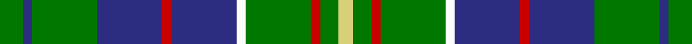

In pattern [GBGBRBWGRGY](/stripes/gbgbrbwgrgy/).

This was sourced from tartans-authority.  It is a [11 stripe tartan](/stripes/stripes11/).

Original link http://www.tartansauthority.com/tartan-ferret/display/719/

## Thread count
G/10 DB4 G28 DB28 R4 DB28 W4 G28 R4 G8 LG/6

## Palette
Each colour and the base-6 reference it is a variant of.

| Colour | Shade | Base |
|---|---|---|
| DB | <code style="background-color:#2C2C80;">#2C2C80</code> `oklch(35.0% 0.138 276.6)` <small>#2C2C80</small> | B <code style="background-color:#2A418A;">#2A418A</code> |
| G | <code style="background-color:#007800;">#007800</code> `oklch(49.6% 0.169 142.5)` <small>#007800</small> | G <code style="background-color:#006100;">#006100</code> |
| LG | <code style="background-color:#D8D078;">#D8D078</code> `oklch(84.5% 0.110 103.9)` <small>#D8D078</small> | Y <code style="background-color:#F2BF00;">#F2BF00</code> |
| R | <code style="background-color:#C80000;">#C80000</code> `oklch(52.3% 0.215 29.2)` <small>#C80000</small> | R <code style="background-color:#CC0000;">#CC0000</code> |
| W | <code style="background-color:#FCFCFC;">#FCFCFC</code> `oklch(99.1% 0.000 89.9)` <small>#FCFCFC</small> | W <code style="background-color:#F7F7F7;">#F7F7F7</code> |

## Nearest tartans

The nearest existing variants by ΔTartan distance, with this tartan at the top so the swatches line up against it.

ΔTartan

Tartan

Sett

—

<a href="/ttd/edit/#slug=g5db2g14db14r2db14w2g14r2g4ly3~x2">Hunter of Hunterston (Clan)</a> <a class="nn-out" href="/setts/s11/g5db2g14db14r2db14w2g14r2g4ly3~x2/" title="open its dictionary page">↗</a>

0.61

<a href="/ttd/edit/#slug=g21db4w4db32g12ly4g8r4g6db12">Harkness</a> <a class="nn-out" href="/setts/s10/g21db4w4db32g12ly4g8r4g6db12/" title="open its dictionary page">↗</a>

0.70

<a href="/ttd/edit/#slug=g5db2g12db12r2db12w2g12r2g4ly3~x2">Hunter of Hunterston</a> <a class="nn-out" href="/setts/s11/g5db2g12db12r2db12w2g12r2g4ly3~x2/" title="open its dictionary page">↗</a>

0.73

<a href="/ttd/edit/#slug=dg14w2db3lg7dg2lg7db3w2dg14t2~x4">Manx Ellan Vannin</a> <a class="nn-out" href="/setts/s10/dg14w2db3lg7dg2lg7db3w2dg14t2~x4/" title="open its dictionary page">↗</a>

1.01

<a href="/ttd/edit/#slug=w3db28g26r3g26db26lb12db3lb3">Seaford House</a> <a class="nn-out" href="/setts/s9/w3db28g26r3g26db26lb12db3lb3/" title="open its dictionary page">↗</a>

1.11

<a href="/ttd/edit/#slug=db22g6db5t2g22r6g5r4g9w3~x2">MacConnell</a> <a class="nn-out" href="/setts/s10/db22g6db5t2g22r6g5r4g9w3~x2/" title="open its dictionary page">↗</a>

1.16

<a href="/ttd/edit/#slug=r2db8k1g2k1g4k1g2k1db8ly2~x2">MacCainsh</a> <a class="nn-out" href="/setts/s11/r2db8k1g2k1g4k1g2k1db8ly2~x2/" title="open its dictionary page">↗</a>

1.16

<a href="/ttd/edit/#slug=g10w2g10k3db12r3db12g15w2db3k2g3ly3~x2">Greylock</a> <a class="nn-out" href="/setts/s13/g10w2g10k3db12r3db12g15w2db3k2g3ly3~x2/" title="open its dictionary page">↗</a>

1.17

<a href="/ttd/edit/#slug=db19g7db7t2g20k9g6k4g10w3~x2">O'Connell, William (Name)</a> <a class="nn-out" href="/setts/s10/db19g7db7t2g20k9g6k4g10w3~x2/" title="open its dictionary page">↗</a>

1.19

<a href="/ttd/edit/#slug=y3g12k5g2k5y2r2y2k5g12w2y3~x2">Wilcox, Yu, Cruikshank Reunion</a> <a class="nn-out" href="/setts/s12/y3g12k5g2k5y2r2y2k5g12w2y3~x2/" title="open its dictionary page">↗</a>

1.21

<a href="/ttd/edit/#slug=db8k1db8k2g6r1g6k2db8w1~x2">Dalmeny</a> <a class="nn-out" href="/setts/s10/db8k1db8k2g6r1g6k2db8w1~x2/" title="open its dictionary page">↗</a>

## Neighbour map

Every grey dot is one of 14299 variants placed by the first two principal components of the ΔTartan feature space (44% of its variance). Red is this tartan; blue dots are its nearest — click one to open its page.

<svg viewBox="0 0 640 380" role="img" style="max-width:100%;height:auto;border:1px solid #e0e0e0;border-radius:4px;display:block" xmlns="http://www.w3.org/2000/svg"><image href="/nn/cloud.v1.png" width="640" height="380"/><a href="/setts/s10/g21db4w4db32g12ly4g8r4g6db12/"><circle cx="221.7" cy="192.5" r="4" fill="#3465a4"><title>Harkness</title></circle></a><a href="/setts/s11/g5db2g12db12r2db12w2g12r2g4ly3~x2/"><circle cx="208.8" cy="206.2" r="4" fill="#3465a4"><title>Hunter of Hunterston</title></circle></a><a href="/setts/s10/dg14w2db3lg7dg2lg7db3w2dg14t2~x4/"><circle cx="210.1" cy="184.4" r="4" fill="#3465a4"><title>Manx Ellan Vannin</title></circle></a><a href="/setts/s9/w3db28g26r3g26db26lb12db3lb3/"><circle cx="196.7" cy="189.2" r="4" fill="#3465a4"><title>Seaford House</title></circle></a><a href="/setts/s10/db22g6db5t2g22r6g5r4g9w3~x2/"><circle cx="246.6" cy="180.2" r="4" fill="#3465a4"><title>MacConnell</title></circle></a><a href="/setts/s11/r2db8k1g2k1g4k1g2k1db8ly2~x2/"><circle cx="199.6" cy="171.9" r="4" fill="#3465a4"><title>MacCainsh</title></circle></a><a href="/setts/s13/g10w2g10k3db12r3db12g15w2db3k2g3ly3~x2/"><circle cx="161.4" cy="164.2" r="4" fill="#3465a4"><title>Greylock</title></circle></a><a href="/setts/s10/db19g7db7t2g20k9g6k4g10w3~x2/"><circle cx="224.6" cy="205.5" r="4" fill="#3465a4"><title>O'Connell, William (Name)</title></circle></a><a href="/setts/s12/y3g12k5g2k5y2r2y2k5g12w2y3~x2/"><circle cx="189.2" cy="200.3" r="4" fill="#3465a4"><title>Wilcox, Yu, Cruikshank Reunion</title></circle></a><a href="/setts/s10/db8k1db8k2g6r1g6k2db8w1~x2/"><circle cx="238.8" cy="201.3" r="4" fill="#3465a4"><title>Dalmeny</title></circle></a><circle cx="214.5" cy="191.5" r="5" fill="#c00000"/></svg>

ID: /setts/s11/g5db2g14db14r2db14w2g14r2g4ly3~x2/
