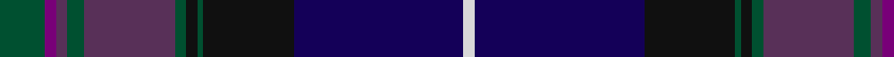

In pattern [GBBGBGKGKBW](/patterns/gbbgbgkgkbw/).

This was sourced from house-of-tartan.  It is a [11 stripes tartan](/stripes/stripes11/).

Original link http://www.house-of-tartan.scotland.net/house/TartanViewjs.asp?colr=Def&tnam=2469

## Thread count
G/16 P4 N4 G6 N32 G4 K4 G2 K32 DB60 LN/4

## Palette
Each colour and its ΔE from the base-6 reference it is a variant of.

| Colour | Shade | Base | ΔE (OKLab) |
|---|---|---|---|
| DB | <code style="background-color:#140058;">#140058</code> `#140058` | B <code style="background-color:#2A418A;">#2A418A</code> | 0.18 |
| G | <code style="background-color:#005030;">#005030</code> `#005030` | G <code style="background-color:#006100;">#006100</code> | 0.08 |
| K | <code style="background-color:#101010;">#101010</code> `#101010` | K <code style="background-color:#000000;">#000000</code> | 0.17 |
| LN | <code style="background-color:#D8D8D8;">#D8D8D8</code> `#D8D8D8` | W <code style="background-color:#F7F7F7;">#F7F7F7</code> | 0.09 |
| N | <code style="background-color:#583058;">#583058</code> `#583058` | B <code style="background-color:#2A418A;">#2A418A</code> | 0.11 |
| P | <code style="background-color:#780078;">#780078</code> `#780078` | B <code style="background-color:#2A418A;">#2A418A</code> | 0.17 |

## Nearest tartans

The nearest existing variants by ΔTartan distance.

1. [Spirit of Alva (Fashion)](/setts/s10/b6ba10bb4ba11g20k4g8k21bc47b2~b2c2c80-ba780078-bb440044-bc202060-g285800-k101010/) — ΔT 0.87
1. [McGuirk (2013)](/setts/s12/g4r1g1r3g16k12r1b27w2b3w1y2x2~b202060-g003820-k101010-ra00000-wa8ace8-ye8c000/) — ΔT 1.11
1. [Western Isles (Fashion)](/setts/s12/g9r2b2g3b18g2k2g1k19ra1ba33w2x2~b780078-ba202060-g005010-k101010-ra00048-rac80000-we0e0e0/) — ΔT 1.17
1. [Highland Pride of Scotland (Fashion)](/setts/s11/b9g2ba2bb2g18ba2k2g1k19b33w2x2~b202060-ba780078-bb440044-g285800-k101010-we0e0e0/) — ΔT 1.22
1. [Century 21 (Fashion)](/setts/s11/b2k2b21ba1b1ba2b1ba8g23y2r2x2~b2c2c80-ba3c4484-g003820-k101010-rc80000-yc4bc68/) — ΔT 1.26
1. [Heartlands (Fashion)](/setts/s11/b4ba1bb20b2bb2b18g2b2g22r2bc4x2~b202060-ba2474e8-bb1c1c1c-bc780078-g285800-ra00048/) — ΔT 1.27
1. [Bowhunter (Fashion)](/setts/s12/b3g10b2ba25ga3r4ga3gb10ba3b2r3b1x2~b780078-ba2c2c80-g5c6428-ga604000-gb006818-r888888/) — ΔT 1.30
1. [Scottish Pride (Fashion)](/setts/s11/g6b2ba2g2ba15g3k2g1k15bb43w2x2~b780078-ba440044-bb2c2c80-g006818-k101010-we0e0e0/) — ΔT 1.35
1. [Strathtummel](/setts/s14/b37k2b2k3ka13k10w2k10g1k2g2k2g9k13x2~b000680-g434f04-k23001f-ka101010-wffffff/) — ΔT 1.35
1. [Cowal (Corporate)](/setts/s10/b6ba22k12bb10g3k1g3bb10b2w2x2~b1c0070-ba003c64-bb780078-g006818-k101010-we0e0e0/) — ΔT 1.38

## Neighbour map

Every grey dot is one of 15726 variants placed by the first two principal components of the ΔTartan feature space (44% of its variance). Red is this tartan; blue dots are its nearest — click one to open its page.

<svg viewBox="0 0 640 380" role="img" style="max-width:100%;height:auto;border:1px solid #e0e0e0;border-radius:4px;display:block" xmlns="http://www.w3.org/2000/svg"><image href="/nn/cloud.v1.png" width="640" height="380"/><a href="/setts/s10/b6ba10bb4ba11g20k4g8k21bc47b2~b2c2c80-ba780078-bb440044-bc202060-g285800-k101010/"><circle cx="227.7" cy="144.8" r="4" fill="#3465a4"><title>Spirit of Alva (Fashion)</title></circle></a><a href="/setts/s12/g4r1g1r3g16k12r1b27w2b3w1y2x2~b202060-g003820-k101010-ra00000-wa8ace8-ye8c000/"><circle cx="254.3" cy="103.5" r="4" fill="#3465a4"><title>McGuirk (2013)</title></circle></a><a href="/setts/s12/g9r2b2g3b18g2k2g1k19ra1ba33w2x2~b780078-ba202060-g005010-k101010-ra00048-rac80000-we0e0e0/"><circle cx="214.7" cy="78.2" r="4" fill="#3465a4"><title>Western Isles (Fashion)</title></circle></a><a href="/setts/s11/b9g2ba2bb2g18ba2k2g1k19b33w2x2~b202060-ba780078-bb440044-g285800-k101010-we0e0e0/"><circle cx="294.2" cy="110.8" r="4" fill="#3465a4"><title>Highland Pride of Scotland (Fashion)</title></circle></a><a href="/setts/s11/b2k2b21ba1b1ba2b1ba8g23y2r2x2~b2c2c80-ba3c4484-g003820-k101010-rc80000-yc4bc68/"><circle cx="283.3" cy="125.6" r="4" fill="#3465a4"><title>Century 21 (Fashion)</title></circle></a><a href="/setts/s11/b4ba1bb20b2bb2b18g2b2g22r2bc4x2~b202060-ba2474e8-bb1c1c1c-bc780078-g285800-ra00048/"><circle cx="244.0" cy="137.9" r="4" fill="#3465a4"><title>Heartlands (Fashion)</title></circle></a><a href="/setts/s12/b3g10b2ba25ga3r4ga3gb10ba3b2r3b1x2~b780078-ba2c2c80-g5c6428-ga604000-gb006818-r888888/"><circle cx="237.3" cy="113.7" r="4" fill="#3465a4"><title>Bowhunter (Fashion)</title></circle></a><a href="/setts/s11/g6b2ba2g2ba15g3k2g1k15bb43w2x2~b780078-ba440044-bb2c2c80-g006818-k101010-we0e0e0/"><circle cx="311.2" cy="86.9" r="4" fill="#3465a4"><title>Scottish Pride (Fashion)</title></circle></a><a href="/setts/s14/b37k2b2k3ka13k10w2k10g1k2g2k2g9k13x2~b000680-g434f04-k23001f-ka101010-wffffff/"><circle cx="286.9" cy="113.4" r="4" fill="#3465a4"><title>Strathtummel</title></circle></a><a href="/setts/s10/b6ba22k12bb10g3k1g3bb10b2w2x2~b1c0070-ba003c64-bb780078-g006818-k101010-we0e0e0/"><circle cx="170.9" cy="137.6" r="4" fill="#3465a4"><title>Cowal (Corporate)</title></circle></a><circle cx="241.1" cy="116.6" r="5" fill="#c00000"/></svg>

ID: /setts/s11/g8b2ba2g3ba16g2k2g1k16bb30w2x2~b780078-ba583058-bb140058-g005030-k101010-wd8d8d8/
