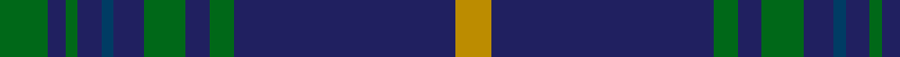

**Bands:** [YBGBGBBBGBG](/stripes/ybgbgbbbgbg/) · **Stripes:** [LO DB G DB G DB DT DB G DB G](/stripes/stripes11/) LO DB G DB G DB DT DB G DB G

This was sourced from tartans-authority.  It is a [11 band tartan](/bands/bands11/).

Original link http://www.tartansauthority.com/tartan-ferret/display/5757/

## Thread count
G/8 DBa3 G2 DBa4 DB2 DBa5 G7 DBa4 G4 DBa37 DYa/6

## Palette
Each colour and its ΔE from the base-6 reference it is a variant of.

| Colour | Shade | Base | ΔE (OKLab) |
|---|---|---|---|
| DB | <code style="background-color:#003C64;">#003C64</code> `#003C64` | B <code style="background-color:#2A418A;">#2A418A</code> | 0.08 |
| DBa | <code style="background-color:#202060;">#202060</code> `#202060` | B <code style="background-color:#2A418A;">#2A418A</code> | 0.11 |
| DY | <code style="background-color:#BC8C00;">#BC8C00</code> `#BC8C00` | Y <code style="background-color:#F2BF00;">#F2BF00</code> | 0.16 |
| DYa | <code style="background-color:#BC8C00;">#BC8C00</code> `#BC8C00` | Y <code style="background-color:#F2BF00;">#F2BF00</code> | 0.16 |
| G | <code style="background-color:#006818;">#006818</code> `#006818` | G <code style="background-color:#006100;">#006100</code> | 0.02 |

## Nearest tartans

The nearest existing variants by ΔTartan distance.

1. [Jenkins Welsh Name Tartan Tartan Number: 5757. Earliest known date: 2002 The tartan for this Welsh surname and its variations, Jenks, Jenkin, Jankin, Seincyn, is actually woven in Wales at the Cambrian Woollen Mill, weaving on the same site since 1830. This tartan differs from many traditional patterns in that the warp and weft differ, giving the finished worsted wool cloth more of a predominant stripe, vertically noticeable in the finished Kilt, or Cilt in Wales. See products available Copyright © Blair Urquhart, Comrie, 2015](/setts/s11/g8db3g2db4lo2db5g7db4g4db37r6/) — ΔT 0.33
1. [MacArthur Fox Green (Personal)](/setts/s10/r4dt4k2dt31k10ly3dt5k11dt6k3~x2/) — ΔT 1.06
1. [Kinross](/setts/s14/dg20db2g6db2dg4db27lo2db8~x2/) — ΔT 1.19
1. [Wheadon](/setts/s10/db15g7ly3g7db40g7ly3g7db15r5~x2/) — ΔT 1.21
1. [Orlando, City of (District)](/setts/s9/db12ly1g16db1g1db14g3db14r2~x4/) — ΔT 1.25
1. [Roxburgh](/setts/s8/db16w1db1w1db8dg16r1db2~x2/) — ΔT 1.27
1. [Oliver, hunting](/setts/s9/db40g3db2g12k2g2ly2g2k3~x2/) — ΔT 1.30
1. [Tern House](/setts/s7/g23db3k8db4g4db56ly8/) — ΔT 1.32
1. [Edinburgh, The University of](/setts/s7/k8m26k22dt110w4k5w4/) — ΔT 1.35
1. [Chateau](/setts/s10/n36k3dy3t1dy3k3n4dy6k1t2~x4/) — ΔT 1.35

## Neighbour map

Every grey dot is one of 14299 variants placed by the first two principal components of the ΔTartan feature space (44% of its variance). Red is this tartan; blue dots are its nearest — click one to open its page.

<svg viewBox="0 0 640 380" role="img" style="max-width:100%;height:auto;border:1px solid #e0e0e0;border-radius:4px;display:block" xmlns="http://www.w3.org/2000/svg"><image href="/nn/cloud.v1.png" width="640" height="380"/><a href="/setts/s11/g8db3g2db4lo2db5g7db4g4db37r6/"><circle cx="423.8" cy="159.8" r="4" fill="#3465a4"><title>Jenkins Welsh Name Tartan Tartan Number: 5757. Earliest known date: 2002 The tartan for this Welsh surname and its variations, Jenks, Jenkin, Jankin, Seincyn, is actually woven in Wales at the Cambrian Woollen Mill, weaving on the same site since 1830. This tartan differs from many traditional patterns in that the warp and weft differ, giving the finished worsted wool cloth more of a predominant stripe, vertically noticeable in the finished Kilt, or Cilt in Wales. See products available Copyright © Blair Urquhart, Comrie, 2015</title></circle></a><a href="/setts/s10/r4dt4k2dt31k10ly3dt5k11dt6k3~x2/"><circle cx="375.9" cy="189.9" r="4" fill="#3465a4"><title>MacArthur Fox Green (Personal)</title></circle></a><a href="/setts/s14/dg20db2g6db2dg4db27lo2db8~x2/"><circle cx="358.1" cy="167.0" r="4" fill="#3465a4"><title>Kinross</title></circle></a><a href="/setts/s10/db15g7ly3g7db40g7ly3g7db15r5~x2/"><circle cx="374.6" cy="186.0" r="4" fill="#3465a4"><title>Wheadon</title></circle></a><a href="/setts/s9/db12ly1g16db1g1db14g3db14r2~x4/"><circle cx="405.0" cy="202.9" r="4" fill="#3465a4"><title>Orlando, City of (District)</title></circle></a><a href="/setts/s8/db16w1db1w1db8dg16r1db2~x2/"><circle cx="399.0" cy="197.5" r="4" fill="#3465a4"><title>Roxburgh</title></circle></a><a href="/setts/s9/db40g3db2g12k2g2ly2g2k3~x2/"><circle cx="398.0" cy="139.4" r="4" fill="#3465a4"><title>Oliver, hunting</title></circle></a><a href="/setts/s7/g23db3k8db4g4db56ly8/"><circle cx="371.2" cy="174.9" r="4" fill="#3465a4"><title>Tern House</title></circle></a><a href="/setts/s7/k8m26k22dt110w4k5w4/"><circle cx="427.5" cy="159.7" r="4" fill="#3465a4"><title>Edinburgh, The University of</title></circle></a><a href="/setts/s10/n36k3dy3t1dy3k3n4dy6k1t2~x4/"><circle cx="451.0" cy="123.5" r="4" fill="#3465a4"><title>Chateau</title></circle></a><circle cx="423.6" cy="162.7" r="5" fill="#c00000"/></svg>

ID: /setts/s11/g8db3g2db4dt2db5g7db4g4db37lo6/
