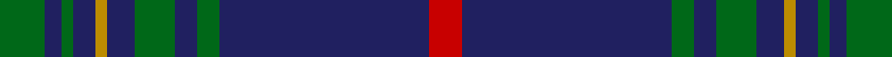

In pattern [GBGBYBGBGBR](/stripes/gbgbybgbgbr/).

This was sourced from house-of-tartan.  It is a [11 stripe tartan](/stripes/stripes11/).

Original link http://www.house-of-tartan.scotland.net/house/TartanViewjs.asp?colr=Def&tnam=5757

## Thread count
G/8 DB3 G2 DB4 DY2 DB5 G7 DB4 G4 DB37 R/6

## Palette
Each colour and the base-6 reference it is a variant of.

| Colour | Shade | Base |
|---|---|---|
| DB | <code style="background-color:#202060;">#202060</code> `oklch(28.9% 0.111 276.9)` <small>#202060</small> | B <code style="background-color:#2A418A;">#2A418A</code> |
| DBa | <code style="background-color:#003C64;">#003C64</code> `oklch(34.5% 0.089 246.0)` <small>#003C64</small> | B <code style="background-color:#2A418A;">#2A418A</code> |
| DY | <code style="background-color:#BC8C00;">#BC8C00</code> `oklch(66.8% 0.137 84.1)` <small>#BC8C00</small> | Y <code style="background-color:#F2BF00;">#F2BF00</code> |
| G | <code style="background-color:#006818;">#006818</code> `oklch(45.0% 0.142 145.0)` <small>#006818</small> | G <code style="background-color:#006100;">#006100</code> |
| R | <code style="background-color:#C80000;">#C80000</code> `oklch(52.3% 0.215 29.2)` <small>#C80000</small> | R <code style="background-color:#CC0000;">#CC0000</code> |

## Nearest tartans

The nearest existing variants by ΔTartan distance.

1. [Jenkins (Welsh Name)](/setts/s11/g8db3g2db4dt2db5g7db4g4db37lo6/) — ΔT 0.33
1. [MacArthur Fox Green (Personal)](/setts/s10/r4dt4k2dt31k10ly3dt5k11dt6k3~x2/) — ΔT 1.08
1. [Wheadon](/setts/s10/db15g7ly3g7db40g7ly3g7db15r5~x2/) — ΔT 1.19
1. [Kinross](/setts/s14/dg20db2g6db2dg4db27lo2db8~x2/) — ΔT 1.21
1. [City Building (Glasgow) LLP](/setts/s10/k3n6k8lr2k8n3k5n36k2n3~x2/) — ΔT 1.25
1. [Orlando, City of (District)](/setts/s9/db12ly1g16db1g1db14g3db14r2~x4/) — ΔT 1.32
1. [Tern House](/setts/s7/g23db3k8db4g4db56ly8/) — ΔT 1.35
1. [Edinburgh, The University of](/setts/s7/k8m26k22dt110w4k5w4/) — ΔT 1.36
1. [Benyon of Wales (Name)](/setts/s15/db22k1dg3db6k1db6dg3db4dg7db11ly1db11dg7ly2k4~x2/) — ΔT 1.37
1. [Lochnagar Dress (Fashion)](/setts/s10/y5k1y33dp1y9k9dp5k1r2k4~x2/) — ΔT 1.38

## Neighbour map

Every grey dot is one of 14299 variants placed by the first two principal components of the ΔTartan feature space (44% of its variance). Red is this tartan; blue dots are its nearest — click one to open its page.

<svg viewBox="0 0 640 380" role="img" style="max-width:100%;height:auto;border:1px solid #e0e0e0;border-radius:4px;display:block" xmlns="http://www.w3.org/2000/svg"><image href="/nn/cloud.v1.png" width="640" height="380"/><a href="/setts/s11/g8db3g2db4dt2db5g7db4g4db37lo6/"><circle cx="423.6" cy="162.7" r="4" fill="#3465a4"><title>Jenkins (Welsh Name)</title></circle></a><a href="/setts/s10/r4dt4k2dt31k10ly3dt5k11dt6k3~x2/"><circle cx="375.9" cy="189.9" r="4" fill="#3465a4"><title>MacArthur Fox Green (Personal)</title></circle></a><a href="/setts/s10/db15g7ly3g7db40g7ly3g7db15r5~x2/"><circle cx="374.6" cy="186.0" r="4" fill="#3465a4"><title>Wheadon</title></circle></a><a href="/setts/s14/dg20db2g6db2dg4db27lo2db8~x2/"><circle cx="358.1" cy="167.0" r="4" fill="#3465a4"><title>Kinross</title></circle></a><a href="/setts/s10/k3n6k8lr2k8n3k5n36k2n3~x2/"><circle cx="452.9" cy="179.3" r="4" fill="#3465a4"><title>City Building (Glasgow) LLP</title></circle></a><a href="/setts/s9/db12ly1g16db1g1db14g3db14r2~x4/"><circle cx="405.0" cy="202.9" r="4" fill="#3465a4"><title>Orlando, City of (District)</title></circle></a><a href="/setts/s7/g23db3k8db4g4db56ly8/"><circle cx="371.2" cy="174.9" r="4" fill="#3465a4"><title>Tern House</title></circle></a><a href="/setts/s7/k8m26k22dt110w4k5w4/"><circle cx="427.5" cy="159.7" r="4" fill="#3465a4"><title>Edinburgh, The University of</title></circle></a><a href="/setts/s15/db22k1dg3db6k1db6dg3db4dg7db11ly1db11dg7ly2k4~x2/"><circle cx="428.3" cy="175.8" r="4" fill="#3465a4"><title>Benyon of Wales (Name)</title></circle></a><a href="/setts/s10/y5k1y33dp1y9k9dp5k1r2k4~x2/"><circle cx="468.2" cy="137.2" r="4" fill="#3465a4"><title>Lochnagar Dress (Fashion)</title></circle></a><circle cx="423.8" cy="159.8" r="5" fill="#c00000"/></svg>

ID: /setts/s11/g8db3g2db4lo2db5g7db4g4db37r6/
