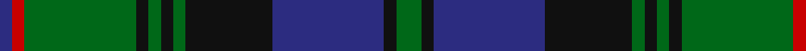

In pattern [BRGKGKGKBKG](/patterns/brgkgkgkbkg/).

This was sourced from tartans-authority.  It is a [11 stripes tartan](/stripes/stripes11/).

Original link http://www.tartansauthority.com/tartan-ferret/display/765/

## Thread count
DB/4 R4 G36 K4 G4 K4 G4 K28 DB36 K4 G/8

## Palette
Each colour and its ΔE from the base-6 reference it is a variant of.

| Colour | Shade | Base | ΔE (OKLab) |
|---|---|---|---|
| DB | <code style="background-color:#2C2C80;">#2C2C80</code> `#2C2C80` | B <code style="background-color:#2C4084;">#2C4084</code> | 0.05 |
| G | <code style="background-color:#006818;">#006818</code> `#006818` | G <code style="background-color:#006400;">#006400</code> | 0.02 |
| K | <code style="background-color:#101010;">#101010</code> `#101010` | K <code style="background-color:#000000;">#000000</code> | 0.17 |
| R | <code style="background-color:#C80000;">#C80000</code> `#C80000` | R <code style="background-color:#C80000;">#C80000</code> | 0.00 |

## Nearest tartans

The nearest existing variants by ΔTartan distance.

1. [Campbell of Breadalbane #2](/setts/s13/b52k8b8k8b8k54y10g94y10k54b50k8b8-b2c4084-g005020-k101010-ye8c000/) — ΔT 0.77
1. [Shaw](/setts/s10/g48k4b6k4b16r4b16k4b6k4-b2c2c80-g006818-k101010-rc80000/) — ΔT 0.84
1. [Aitchison (Personal)](/setts/s9/b4g50k22ba4k22ba36k4ba6k4-b780078-ba003c64-g288028-k101010/) — ΔT 0.86
1. [Campbell of Breadalbane (Military)](/setts/s13/b52k8b8k8b8k54y10g94y10k54b50k8b8-b202060-g006818-k101010-ye8c000/) — ΔT 0.86
1. [Urquhart Clan Tartan Tartan Number: 774. Earliest known date: 1831 Recorded in the scales given by James Logan in his book 'The Scottish Gael' (1831) and also given by Thomas Smibert in his 'Clans of the Highlands of Scotland' (1850). It has a foundation similar to the Black Watch but with pairs of black lines appearing in the green bands, not the blue. See products available Copyright © Blair Urquhart, Comrie, 2015](/setts/s13/g16k2g2k2g2k16b16r2b16k16g16k2g2-b2c2c80-g006818-k101010-rc80000/) — ΔT 0.86
1. [Gordon #2](/setts/s10/b56k6b6k6b6k44g44y4g5y8-b2c4084-g005020-k101010-ye8c000/) — ΔT 0.87
1. [Dewar's Highlander](/setts/s13/g56k6g7k6g7k35b45y6b45k35g45k6g6-b202060-g006818-k101010-ybc8c00/) — ΔT 0.88
1. [Urquhart (Logan)](/setts/s13/g16k2g2k2g2k16b16r2b16k16g16k2g2-b2c2c80-g006818-k101010-r880000/) — ΔT 0.88
1. [Scottish Tourist Board (1981) (Corp)](/setts/s11/b60k4b4k4b4k64g30r4g8r8g60-b2c2c80-g006818-k101010-rc80000/) — ΔT 0.89
1. [MacHarg, Iain](/setts/s9/g40k4g4k4g4k16b48ba6b6-b2c2c80-ba780078-g006818-k101010/) — ΔT 0.90

## Neighbour map

Every grey dot is one of 15726 variants placed by the first two principal components of the ΔTartan feature space (44% of its variance). Red is this tartan; blue dots are its nearest — click one to open its page.

<svg viewBox="0 0 640 380" role="img" style="max-width:100%;height:auto;border:1px solid #e0e0e0;border-radius:4px;display:block" xmlns="http://www.w3.org/2000/svg"><image href="/nn/cloud.v1.png" width="640" height="380"/><a href="/setts/s13/b52k8b8k8b8k54y10g94y10k54b50k8b8-b2c4084-g005020-k101010-ye8c000/"><circle cx="209.6" cy="178.2" r="4" fill="#3465a4"><title>Campbell of Breadalbane #2</title></circle></a><a href="/setts/s10/g48k4b6k4b16r4b16k4b6k4-b2c2c80-g006818-k101010-rc80000/"><circle cx="279.9" cy="179.2" r="4" fill="#3465a4"><title>Shaw</title></circle></a><a href="/setts/s9/b4g50k22ba4k22ba36k4ba6k4-b780078-ba003c64-g288028-k101010/"><circle cx="216.5" cy="193.8" r="4" fill="#3465a4"><title>Aitchison (Personal)</title></circle></a><a href="/setts/s13/b52k8b8k8b8k54y10g94y10k54b50k8b8-b202060-g006818-k101010-ye8c000/"><circle cx="202.3" cy="175.4" r="4" fill="#3465a4"><title>Campbell of Breadalbane (Military)</title></circle></a><a href="/setts/s13/g16k2g2k2g2k16b16r2b16k16g16k2g2-b2c2c80-g006818-k101010-rc80000/"><circle cx="196.9" cy="207.3" r="4" fill="#3465a4"><title>Urquhart Clan Tartan Tartan Number: 774. Earliest known date: 1831 Recorded in the scales given by James Logan in his book 'The Scottish Gael' (1831) and also given by Thomas Smibert in his 'Clans of the Highlands of Scotland' (1850). It has a foundation similar to the Black Watch but with pairs of black lines appearing in the green bands, not the blue. See products available Copyright © Blair Urquhart, Comrie, 2015</title></circle></a><a href="/setts/s10/b56k6b6k6b6k44g44y4g5y8-b2c4084-g005020-k101010-ye8c000/"><circle cx="225.1" cy="173.5" r="4" fill="#3465a4"><title>Gordon #2</title></circle></a><a href="/setts/s13/g56k6g7k6g7k35b45y6b45k35g45k6g6-b202060-g006818-k101010-ybc8c00/"><circle cx="222.2" cy="205.0" r="4" fill="#3465a4"><title>Dewar's Highlander</title></circle></a><a href="/setts/s13/g16k2g2k2g2k16b16r2b16k16g16k2g2-b2c2c80-g006818-k101010-r880000/"><circle cx="199.9" cy="208.9" r="4" fill="#3465a4"><title>Urquhart (Logan)</title></circle></a><a href="/setts/s11/b60k4b4k4b4k64g30r4g8r8g60-b2c2c80-g006818-k101010-rc80000/"><circle cx="248.8" cy="166.0" r="4" fill="#3465a4"><title>Scottish Tourist Board (1981) (Corp)</title></circle></a><a href="/setts/s9/g40k4g4k4g4k16b48ba6b6-b2c2c80-ba780078-g006818-k101010/"><circle cx="268.5" cy="189.6" r="4" fill="#3465a4"><title>MacHarg, Iain</title></circle></a><circle cx="228.6" cy="190.9" r="5" fill="#c00000"/></svg>

ID: /setts/s11/g8k4b36k28g4k4g4k4g36r4b4-b2c2c80-g006818-k101010-rc80000/
