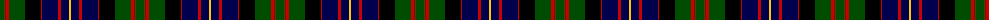

In pattern [GRGRGKRBRBY](/patterns/grgrgkrbrby/).

This was sourced from weddslist.  It is a [11 stripes tartan](/stripes/stripes11/).

Original link http://www.weddslist.com/cgi-bin/tartans/pg.pl?source=rb

## Thread count
G/8 R1 G1 R3 G16 K16 R1 DB16 R3 DB8 Y/2

## Palette
Each colour and its ΔE from the base-6 reference it is a variant of.

| Colour | Shade | Base | ΔE (OKLab) |
|---|---|---|---|
| DB | <code style="background-color:#00004C;">#00004C</code> `#00004C` | B <code style="background-color:#2A418A;">#2A418A</code> | 0.21 |
| G | <code style="background-color:#004C00;">#004C00</code> `#004C00` | G <code style="background-color:#006100;">#006100</code> | 0.07 |
| K | <code style="background-color:#000000;">#000000</code> `#000000` | K <code style="background-color:#000000;">#000000</code> | 0.00 |
| R | <code style="background-color:#C80000;">#C80000</code> `#C80000` | R <code style="background-color:#CC0000;">#CC0000</code> | 0.01 |
| Y | <code style="background-color:#FFC800;">#FFC800</code> `#FFC800` | Y <code style="background-color:#F2BF00;">#F2BF00</code> | 0.03 |

## Nearest tartans

The nearest existing variants by ΔTartan distance.

1. [Cameron of Erracht](/setts/s11/g16r2g2r6g32k32r2b32r6b16y4-b000052-g11450d-k000000-raa0000-yaaaa00/) — ΔT 0.49
1. [Cameron of Erracht](/setts/s11/g8r1g1r3g16k16r1b16r3b8y2-b000052-g11450d-k000000-raa0000-yaaaa00/) — ΔT 0.49
1. [Clark of Ulva (Clan)](/setts/s11/w6g6k8g28k8g6k28b36y2b8y4-b000048-g285800-k000000-w00fcfc-yd87c00/) — ΔT 0.59
1. [Clanranald, MacDonald of (Clan)](/setts/s13/b32r4b4r14b62r4k64w6g62r14g4r4g32-b000048-g045c38-k000000-rc80000-wc8c8c8/) — ΔT 0.60
1. [Logan and MacLennan](/setts/s11/r12b6r4b4r4b32k24g32r2k2y4-b000052-g11450d-k000000-raa0000-yaaaa00/) — ΔT 0.61
1. [MacDonell of Glengarry](/setts/s11/b16r8b24r2k24g24r6g4r2g8w2-b000064-g004c00-k000000-rc80000-wd0d0d0/) — ΔT 0.64
1. [MacDonald of Clanranald](/setts/s13/b16r2b4r6b24r2k24w2g24r6g4r2g16-b000064-g004c00-k000000-rc80000-wd0d0d0/) — ΔT 0.65
1. [Clerke of Ulva](/setts/s13/w6g6k8g28k8g6k28b36y2b8y4b8y2-b000048-g285800-k000000-w00fcfc-yd87c00/) — ΔT 0.68
1. [MacDonell of Glengarry D](/setts/s13/b8r1b2r3b12r1k12g12r3g2r1g4w1-b000064-g004c00-k000000-rc80000-wd0d0d0/) — ΔT 0.73
1. [Clerke of Ulva](/setts/s11/b6g6k8g28k8g6k28ba36r2ba8r4-b5480b0-ba304080-g008000-k000000-r900030/) — ΔT 0.73

## Neighbour map

Every grey dot is one of 15726 variants placed by the first two principal components of the ΔTartan feature space (44% of its variance). Red is this tartan; blue dots are its nearest — click one to open its page.

<svg viewBox="0 0 640 380" role="img" style="max-width:100%;height:auto;border:1px solid #e0e0e0;border-radius:4px;display:block" xmlns="http://www.w3.org/2000/svg"><image href="/nn/cloud.v1.png" width="640" height="380"/><a href="/setts/s11/g16r2g2r6g32k32r2b32r6b16y4-b000052-g11450d-k000000-raa0000-yaaaa00/"><circle cx="167.2" cy="157.2" r="4" fill="#3465a4"><title>Cameron of Erracht</title></circle></a><a href="/setts/s11/g8r1g1r3g16k16r1b16r3b8y2-b000052-g11450d-k000000-raa0000-yaaaa00/"><circle cx="167.2" cy="157.2" r="4" fill="#3465a4"><title>Cameron of Erracht</title></circle></a><a href="/setts/s11/w6g6k8g28k8g6k28b36y2b8y4-b000048-g285800-k000000-w00fcfc-yd87c00/"><circle cx="144.8" cy="146.8" r="4" fill="#3465a4"><title>Clark of Ulva (Clan)</title></circle></a><a href="/setts/s13/b32r4b4r14b62r4k64w6g62r14g4r4g32-b000048-g045c38-k000000-rc80000-wc8c8c8/"><circle cx="150.4" cy="134.0" r="4" fill="#3465a4"><title>Clanranald, MacDonald of (Clan)</title></circle></a><a href="/setts/s11/r12b6r4b4r4b32k24g32r2k2y4-b000052-g11450d-k000000-raa0000-yaaaa00/"><circle cx="161.7" cy="143.4" r="4" fill="#3465a4"><title>Logan and MacLennan</title></circle></a><a href="/setts/s11/b16r8b24r2k24g24r6g4r2g8w2-b000064-g004c00-k000000-rc80000-wd0d0d0/"><circle cx="134.1" cy="165.3" r="4" fill="#3465a4"><title>MacDonell of Glengarry</title></circle></a><a href="/setts/s13/b16r2b4r6b24r2k24w2g24r6g4r2g16-b000064-g004c00-k000000-rc80000-wd0d0d0/"><circle cx="140.6" cy="155.2" r="4" fill="#3465a4"><title>MacDonald of Clanranald</title></circle></a><a href="/setts/s13/w6g6k8g28k8g6k28b36y2b8y4b8y2-b000048-g285800-k000000-w00fcfc-yd87c00/"><circle cx="155.3" cy="135.7" r="4" fill="#3465a4"><title>Clerke of Ulva</title></circle></a><a href="/setts/s13/b8r1b2r3b12r1k12g12r3g2r1g4w1-b000064-g004c00-k000000-rc80000-wd0d0d0/"><circle cx="147.7" cy="151.0" r="4" fill="#3465a4"><title>MacDonell of Glengarry D</title></circle></a><a href="/setts/s11/b6g6k8g28k8g6k28ba36r2ba8r4-b5480b0-ba304080-g008000-k000000-r900030/"><circle cx="142.3" cy="142.6" r="4" fill="#3465a4"><title>Clerke of Ulva</title></circle></a><circle cx="153.9" cy="150.9" r="5" fill="#c00000"/></svg>

ID: /setts/s11/g8r1g1r3g16k16r1b16r3b8y2-b00004c-g004c00-k000000-rc80000-yffc800/
