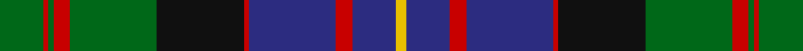

This page is one **sett** — a single exact thread-count. It belongs to the [tartan](/tartans/g8r1g1r3g16k16r1db16r3db8ly2/)
(the same proportion at any scale), whose colour order is pattern [GRGRGKRBRBY](/stripes/grgrgkrbrby/).

Sourced from tartans-authority.  It is a [11 stripe tartan](/stripes/stripes11/).

Original link http://www.tartansauthority.com/tartan-ferret/display/993/

## Also known as

This cloth is also recorded under:

- Cameron of Erracht Regimental

4 attestations — the source records this cloth was collapsed from (oldest owns this page)

<ul>
<li>1793 — Cameron of Erracht (Clan) (tartans-authority, <a href="http://www.tartansauthority.com/tartan-ferret/display/993/">record</a>)</li>
<li>01/01/1831 — Cameron of Erracht (register-of-tartans, <a href="https://www.tartanregister.gov.uk/tartanDetails.aspx?ref=495">record</a>)</li>
<li>undated — Cameron of Erracht (weddslist, <a href="http://www.weddslist.com/cgi-bin/tartans/pg.pl?source=sts">record</a>)</li>
<li>undated — Cameron of Erracht Regimental Tartan Tartan Number: 993. Earliest known date: 1793 Designed for the Queen's Own Cameron Highlanders raised by Alan Cameron of Erracht in 1793. It was never adopted by the clan. A sample of this tartan exists in the Cockburn Collection (1810-20) in the Mitchell Library in Glasgow. See products available Copyright © Blair Urquhart, Comrie, 2015 (house-of-tartan, <a href="http://www.house-of-tartan.scotland.net/house/TartanViewjs.asp?colr=Def&tnam=993">record</a>)</li>
</ul>

## Register references

External register numbers recorded for this tartan.

- Scottish Register of Tartans: [495](https://www.tartanregister.gov.uk/tartanDetails.aspx?ref=495)
- Scottish Tartans Authority (ITI): 993
- Scottish Tartans World Register: 993

## Thread count
G/16 R2 G2 R6 G32 K32 R2 DB32 R6 DB16 Y/4

## Palette

Palette: <strong>Tartan Register</strong>
<table><thead><tr><th>Colour</th><th>Threads</th><th>Shade</th><th>Base</th><th>OKLCh</th></tr></thead><tbody><tr><td>G/</td><td style="text-align:right;font-variant-numeric:tabular-nums">16</td><td><code style="background-color:#006818;">#006818</code> <small style="color:#888">#006818</small></td><td>G <code style="background-color:#006100;">#006100</code></td><td><small style="color:#888">oklch(45.0% 0.142 145.0)</small></td></tr><tr><td>R</td><td style="text-align:right;font-variant-numeric:tabular-nums">2</td><td><code style="background-color:#C80000;">#C80000</code> <small style="color:#888">#C80000</small></td><td>R <code style="background-color:#CC0000;">#CC0000</code></td><td><small style="color:#888">oklch(52.3% 0.215 29.2)</small></td></tr><tr><td>G</td><td style="text-align:right;font-variant-numeric:tabular-nums">2</td><td><code style="background-color:#006818;">#006818</code> <small style="color:#888">#006818</small></td><td>G <code style="background-color:#006100;">#006100</code></td><td><small style="color:#888">oklch(45.0% 0.142 145.0)</small></td></tr><tr><td>R</td><td style="text-align:right;font-variant-numeric:tabular-nums">6</td><td><code style="background-color:#C80000;">#C80000</code> <small style="color:#888">#C80000</small></td><td>R <code style="background-color:#CC0000;">#CC0000</code></td><td><small style="color:#888">oklch(52.3% 0.215 29.2)</small></td></tr><tr><td>G</td><td style="text-align:right;font-variant-numeric:tabular-nums">32</td><td><code style="background-color:#006818;">#006818</code> <small style="color:#888">#006818</small></td><td>G <code style="background-color:#006100;">#006100</code></td><td><small style="color:#888">oklch(45.0% 0.142 145.0)</small></td></tr><tr><td>K</td><td style="text-align:right;font-variant-numeric:tabular-nums">32</td><td><code style="background-color:#101010;">#101010</code> <small style="color:#888">#101010</small></td><td>K <code style="background-color:#000000;">#000000</code></td><td><small style="color:#888">oklch(17.3% 0.000 89.9)</small></td></tr><tr><td>R</td><td style="text-align:right;font-variant-numeric:tabular-nums">2</td><td><code style="background-color:#C80000;">#C80000</code> <small style="color:#888">#C80000</small></td><td>R <code style="background-color:#CC0000;">#CC0000</code></td><td><small style="color:#888">oklch(52.3% 0.215 29.2)</small></td></tr><tr><td>DB</td><td style="text-align:right;font-variant-numeric:tabular-nums">32</td><td><code style="background-color:#2C2C80;">#2C2C80</code> <small style="color:#888">#2C2C80</small></td><td>B <code style="background-color:#2A418A;">#2A418A</code></td><td><small style="color:#888">oklch(35.0% 0.138 276.6)</small></td></tr><tr><td>R</td><td style="text-align:right;font-variant-numeric:tabular-nums">6</td><td><code style="background-color:#C80000;">#C80000</code> <small style="color:#888">#C80000</small></td><td>R <code style="background-color:#CC0000;">#CC0000</code></td><td><small style="color:#888">oklch(52.3% 0.215 29.2)</small></td></tr><tr><td>DB</td><td style="text-align:right;font-variant-numeric:tabular-nums">16</td><td><code style="background-color:#2C2C80;">#2C2C80</code> <small style="color:#888">#2C2C80</small></td><td>B <code style="background-color:#2A418A;">#2A418A</code></td><td><small style="color:#888">oklch(35.0% 0.138 276.6)</small></td></tr><tr><td>Y/</td><td style="text-align:right;font-variant-numeric:tabular-nums">4</td><td><code style="background-color:#E8C000;">#E8C000</code> <small style="color:#888">#E8C000</small></td><td>Y <code style="background-color:#F2BF00;">#F2BF00</code></td><td><small style="color:#888">oklch(81.9% 0.168 93.7)</small></td></tr></tbody></table>

## Nearest tartans

The nearest existing variants by ΔTartan distance, with this tartan at the top so the swatches line up against it.

ΔTartan

Tartan

Sett

—

<a href="/ttd/edit/#slug=g8r1g1r3g16k16r1db16r3db8ly2~x2">Cameron of Erracht (Clan)</a> <a class="nn-out" href="/setts/s11/g8r1g1r3g16k16r1db16r3db8ly2~x2/" title="open its dictionary page">↗</a>

0.37

<a href="/ttd/edit/#slug=db16r5db30r2k33g30r5g2r2g7w4">MacDonell of Glengarry #3</a> <a class="nn-out" href="/setts/s11/db16r5db30r2k33g30r5g2r2g7w4/" title="open its dictionary page">↗</a>

0.59

<a href="/ttd/edit/#slug=r6db2g5db18g10db2k28db2g10lo3~x2">Ofally, County</a> <a class="nn-out" href="/setts/s10/r6db2g5db18g10db2k28db2g10lo3~x2/" title="open its dictionary page">↗</a>

0.61

<a href="/ttd/edit/#slug=dg16r2dg2r7dg31w3k32r2db31r7db2r2db16~x2">MacDonald of Clanranald #2</a> <a class="nn-out" href="/setts/s13/dg16r2dg2r7dg31w3k32r2db31r7db2r2db16~x2/" title="open its dictionary page">↗</a>

0.63

<a href="/ttd/edit/#slug=k9lo1dg3r5dg16k17r2b16r5b3r3b9~x2">Bowie, Black (Name)</a> <a class="nn-out" href="/setts/s12/k9lo1dg3r5dg16k17r2b16r5b3r3b9~x2/" title="open its dictionary page">↗</a>

0.64

<a href="/ttd/edit/#slug=r6db3r2db2r2db16k12g16r1k1ly2~x2">Logan #7</a> <a class="nn-out" href="/setts/s11/r6db3r2db2r2db16k12g16r1k1ly2~x2/" title="open its dictionary page">↗</a>

0.67

<a href="/ttd/edit/#slug=db3ly1db12k4ly2k4dg8r2dg8r1~x4">MacMillan Htg (1906) (Clan)</a> <a class="nn-out" href="/setts/s10/db3ly1db12k4ly2k4dg8r2dg8r1~x4/" title="open its dictionary page">↗</a>

0.68

<a href="/ttd/edit/#slug=db8r4db12r1k12dg12r3dg2r1dg4w1~x2">MacDonell of Glengarry #2</a> <a class="nn-out" href="/setts/s11/db8r4db12r1k12dg12r3dg2r1dg4w1~x2/" title="open its dictionary page">↗</a>

0.69

<a href="/ttd/edit/#slug=k3db9k2lo5db1lo5k2dg15k1r3~x2">New Zealand (2003)</a> <a class="nn-out" href="/setts/s10/k3db9k2lo5db1lo5k2dg15k1r3~x2/" title="open its dictionary page">↗</a>

0.69

<a href="/ttd/edit/#slug=r5db30k19g23k2w2k5w2k2g23k19db25g5~x2">Loch Carron</a> <a class="nn-out" href="/setts/s13/r5db30k19g23k2w2k5w2k2g23k19db25g5~x2/" title="open its dictionary page">↗</a>

0.73

<a href="/ttd/edit/#slug=dg8r1dg2r3dg12w1k12r1db12r3db2r1db8~x2">MacDonald of Clanranald</a> <a class="nn-out" href="/setts/s13/dg8r1dg2r3dg12w1k12r1db12r3db2r1db8~x2/" title="open its dictionary page">↗</a>

## Neighbour map

Every grey dot is one of 14359 variants placed by the first two principal components of the ΔTartan feature space (44% of its variance). Red is this tartan; blue dots are its nearest — click one to open its page.

<svg viewBox="0 0 640 380" role="img" style="max-width:100%;height:auto;border:1px solid #e0e0e0;border-radius:4px;display:block" xmlns="http://www.w3.org/2000/svg"><image href="/nn/cloud.v1.png" width="640" height="380"/><a href="/setts/s11/db16r5db30r2k33g30r5g2r2g7w4/"><circle cx="181.9" cy="150.9" r="4" fill="#3465a4"><title>MacDonell of Glengarry #3</title></circle></a><a href="/setts/s10/r6db2g5db18g10db2k28db2g10lo3~x2/"><circle cx="171.8" cy="164.8" r="4" fill="#3465a4"><title>Ofally, County</title></circle></a><a href="/setts/s13/dg16r2dg2r7dg31w3k32r2db31r7db2r2db16~x2/"><circle cx="182.0" cy="146.0" r="4" fill="#3465a4"><title>MacDonald of Clanranald #2</title></circle></a><a href="/setts/s12/k9lo1dg3r5dg16k17r2b16r5b3r3b9~x2/"><circle cx="151.0" cy="157.4" r="4" fill="#3465a4"><title>Bowie, Black (Name)</title></circle></a><a href="/setts/s11/r6db3r2db2r2db16k12g16r1k1ly2~x2/"><circle cx="171.0" cy="142.7" r="4" fill="#3465a4"><title>Logan #7</title></circle></a><a href="/setts/s10/db3ly1db12k4ly2k4dg8r2dg8r1~x4/"><circle cx="162.8" cy="180.1" r="4" fill="#3465a4"><title>MacMillan Htg (1906) (Clan)</title></circle></a><a href="/setts/s11/db8r4db12r1k12dg12r3dg2r1dg4w1~x2/"><circle cx="163.6" cy="175.6" r="4" fill="#3465a4"><title>MacDonell of Glengarry #2</title></circle></a><a href="/setts/s10/k3db9k2lo5db1lo5k2dg15k1r3~x2/"><circle cx="162.1" cy="160.1" r="4" fill="#3465a4"><title>New Zealand (2003)</title></circle></a><a href="/setts/s13/r5db30k19g23k2w2k5w2k2g23k19db25g5~x2/"><circle cx="176.6" cy="163.5" r="4" fill="#3465a4"><title>Loch Carron</title></circle></a><a href="/setts/s13/dg8r1dg2r3dg12w1k12r1db12r3db2r1db8~x2/"><circle cx="172.2" cy="167.0" r="4" fill="#3465a4"><title>MacDonald of Clanranald</title></circle></a><circle cx="175.0" cy="157.2" r="5" fill="#c00000"/></svg>

ID: /setts/s11/g8r1g1r3g16k16r1db16r3db8ly2~x2/
