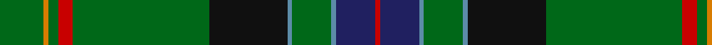

In pattern [GYGRGKBGBBR](/stripes/gygrgkbgbbr/).

This was sourced from tartans-authority.  It is a [11 stripe tartan](/stripes/stripes11/).

Original link http://www.tartansauthority.com/tartan-ferret/display/11280/

## Thread count
G/18 O2 G4 R6 G56 K32 B2 G16 B2 DB16 R/2

## Palette
Each colour and the base-6 reference it is a variant of.

| Colour | Shade | Base |
|---|---|---|
| B | <code style="background-color:#5C8CA8;">#5C8CA8</code> `oklch(61.7% 0.067 235.0)` <small>#5C8CA8</small> | B <code style="background-color:#2A418A;">#2A418A</code> |
| DB | <code style="background-color:#202060;">#202060</code> `oklch(28.9% 0.111 276.9)` <small>#202060</small> | B <code style="background-color:#2A418A;">#2A418A</code> |
| G | <code style="background-color:#006818;">#006818</code> `oklch(45.0% 0.142 145.0)` <small>#006818</small> | G <code style="background-color:#006100;">#006100</code> |
| K | <code style="background-color:#101010;">#101010</code> `oklch(17.3% 0.000 89.9)` <small>#101010</small> | K <code style="background-color:#000000;">#000000</code> |
| O | <code style="background-color:#D87C00;">#D87C00</code> `oklch(67.3% 0.155 61.8)` <small>#D87C00</small> | Y <code style="background-color:#F2BF00;">#F2BF00</code> |
| R | <code style="background-color:#C80000;">#C80000</code> `oklch(52.3% 0.215 29.2)` <small>#C80000</small> | R <code style="background-color:#CC0000;">#CC0000</code> |

## Nearest tartans

The nearest existing variants by ΔTartan distance, with this tartan at the top so the swatches line up against it.

ΔTartan

Tartan

Sett

—

<a href="/ttd/edit/#slug=g9lo1g2r3g28k16t1g8t1db8r1~x2">New York Caledonian Club Day</a> <a class="nn-out" href="/setts/s11/g9lo1g2r3g28k16t1g8t1db8r1~x2/" title="open its dictionary page">↗</a>

0.72

<a href="/ttd/edit/#slug=g9o1g2r3g28k16lb1g8lb1db8r1~x2">New York Caledonian Club Day</a> <a class="nn-out" href="/setts/s11/g9o1g2r3g28k16lb1g8lb1db8r1~x2/" title="open its dictionary page">↗</a>

1.02

<a href="/ttd/edit/#slug=k17y4g51ly3g4ly3g51y4k17db6~x2">U.S. Army</a> <a class="nn-out" href="/setts/s10/k17y4g51ly3g4ly3g51y4k17db6~x2/" title="open its dictionary page">↗</a>

1.05

<a href="/ttd/edit/#slug=k2g2ly1g3m1g2m1g12db4k3db3k3db3k3db4g24r2~x2">Kennedy Clan Tartan Tartan Number: 1123. Earliest known date: 1847 The Earls of Cassilis built Culzean Castle on the site of an ancient Kennedy stronghold. Dunure Castle near Culzean on the Ayrshire coast, was also owned by the Kennedys. The tartan was first recorded by MacIan in his book 'The Clans of the Scottish Highlands' (1847) which he co-authored with James Logan. See products available Copyright © Blair Urquhart, Comrie, 2015</a> <a class="nn-out" href="/setts/s17/k2g2ly1g3m1g2m1g12db4k3db3k3db3k3db4g24r2~x2/" title="open its dictionary page">↗</a>

1.10

<a href="/ttd/edit/#slug=b14k3b14k10g40k1g3k1w3k1o3k1g40k10~x2">Irish Diaspora</a> <a class="nn-out" href="/setts/s14/b14k3b14k10g40k1g3k1w3k1o3k1g40k10~x2/" title="open its dictionary page">↗</a>

1.17

<a href="/ttd/edit/#slug=dg49k8lo20lo3dg23r6k5t3dg10lo10~x2">State Seal of Maine (Fashion)</a> <a class="nn-out" href="/setts/s10/dg49k8lo20lo3dg23r6k5t3dg10lo10~x2/" title="open its dictionary page">↗</a>

1.21

<a href="/ttd/edit/#slug=dg28b1dg4r1k1lr1k1g4r4k2r4lr2~x2">Carroll O'Reed</a> <a class="nn-out" href="/setts/s12/dg28b1dg4r1k1lr1k1g4r4k2r4lr2~x2/" title="open its dictionary page">↗</a>

1.24

<a href="/ttd/edit/#slug=db3k1dg16lo1r1lb1r6dg3r1dg3lb1~x4">Canadian Caledonian Hunting</a> <a class="nn-out" href="/setts/s11/db3k1dg16lo1r1lb1r6dg3r1dg3lb1~x4/" title="open its dictionary page">↗</a>

1.29

<a href="/ttd/edit/#slug=dg32t2k7ly1k1w1k2r7dg5k1dg3w1~x2">Stuart/Stewart (Variant)</a> <a class="nn-out" href="/setts/s12/dg32t2k7ly1k1w1k2r7dg5k1dg3w1~x2/" title="open its dictionary page">↗</a>

1.32

<a href="/ttd/edit/#slug=w1g12dg1k2b2k1dg16r1dg16g1k1ly1~x2">Walsh</a> <a class="nn-out" href="/setts/s12/w1g12dg1k2b2k1dg16r1dg16g1k1ly1~x2/" title="open its dictionary page">↗</a>

1.34

<a href="/ttd/edit/#slug=dg32w1k3w1g14dg7k3m3w1~x2">Leach, Leech, Leitch, hunting</a> <a class="nn-out" href="/setts/s9/dg32w1k3w1g14dg7k3m3w1~x2/" title="open its dictionary page">↗</a>

## Neighbour map

Every grey dot is one of 14299 variants placed by the first two principal components of the ΔTartan feature space (44% of its variance). Red is this tartan; blue dots are its nearest — click one to open its page.

<svg viewBox="0 0 640 380" role="img" style="max-width:100%;height:auto;border:1px solid #e0e0e0;border-radius:4px;display:block" xmlns="http://www.w3.org/2000/svg"><image href="/nn/cloud.v1.png" width="640" height="380"/><a href="/setts/s11/g9o1g2r3g28k16lb1g8lb1db8r1~x2/"><circle cx="345.6" cy="114.5" r="4" fill="#3465a4"><title>New York Caledonian Club Day</title></circle></a><a href="/setts/s10/k17y4g51ly3g4ly3g51y4k17db6~x2/"><circle cx="354.3" cy="143.7" r="4" fill="#3465a4"><title>U.S. Army</title></circle></a><a href="/setts/s17/k2g2ly1g3m1g2m1g12db4k3db3k3db3k3db4g24r2~x2/"><circle cx="333.1" cy="99.6" r="4" fill="#3465a4"><title>Kennedy Clan Tartan Tartan Number: 1123. Earliest known date: 1847 The Earls of Cassilis built Culzean Castle on the site of an ancient Kennedy stronghold. Dunure Castle near Culzean on the Ayrshire coast, was also owned by the Kennedys. The tartan was first recorded by MacIan in his book 'The Clans of the Scottish Highlands' (1847) which he co-authored with James Logan. See products available Copyright © Blair Urquhart, Comrie, 2015</title></circle></a><a href="/setts/s14/b14k3b14k10g40k1g3k1w3k1o3k1g40k10~x2/"><circle cx="329.7" cy="90.5" r="4" fill="#3465a4"><title>Irish Diaspora</title></circle></a><a href="/setts/s10/dg49k8lo20lo3dg23r6k5t3dg10lo10~x2/"><circle cx="313.6" cy="147.1" r="4" fill="#3465a4"><title>State Seal of Maine (Fashion)</title></circle></a><a href="/setts/s12/dg28b1dg4r1k1lr1k1g4r4k2r4lr2~x2/"><circle cx="358.9" cy="85.1" r="4" fill="#3465a4"><title>Carroll O'Reed</title></circle></a><a href="/setts/s11/db3k1dg16lo1r1lb1r6dg3r1dg3lb1~x4/"><circle cx="319.0" cy="121.0" r="4" fill="#3465a4"><title>Canadian Caledonian Hunting</title></circle></a><a href="/setts/s12/dg32t2k7ly1k1w1k2r7dg5k1dg3w1~x2/"><circle cx="381.8" cy="79.3" r="4" fill="#3465a4"><title>Stuart/Stewart (Variant)</title></circle></a><a href="/setts/s12/w1g12dg1k2b2k1dg16r1dg16g1k1ly1~x2/"><circle cx="324.3" cy="117.9" r="4" fill="#3465a4"><title>Walsh</title></circle></a><a href="/setts/s9/dg32w1k3w1g14dg7k3m3w1~x2/"><circle cx="368.0" cy="124.7" r="4" fill="#3465a4"><title>Leach, Leech, Leitch, hunting</title></circle></a><circle cx="347.9" cy="121.1" r="5" fill="#c00000"/></svg>

ID: /setts/s11/g9lo1g2r3g28k16t1g8t1db8r1~x2/
