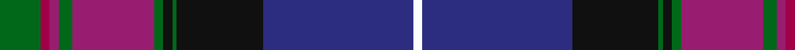

In pattern [GRRGRGKGKBW](/patterns/grrgrgkgkbw/).

This was sourced from register-of-tartans.  It is a [11 stripes tartan](/stripes/stripes11/).

Original link https://www.tartanregister.gov.uk/tartanDetails.aspx?ref=3375

## Attestations

This cloth appears in 2 source records; the oldest owns this page.

- 01/01/1996 — Pride of Scotland (register-of-tartans, [record](https://www.tartanregister.gov.uk/tartanDetails.aspx?ref=3375))
- pre 1997 — Pride of Scotland (Fashion) (tartans-authority, [record](http://www.tartansauthority.com/tartan-ferret/display/2469/))

## Thread count
G/18 R4 P4 G6 P36 G4 K4 G2 K38 DB66 W/4

## Palette
Each colour and its ΔE from the base-6 reference it is a variant of.

| Colour | Shade | Base | ΔE (OKLab) |
|---|---|---|---|
| DB | <code style="background-color:#2C2C80;">#2C2C80</code> `#2C2C80` | B <code style="background-color:#2A418A;">#2A418A</code> | 0.06 |
| G | <code style="background-color:#006818;">#006818</code> `#006818` | G <code style="background-color:#006100;">#006100</code> | 0.02 |
| K | <code style="background-color:#101010;">#101010</code> `#101010` | K <code style="background-color:#000000;">#000000</code> | 0.17 |
| P | <code style="background-color:#981C70;">#981C70</code> `#981C70` | R <code style="background-color:#CC0000;">#CC0000</code> | 0.17 |
| R | <code style="background-color:#A00048;">#A00048</code> `#A00048` | R <code style="background-color:#CC0000;">#CC0000</code> | 0.12 |
| W | <code style="background-color:#FCFCFC;">#FCFCFC</code> `#FCFCFC` | W <code style="background-color:#F7F7F7;">#F7F7F7</code> | 0.01 |

## Nearest tartans

The nearest existing variants by ΔTartan distance.

1. [Lang of Sherbrooke (Personal)](/setts/s11/g10y2b2g2b13g2b2g1k13ba24w2x2~b780078-ba2c2c80-g00643c-k101010-wfcfcfc-ye8c000/) — ΔT 0.68
1. [Lang of Sherbrooke (Personal)](/setts/s11/g10y2k2g2k13g2k2g1b13ba24w2x2~b780078-ba2c2c80-g00643c-k101010-wfcfcfc-ye8c000/) — ΔT 0.71
1. [Accenture](/setts/s10/b3r1ba4g2ra2g21r3b21ba25w3x2~b780078-ba2c2c80-g006818-r888888-rac80000-we0e0e0/) — ΔT 0.81
1. [Smithsonian (Corporate)](/setts/s11/b2w2g24k24y1r2g2r2y1b24g2x2~b202060-g406054-k101010-rc80000-we0e0e0-ye8c000/) — ΔT 1.02
1. [Spirit of Bannockburn (Fashion)](/setts/s13/k2b4r4b3g20b5k4b3k7b3k3ba35w2x2~b780078-ba2c2c80-g006818-k101010-rb468ac-wfcfcfc/) — ΔT 1.09
1. [University of Dundee](/setts/s10/b5r4ra6y1ra9ba35b5y1b12w1x2~b1c1c50-ba2c2c80-r888888-rac80000-we0e0e0-ybc8c00/) — ΔT 1.16
1. [Rendell, Charles (Personal)](/setts/s17/k2g2b1g2b1g2b1g12ba4k3ba3k3ba3k3ba4bb24r2x2~b9058d8-ba38409c-bb440044-g006818-k101010-rc80000/) — ΔT 1.19
1. [Unidentified #7](/setts/s11/b2r2b2r2b20k24g12y1k2g2ba2x2~b2c4084-ba3c82af-g005020-k101010-rdc0000-ye8c000/) — ΔT 1.23
1. [Cumnock Hunting (District)](/setts/s10/b23w1b2ba16k3ba2k30y1k2r3x2~b780078-ba2c2c80-k101010-rc80000-we0e0e0-yfcb464/) — ΔT 1.24
1. [Héritage Séquane](/setts/s12/b5r2y7r2b42g28k5b10k15g5w3r3~b2b0064-g004a2f-k101010-raf011c-wffffff-yd5aa02/) — ΔT 1.25

## Neighbour map

Every grey dot is one of 15726 variants placed by the first two principal components of the ΔTartan feature space (44% of its variance). Red is this tartan; blue dots are its nearest — click one to open its page.

<svg viewBox="0 0 640 380" role="img" style="max-width:100%;height:auto;border:1px solid #e0e0e0;border-radius:4px;display:block" xmlns="http://www.w3.org/2000/svg"><image href="/nn/cloud.v1.png" width="640" height="380"/><a href="/setts/s11/g10y2b2g2b13g2b2g1k13ba24w2x2~b780078-ba2c2c80-g00643c-k101010-wfcfcfc-ye8c000/"><circle cx="173.0" cy="106.4" r="4" fill="#3465a4"><title>Lang of Sherbrooke (Personal)</title></circle></a><a href="/setts/s11/g10y2k2g2k13g2k2g1b13ba24w2x2~b780078-ba2c2c80-g00643c-k101010-wfcfcfc-ye8c000/"><circle cx="170.3" cy="107.0" r="4" fill="#3465a4"><title>Lang of Sherbrooke (Personal)</title></circle></a><a href="/setts/s10/b3r1ba4g2ra2g21r3b21ba25w3x2~b780078-ba2c2c80-g006818-r888888-rac80000-we0e0e0/"><circle cx="201.7" cy="110.6" r="4" fill="#3465a4"><title>Accenture</title></circle></a><a href="/setts/s11/b2w2g24k24y1r2g2r2y1b24g2x2~b202060-g406054-k101010-rc80000-we0e0e0-ye8c000/"><circle cx="204.3" cy="102.1" r="4" fill="#3465a4"><title>Smithsonian (Corporate)</title></circle></a><a href="/setts/s13/k2b4r4b3g20b5k4b3k7b3k3ba35w2x2~b780078-ba2c2c80-g006818-k101010-rb468ac-wfcfcfc/"><circle cx="189.8" cy="102.5" r="4" fill="#3465a4"><title>Spirit of Bannockburn (Fashion)</title></circle></a><a href="/setts/s10/b5r4ra6y1ra9ba35b5y1b12w1x2~b1c1c50-ba2c2c80-r888888-rac80000-we0e0e0-ybc8c00/"><circle cx="280.2" cy="95.1" r="4" fill="#3465a4"><title>University of Dundee</title></circle></a><a href="/setts/s17/k2g2b1g2b1g2b1g12ba4k3ba3k3ba3k3ba4bb24r2x2~b9058d8-ba38409c-bb440044-g006818-k101010-rc80000/"><circle cx="195.8" cy="81.8" r="4" fill="#3465a4"><title>Rendell, Charles (Personal)</title></circle></a><a href="/setts/s11/b2r2b2r2b20k24g12y1k2g2ba2x2~b2c4084-ba3c82af-g005020-k101010-rdc0000-ye8c000/"><circle cx="229.3" cy="110.8" r="4" fill="#3465a4"><title>Unidentified #7</title></circle></a><a href="/setts/s10/b23w1b2ba16k3ba2k30y1k2r3x2~b780078-ba2c2c80-k101010-rc80000-we0e0e0-yfcb464/"><circle cx="274.1" cy="103.2" r="4" fill="#3465a4"><title>Cumnock Hunting (District)</title></circle></a><a href="/setts/s12/b5r2y7r2b42g28k5b10k15g5w3r3~b2b0064-g004a2f-k101010-raf011c-wffffff-yd5aa02/"><circle cx="227.2" cy="108.8" r="4" fill="#3465a4"><title>Héritage Séquane</title></circle></a><circle cx="209.8" cy="90.0" r="5" fill="#c00000"/></svg>

ID: /setts/s11/g9r2ra2g3ra18g2k2g1k19b33w2x2~b2c2c80-g006818-k101010-ra00048-ra981c70-wfcfcfc/
