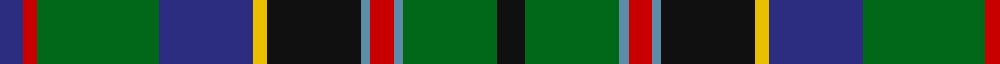

In pattern [BRGBYKBRBGK](/patterns/brgbykbrbgk/).

This was sourced from house-of-tartan.  It is a [11 stripes tartan](/stripes/stripes11/).

Original link http://www.house-of-tartan.scotland.net/house/TartanViewjs.asp?colr=Def&tnam=517

## Thread count
DB/10 R6 G52 DB40 Y6 K40 B4 R10 B4 G40 K/12

## Palette
Each colour and its ΔE from the base-6 reference it is a variant of.

| Colour | Shade | Base | ΔE (OKLab) |
|---|---|---|---|
| B | <code style="background-color:#5C8CA8;">#5C8CA8</code> `#5C8CA8` | B <code style="background-color:#2A418A;">#2A418A</code> | 0.23 |
| DB | <code style="background-color:#2C2C80;">#2C2C80</code> `#2C2C80` | B <code style="background-color:#2A418A;">#2A418A</code> | 0.06 |
| G | <code style="background-color:#006818;">#006818</code> `#006818` | G <code style="background-color:#006100;">#006100</code> | 0.02 |
| K | <code style="background-color:#101010;">#101010</code> `#101010` | K <code style="background-color:#000000;">#000000</code> | 0.17 |
| R | <code style="background-color:#C80000;">#C80000</code> `#C80000` | R <code style="background-color:#CC0000;">#CC0000</code> | 0.01 |
| Y | <code style="background-color:#E8C000;">#E8C000</code> `#E8C000` | Y <code style="background-color:#F2BF00;">#F2BF00</code> | 0.02 |

## Nearest tartans

The nearest existing variants by ΔTartan distance.

1. [Kelsey, William (Personal)](/setts/s12/g24r4g4r10g32b6ra4k4ra6b12k40y6-b2c2c80-g006818-k101010-rc80000-ra888888-yfccc00/) — ΔT 0.76
1. [East Lothian (Fashion) Fashion Tartan Tartan Number: 2561. Earliest known date: 1999 David McGill's company has designed quite a wide range of fashion tartans and in many cases, has given them names suggesting that they are tartans for cities, counties, states and even countries. See products available Copyright © Blair Urquhart, Comrie, 2015](/setts/s12/b34ba8b4k22g66y8g66k22b4ba8b34bb12-b2c2c80-ba780078-bb5c8ca8-g006818-k101010-ye8c000/) — ΔT 0.78
1. [Stephenson (Name)](/setts/s11/k12g40b4r10b4k40y6ba40g52r6ba10-b2474e8-ba1c0070-g408060-k101010-r880000-yd09800/) — ΔT 0.81
1. [Gow Hunting Family Tartan Tartan Number: 1893. Earliest known date: pre 2003 MacDonells of Keppoch are an independant branch of Clan Donald. See products available Copyright © Blair Urquhart, Comrie, 2015](/setts/s14/b48ba12b48k48g48k4y12k4g48k4r4k4g48k48-b2c2c80-ba202060-g006818-k101010-rc80000-ye8c000/) — ΔT 0.81
1. [Big Rory (Corporate)](/setts/s10/b10w5b48k35g5k5g35r5g5ba5-b2c607c-ba780078-g006818-k101010-rc80000-we0e0e0/) — ΔT 0.86
1. [MacComb Family Tartan Tartan Number: 2340. Earliest known date: pre 1997 STS notes: Designed for a Mr McComb to play himself in as club captain of a golf club. It is the MacThomas with the over check changed to the clubs colours. Design by Donald Fraser (Oct 2002) of Berwick upon Tweed. See products available Copyright © Blair Urquhart, Comrie, 2015](/setts/s12/b6r4b36k12g36y4ga6y4g36k12b36r4-b2c2c80-g006818-ga408060-k101010-rc80000-ye8c000/) — ΔT 0.87
1. [Paisley District Tartan Tartan Number: 640. Earliest known date: 1952 This design won a first prize at Kelso Highland Show for designer, Allan Drennan, in 1952. He regarded it as having 'a motif of the Clan Donald'. It is also worn by members of the Paisley & Allied Families Society and the '100 Pipers' pipe band (in ancient colours). See products available Copyright © Blair Urquhart, Comrie, 2015](/setts/s12/b14w4g6b36y4k30y4g34r10g6r4g14-b2c2c80-g006818-k101010-rc80000-we0e0e0-ye8c000/) — ΔT 0.88
1. [MacInnes Clan Tartan Tartan Number: 1464. Earliest known date: 1908 Recorded by Adam in 1908. The Clan MacInnes of the West and the Clan Innes of Moray are two separate clans. The similarity in the structure of the MacInnes green tartan and the Innes red have resulted in the use of both tartans as 'dress' and 'hunting' tartans by both clans. The notes in the archives of the Scottish Tartans Society attribute the design to the 'Onich Grocer' with no further explanation. MacInneses are hereditary bowmen to the Chief of MacKinnon. See products available Copyright © Blair Urquhart, Comrie, 2015](/setts/s13/r4g12b24k6ba6k6g32k4g4k4g4k24y4-b2c2c80-ba5c8ca8-g006818-k101010-rc80000-ye8c000/) — ΔT 0.88
1. [Adams](/setts/s11/r8g8k4g30b10g10b30g12w2ba38r4-b441800-ba1c0070-g006818-k101010-r880000-wffffff/) — ΔT 0.89
1. [Wojtek Memorial Trust](/setts/s11/w6b30r12b6r6b8g22ga6g6ga56y6-b202060-g003820-ga005020-rdc0000-wffffff-ya08858/) — ΔT 0.90

## Neighbour map

Every grey dot is one of 15726 variants placed by the first two principal components of the ΔTartan feature space (44% of its variance). Red is this tartan; blue dots are its nearest — click one to open its page.

<svg viewBox="0 0 640 380" role="img" style="max-width:100%;height:auto;border:1px solid #e0e0e0;border-radius:4px;display:block" xmlns="http://www.w3.org/2000/svg"><image href="/nn/cloud.v1.png" width="640" height="380"/><a href="/setts/s12/g24r4g4r10g32b6ra4k4ra6b12k40y6-b2c2c80-g006818-k101010-rc80000-ra888888-yfccc00/"><circle cx="143.9" cy="141.9" r="4" fill="#3465a4"><title>Kelsey, William (Personal)</title></circle></a><a href="/setts/s12/b34ba8b4k22g66y8g66k22b4ba8b34bb12-b2c2c80-ba780078-bb5c8ca8-g006818-k101010-ye8c000/"><circle cx="209.4" cy="140.3" r="4" fill="#3465a4"><title>East Lothian (Fashion) Fashion Tartan Tartan Number: 2561. Earliest known date: 1999 David McGill's company has designed quite a wide range of fashion tartans and in many cases, has given them names suggesting that they are tartans for cities, counties, states and even countries. See products available Copyright © Blair Urquhart, Comrie, 2015</title></circle></a><a href="/setts/s11/k12g40b4r10b4k40y6ba40g52r6ba10-b2474e8-ba1c0070-g408060-k101010-r880000-yd09800/"><circle cx="161.6" cy="144.5" r="4" fill="#3465a4"><title>Stephenson (Name)</title></circle></a><a href="/setts/s14/b48ba12b48k48g48k4y12k4g48k4r4k4g48k48-b2c2c80-ba202060-g006818-k101010-rc80000-ye8c000/"><circle cx="156.0" cy="155.7" r="4" fill="#3465a4"><title>Gow Hunting Family Tartan Tartan Number: 1893. Earliest known date: pre 2003 MacDonells of Keppoch are an independant branch of Clan Donald. See products available Copyright © Blair Urquhart, Comrie, 2015</title></circle></a><a href="/setts/s10/b10w5b48k35g5k5g35r5g5ba5-b2c607c-ba780078-g006818-k101010-rc80000-we0e0e0/"><circle cx="163.8" cy="157.2" r="4" fill="#3465a4"><title>Big Rory (Corporate)</title></circle></a><a href="/setts/s12/b6r4b36k12g36y4ga6y4g36k12b36r4-b2c2c80-g006818-ga408060-k101010-rc80000-ye8c000/"><circle cx="165.5" cy="160.9" r="4" fill="#3465a4"><title>MacComb Family Tartan Tartan Number: 2340. Earliest known date: pre 1997 STS notes: Designed for a Mr McComb to play himself in as club captain of a golf club. It is the MacThomas with the over check changed to the clubs colours. Design by Donald Fraser (Oct 2002) of Berwick upon Tweed. See products available Copyright © Blair Urquhart, Comrie, 2015</title></circle></a><a href="/setts/s12/b14w4g6b36y4k30y4g34r10g6r4g14-b2c2c80-g006818-k101010-rc80000-we0e0e0-ye8c000/"><circle cx="119.6" cy="150.7" r="4" fill="#3465a4"><title>Paisley District Tartan Tartan Number: 640. Earliest known date: 1952 This design won a first prize at Kelso Highland Show for designer, Allan Drennan, in 1952. He regarded it as having 'a motif of the Clan Donald'. It is also worn by members of the Paisley &amp; Allied Families Society and the '100 Pipers' pipe band (in ancient colours). See products available Copyright © Blair Urquhart, Comrie, 2015</title></circle></a><a href="/setts/s13/r4g12b24k6ba6k6g32k4g4k4g4k24y4-b2c2c80-ba5c8ca8-g006818-k101010-rc80000-ye8c000/"><circle cx="148.4" cy="157.3" r="4" fill="#3465a4"><title>MacInnes Clan Tartan Tartan Number: 1464. Earliest known date: 1908 Recorded by Adam in 1908. The Clan MacInnes of the West and the Clan Innes of Moray are two separate clans. The similarity in the structure of the MacInnes green tartan and the Innes red have resulted in the use of both tartans as 'dress' and 'hunting' tartans by both clans. The notes in the archives of the Scottish Tartans Society attribute the design to the 'Onich Grocer' with no further explanation. MacInneses are hereditary bowmen to the Chief of MacKinnon. See products available Copyright © Blair Urquhart, Comrie, 2015</title></circle></a><a href="/setts/s11/r8g8k4g30b10g10b30g12w2ba38r4-b441800-ba1c0070-g006818-k101010-r880000-wffffff/"><circle cx="187.9" cy="143.7" r="4" fill="#3465a4"><title>Adams</title></circle></a><a href="/setts/s11/w6b30r12b6r6b8g22ga6g6ga56y6-b202060-g003820-ga005020-rdc0000-wffffff-ya08858/"><circle cx="154.5" cy="149.8" r="4" fill="#3465a4"><title>Wojtek Memorial Trust</title></circle></a><circle cx="168.4" cy="148.8" r="5" fill="#c00000"/></svg>

ID: /setts/s11/k12g40b4r10b4k40y6ba40g52r6ba10-b5c8ca8-ba2c2c80-g006818-k101010-rc80000-ye8c000/
