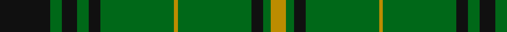

In pattern [KGKGKGYGKGY](/stripes/kgkgkgygkgy/).

This was sourced from tartans-authority.  It is a [11 stripe tartan](/stripes/stripes11/).

Original link http://www.tartansauthority.com/tartan-ferret/display/8515/

## Thread count
K/26 G6 K8 G6 K6 G38 DY2 G38 K6 G4 DY/8

## Palette
Each colour and its ΔE from the base-6 reference it is a variant of.

| Colour | Shade | Base | ΔE (OKLab) |
|---|---|---|---|
| DY | <code style="background-color:#BC8C00;">#BC8C00</code> `#BC8C00` | Y <code style="background-color:#F2BF00;">#F2BF00</code> | 0.16 |
| G | <code style="background-color:#006818;">#006818</code> `#006818` | G <code style="background-color:#006100;">#006100</code> | 0.02 |
| K | <code style="background-color:#101010;">#101010</code> `#101010` | K <code style="background-color:#000000;">#000000</code> | 0.17 |

## Nearest tartans

The nearest existing variants by ΔTartan distance.

1. [Glenbarr](/setts/s8/g3k6r2k6g3k2g16k1~x4/) — ΔT 0.97
1. [MacArthur-Fox 1993 (Personal)](/setts/s8/k22g5k2g5k11g33k2r4~x2/) — ΔT 1.31
1. [Moncrieffe (1998)](/setts/s13/g25k4g4k4g4k26g25r9g25k26g25k2r9~x2/) — ΔT 1.33
1. [MacArthur-Fox Green](/setts/s10/r4g4k2g31k10ly3g5k11g6k3~x2/) — ΔT 1.33
1. [Angle, Green (Fashion)](/setts/s7/lo1dg11k6dg3lo1dg1lo1~x4/) — ΔT 1.35
1. [Northcroft (Personal)](/setts/s7/g24r4g3k14g5r2g10~x2/) — ΔT 1.38
1. [Ross Hunting](/setts/s14/dg2g4dg2g1dg1g1dg3k2dg2k2dg12r1dg2r1~x2/) — ΔT 1.40
1. [MacArthur-Fox 2000 (Personal)](/setts/s10/y5k2y30r2k10y5k2y5k10r2~x2/) — ΔT 1.41
1. [Island Weavers (Corporate)](/setts/s10/g33db2g33r2db12r12g4r2g4w3~x2/) — ΔT 1.42
1. [Duchess of Fife #2](/setts/s6/g70k26g12k14db3k16~x2/) — ΔT 1.43

## Neighbour map

Every grey dot is one of 14299 variants placed by the first two principal components of the ΔTartan feature space (44% of its variance). Red is this tartan; blue dots are its nearest — click one to open its page.

<svg viewBox="0 0 640 380" role="img" style="max-width:100%;height:auto;border:1px solid #e0e0e0;border-radius:4px;display:block" xmlns="http://www.w3.org/2000/svg"><image href="/nn/cloud.v1.png" width="640" height="380"/><a href="/setts/s8/g3k6r2k6g3k2g16k1~x4/"><circle cx="376.8" cy="215.1" r="4" fill="#3465a4"><title>Glenbarr</title></circle></a><a href="/setts/s8/k22g5k2g5k11g33k2r4~x2/"><circle cx="362.7" cy="208.5" r="4" fill="#3465a4"><title>MacArthur-Fox 1993 (Personal)</title></circle></a><a href="/setts/s13/g25k4g4k4g4k26g25r9g25k26g25k2r9~x2/"><circle cx="332.4" cy="216.2" r="4" fill="#3465a4"><title>Moncrieffe (1998)</title></circle></a><a href="/setts/s10/r4g4k2g31k10ly3g5k11g6k3~x2/"><circle cx="349.8" cy="176.0" r="4" fill="#3465a4"><title>MacArthur-Fox Green</title></circle></a><a href="/setts/s7/lo1dg11k6dg3lo1dg1lo1~x4/"><circle cx="396.8" cy="226.0" r="4" fill="#3465a4"><title>Angle, Green (Fashion)</title></circle></a><a href="/setts/s7/g24r4g3k14g5r2g10~x2/"><circle cx="418.0" cy="239.4" r="4" fill="#3465a4"><title>Northcroft (Personal)</title></circle></a><a href="/setts/s14/dg2g4dg2g1dg1g1dg3k2dg2k2dg12r1dg2r1~x2/"><circle cx="396.9" cy="183.4" r="4" fill="#3465a4"><title>Ross Hunting</title></circle></a><a href="/setts/s10/y5k2y30r2k10y5k2y5k10r2~x2/"><circle cx="414.8" cy="190.3" r="4" fill="#3465a4"><title>MacArthur-Fox 2000 (Personal)</title></circle></a><a href="/setts/s10/g33db2g33r2db12r12g4r2g4w3~x2/"><circle cx="414.5" cy="167.7" r="4" fill="#3465a4"><title>Island Weavers (Corporate)</title></circle></a><a href="/setts/s6/g70k26g12k14db3k16~x2/"><circle cx="420.0" cy="221.6" r="4" fill="#3465a4"><title>Duchess of Fife #2</title></circle></a><circle cx="401.5" cy="193.4" r="5" fill="#c00000"/></svg>

ID: /setts/s11/k13g3k4g3k3g19lo1g19k3g2lo4~x2/
