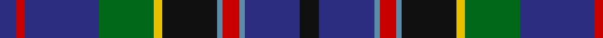

In pattern [BRBGYKBRBBK](/patterns/brbgykbrbbk/).

This was sourced from house-of-tartan.  It is a [11 stripes tartan](/stripes/stripes11/).

Original link http://www.house-of-tartan.scotland.net/house/TartanViewjs.asp?colr=Def&tnam=438

## Thread count
DB/12 R6 DB54 G40 Y6 K40 B4 R12 B4 DB40 K/14

## Palette
Each colour and its ΔE from the base-6 reference it is a variant of.

| Colour | Shade | Base | ΔE (OKLab) |
|---|---|---|---|
| B | <code style="background-color:#5C8CA8;">#5C8CA8</code> `#5C8CA8` | B <code style="background-color:#2C4084;">#2C4084</code> | 0.23 |
| DB | <code style="background-color:#2C2C80;">#2C2C80</code> `#2C2C80` | B <code style="background-color:#2C4084;">#2C4084</code> | 0.05 |
| G | <code style="background-color:#006818;">#006818</code> `#006818` | G <code style="background-color:#006400;">#006400</code> | 0.02 |
| K | <code style="background-color:#101010;">#101010</code> `#101010` | K <code style="background-color:#000000;">#000000</code> | 0.17 |
| R | <code style="background-color:#C80000;">#C80000</code> `#C80000` | R <code style="background-color:#C80000;">#C80000</code> | 0.00 |
| Y | <code style="background-color:#E8C000;">#E8C000</code> `#E8C000` | Y <code style="background-color:#E8C000;">#E8C000</code> | 0.00 |

## Nearest tartans

The nearest existing variants by ΔTartan distance.

1. [Souza Nery (Personal)](/setts/s12/b74r6k34r6g44ka8g44r6k34r6b74w6-b2c2c80-g006818-k101010-ka000000-rc8002c-we0e0e0/) — ΔT 0.41
1. [Czech National (District)](/setts/s11/b8y4b48k4b10r6k28g28w6r6b6-b2c2c80-g006818-k101010-rc80000-we0e0e0-ye8c000/) — ΔT 0.69
1. [Stephenson (Name)](/setts/s11/k12g40b4r10b4k40y6ba40g52r6ba10-b2474e8-ba1c0070-g408060-k101010-r880000-yd09800/) — ΔT 0.81
1. [MacKusick Family Tartan of North America](/setts/s13/b16k4b6k24ba6w2ba6k32g6w4r2w4g16-b2c4084-ba5a008c-g005020-k101010-rdc0000-we0e0e0/) — ΔT 0.87
1. [Sacramento City Fire Department (P&D](/setts/s13/y4b4w2b30k10g22k2r6k2g22k10b34w2-b2c2c80-g006818-k101010-rc80000-wfcfcfc-ye8c000/) — ΔT 0.89
1. [MacBeth/Stewart Brydone 1862](/setts/s12/b66r16k24y4k8w8k8g24b16k8b8w4-b2c4084-g005020-k101010-rdc0000-we0e0e0-ye8c000/) — ΔT 0.90
1. [Loch Lomond Millenium](/setts/s11/k6g4k24b8ba38r6ba38b8k24g4y6-b303070-ba1474b4-g005448-k101010-r880000-yd09800/) — ΔT 0.91
1. [Scottish Italian](/setts/s8/b22ba10g8w6r6k32ba56b4-b1474b4-ba202060-g006818-k101010-rc80000-wfcfcfc/) — ΔT 0.96
1. [MacLulich](/setts/s12/b66r16k24y4k8w8k8g24b16k8b8w4-b2c2c80-g006818-k101010-rc80000-we0e0e0-ye8c000/) — ΔT 0.97
1. [Suzugamine (Corporate)](/setts/s9/b8g10ga38ba10g10k10g10b72y6-b2c2c80-ba780078-g384020-ga006818-k000000-yd8d898/) — ΔT 0.97

## Neighbour map

Every grey dot is one of 15726 variants placed by the first two principal components of the ΔTartan feature space (44% of its variance). Red is this tartan; blue dots are its nearest — click one to open its page.

<svg viewBox="0 0 640 380" role="img" style="max-width:100%;height:auto;border:1px solid #e0e0e0;border-radius:4px;display:block" xmlns="http://www.w3.org/2000/svg"><image href="/nn/cloud.v1.png" width="640" height="380"/><a href="/setts/s12/b74r6k34r6g44ka8g44r6k34r6b74w6-b2c2c80-g006818-k101010-ka000000-rc8002c-we0e0e0/"><circle cx="186.7" cy="147.7" r="4" fill="#3465a4"><title>Souza Nery (Personal)</title></circle></a><a href="/setts/s11/b8y4b48k4b10r6k28g28w6r6b6-b2c2c80-g006818-k101010-rc80000-we0e0e0-ye8c000/"><circle cx="194.2" cy="137.4" r="4" fill="#3465a4"><title>Czech National (District)</title></circle></a><a href="/setts/s11/k12g40b4r10b4k40y6ba40g52r6ba10-b2474e8-ba1c0070-g408060-k101010-r880000-yd09800/"><circle cx="161.6" cy="144.5" r="4" fill="#3465a4"><title>Stephenson (Name)</title></circle></a><a href="/setts/s13/b16k4b6k24ba6w2ba6k32g6w4r2w4g16-b2c4084-ba5a008c-g005020-k101010-rdc0000-we0e0e0/"><circle cx="192.0" cy="126.4" r="4" fill="#3465a4"><title>MacKusick Family Tartan of North America</title></circle></a><a href="/setts/s13/y4b4w2b30k10g22k2r6k2g22k10b34w2-b2c2c80-g006818-k101010-rc80000-wfcfcfc-ye8c000/"><circle cx="204.3" cy="123.5" r="4" fill="#3465a4"><title>Sacramento City Fire Department (P&amp;D</title></circle></a><a href="/setts/s12/b66r16k24y4k8w8k8g24b16k8b8w4-b2c4084-g005020-k101010-rdc0000-we0e0e0-ye8c000/"><circle cx="202.4" cy="117.5" r="4" fill="#3465a4"><title>MacBeth/Stewart Brydone 1862</title></circle></a><a href="/setts/s11/k6g4k24b8ba38r6ba38b8k24g4y6-b303070-ba1474b4-g005448-k101010-r880000-yd09800/"><circle cx="187.2" cy="162.0" r="4" fill="#3465a4"><title>Loch Lomond Millenium</title></circle></a><a href="/setts/s8/b22ba10g8w6r6k32ba56b4-b1474b4-ba202060-g006818-k101010-rc80000-wfcfcfc/"><circle cx="203.0" cy="152.3" r="4" fill="#3465a4"><title>Scottish Italian</title></circle></a><a href="/setts/s12/b66r16k24y4k8w8k8g24b16k8b8w4-b2c2c80-g006818-k101010-rc80000-we0e0e0-ye8c000/"><circle cx="200.1" cy="116.5" r="4" fill="#3465a4"><title>MacLulich</title></circle></a><a href="/setts/s9/b8g10ga38ba10g10k10g10b72y6-b2c2c80-ba780078-g384020-ga006818-k000000-yd8d898/"><circle cx="218.7" cy="151.0" r="4" fill="#3465a4"><title>Suzugamine (Corporate)</title></circle></a><circle cx="197.5" cy="151.3" r="5" fill="#c00000"/></svg>

ID: /setts/s11/k14b40ba4r12ba4k40y6g40b54r6b12-b2c2c80-ba5c8ca8-g006818-k101010-rc80000-ye8c000/
